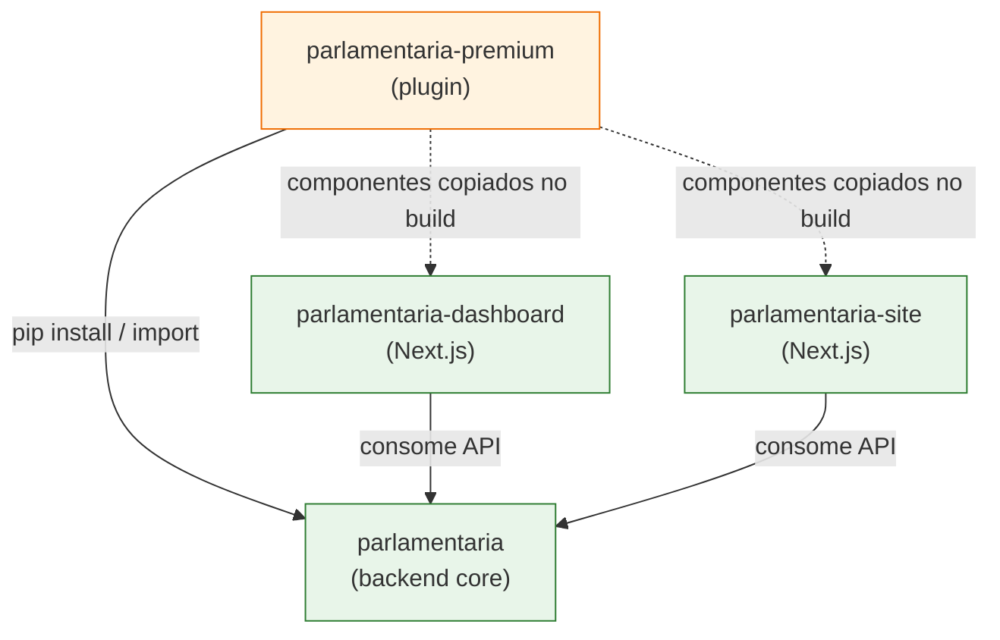
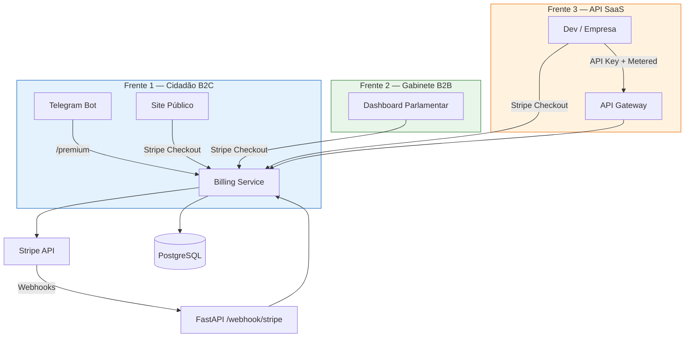
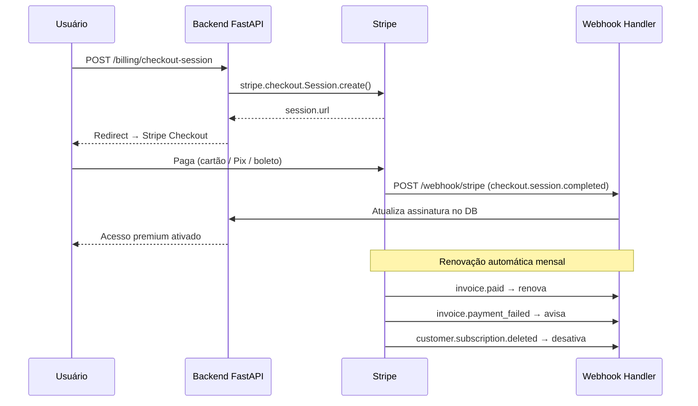
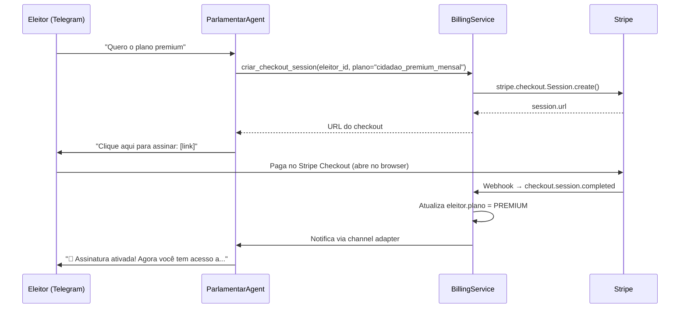
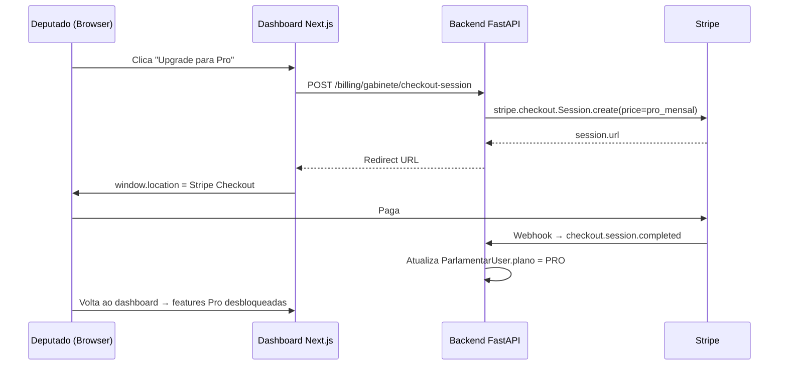

# Parlamentaria — Plano de Monetização com Stripe

> Documento de planejamento técnico para implementação das três frentes de
> monetização da plataforma Parlamentaria. Integração com **Stripe** como
> gateway de pagamentos único.

---

## Índice

1. [Visão Geral](#1-visão-geral)
2. [Estratégia Open Core — Público vs Premium](#2-estratégia-open-core--público-vs-premium)
3. [Arquitetura de Billing](#3-arquitetura-de-billing)
4. [Frente 1 — Freemium para Cidadãos (B2C)](#4-frente-1--freemium-para-cidadãos-b2c)
5. [Frente 2 — Assinatura Premium para Gabinetes (B2B)](#5-frente-2--assinatura-premium-para-gabinetes-b2b)
6. [Frente 3 — API SaaS e Dados Agregados](#6-frente-3--api-saas-e-dados-agregados)
7. [Modelos de Domínio (Billing)](#7-modelos-de-domínio-billing)
8. [Integração Stripe](#8-integração-stripe)
9. [Novos Endpoints](#9-novos-endpoints)
10. [Impacto nos Agentes ADK](#10-impacto-nos-agentes-adk)
11. [Impacto no Dashboard Parlamentar](#11-impacto-no-dashboard-parlamentar)
12. [Impacto no Site / Painel do Cidadão](#12-impacto-no-site--painel-do-cidadão)
13. [Variáveis de Ambiente](#13-variáveis-de-ambiente)
14. [Migrations e Banco de Dados](#14-migrations-e-banco-de-dados)
15. [Segurança e LGPD](#15-segurança-e-lgpd)
16. [Testes](#16-testes)
17. [Sequência de Implementação](#17-sequência-de-implementação)
18. [Estrutura de Arquivos Novos](#18-estrutura-de-arquivos-novos)
19. [Regras para Implementação](#19-regras-para-implementação)

---

## 1. Visão Geral

### 1.1 Três Frentes de Receita

| # | Frente | Modelo | Ticket Médio | Público | Prioridade |
|---|--------|--------|-------------|---------|------------|
| 1 | **Freemium Cidadão** | B2C assinatura mensal/anual | R$ 9,90–19,90/mês ou R$ 99/ano | Eleitores via Telegram | **Alta** (mais fácil e rápido) |
| 2 | **Premium Gabinetes** | B2B assinatura mensal | R$ 199–4.000/mês | Deputados, assessores, partidos | **Média** (maior ticket) |
| 3 | **API SaaS + Dados** | B2B/B2D pay-per-use + assinatura | R$ 0,05–0,20/query ou R$ 99–499/mês | Devs, consultorias, mídia, ONGs | **Média** (receita passiva) |

### 1.2 Projeção de Receita

| Frente | Cenário Conservador | Cenário Otimista |
|--------|--------------------|--------------------|
| Freemium Cidadão | 500 assinantes × R$ 14,90 = **R$ 7.450/mês** | 2.000 × R$ 14,90 = **R$ 29.800/mês** |
| Premium Gabinetes | 20 gabinetes × R$ 349 = **R$ 6.980/mês** | 50 × R$ 499 = **R$ 24.950/mês** |
| API SaaS | 10 clientes × R$ 199 = **R$ 1.990/mês** | 30 × R$ 349 = **R$ 10.470/mês** |
| **Total** | **R$ 16.420/mês** | **R$ 65.220/mês** |

### 1.3 Gateway de Pagamento: Stripe

- **Stripe Checkout**: para fluxo de assinatura web (dashboard e site).
- **Stripe Customer Portal**: gestão self-service de assinatura (upgrade, downgrade, cancelamento).
- **Stripe Billing**: assinaturas recorrentes com trial, prorating e invoices.
- **Stripe Metered Billing**: cobrança por uso para API SaaS (pay-per-use).
- **Stripe Webhooks**: sincronização de estado de pagamento com o backend.
- **Moeda**: BRL (Real brasileiro).
- **Métodos de pagamento**: cartão de crédito, boleto (via Stripe), Pix (via Stripe).

---

## 2. Estratégia Open Core — Público vs Premium

### 2.1 Modelo Adotado: Open Core

O projeto Parlamentaria segue o modelo **Open Core** — o núcleo funcional permanece
**open source (MIT)** e o valor premium é entregue por módulos proprietários (closed-source)
que estendem o core. Isso preserva a missão democrática e cívica do projeto enquanto
viabiliza receita sustentável.

```mermaid
graph TD
    subgraph OpenSource ["Core Open Source (MIT)"]
        direction TB
        DOM["Domain Models"]
        INT["Integração API Câmara"]
        SYNC["Sync Service"]
        REPO["Repositories"]
        AGEN["Agentes ADK (base)"]
        TOOLS_BASE["Tools básicas"]
        CHAN["Channel Adapters"]
        VOTE["Votação Popular"]
        COMP["Comparativos"]
        NOTIF_BASE["Notificações (semanal)"]
        RSS["RSS Feed"]
        HEALTH["Health / Admin"]
        CIDADAO["Painel do Cidadão"]
        SITE["Site Público"]
    end

    subgraph Premium ["Módulos Premium (Closed Source)"]
        direction TB
        BILLING["Billing / Stripe"]
        PLAN_GATE["Plan Enforcement"]
        ANALYTICS["Analytics Avançado"]
        API_SAAS["API SaaS v1"]
        DASH_PRO["Dashboard Pro/Enterprise"]
        AGENT_PRO["Agent Premium Tools"]
        RAG_PRO["RAG Avançado"]
        DIGEST_PRO["Digest Personalizado"]
        EXPORT["Exportação Avançada"]
        SOCIAL_PRO["Social Media Avançado"]
    end

    Premium -->|estende| OpenSource

    style OpenSource fill:#e8f5e9,stroke:#2e7d32
    style Premium fill:#fff3e0,stroke:#ef6c00
```



### 2.2 Princípios da Separação

| Princípio | Descrição |
|-----------|-----------|
| **Democracia é pública** | Toda funcionalidade que permite ao cidadão participar (votar, entender, ser notificado) é gratuita e open source. |
| **Infraestrutura é pública** | Modelos de domínio, integração com API Câmara, sync, repositories — tudo o que compõe a base técnica é MIT. |
| **Conveniência é premium** | Profundidade de análise, personalização, volume ilimitado, ferramentas de produtividade — isso é premium. |
| **Dados brutos são públicos** | Qualquer dado que a API Câmara já expõe gratuitamente continua acessível. Premium cobra pela análise e conveniência. |
| **Contribuições fluem para o core** | Bug fixes e melhorias na infra/domain de contribuidores externos são mergidos no core open source. |
| **Premium nunca degrada o gratuito** | Remover o módulo premium do deploy não quebra nenhuma funcionalidade gratuita. O core roda 100% standalone. |

### 2.3 Licenciamento

| Componente | Licença | Repositório |
|------------|---------|-------------|
| `parlamentaria` (backend core + agents + channels) | **MIT** | `parlamentaria` (público) |
| `parlamentaria-site` | **MIT** | `parlamentaria-site` (público) |
| `parlamentaria-dashboard` | **MIT** (features Free) | `parlamentaria-dashboard` (público) |
| `parlamentaria-premium` (billing + analytics + API SaaS) | **Proprietary / BSL** | `parlamentaria-premium` (privado) |

> **BSL (Business Source License)**: opção intermediária — código visível mas uso comercial requer
> licença. Após 3 anos, converte automaticamente para MIT. Modelo usado por MariaDB, CockroachDB, Sentry.
> Alternativa: simplesmente repositório privado com licença proprietária.

### 2.4 Mapa Completo — Core vs Premium por Módulo

#### 2.4.1 Backend — Domínio e Infra

| Módulo / Arquivo | Core (MIT) | Premium | Notas |
|------------------|:----------:|:-------:|-------|
| `domain/proposicao.py` | ✅ | — | Entidade base |
| `domain/votacao.py` | ✅ | — | Votação real da Câmara |
| `domain/voto_popular.py` | ✅ | — | Voto do cidadão |
| `domain/eleitor.py` | ✅ | — | Campos base. Campo `plano` adicionado pelo premium |
| `domain/deputado.py` | ✅ | — | |
| `domain/partido.py` | ✅ | — | |
| `domain/evento.py` | ✅ | — | |
| `domain/analise_ia.py` | ✅ | — | Análise IA básica |
| `domain/comparativo.py` | ✅ | — | |
| `domain/assinatura.py` | ✅ | — | RSS + Webhook |
| `domain/document_chunk.py` | ✅ | — | RAG base |
| `domain/parlamentar_user.py` | ✅ | — | Auth base |
| `domain/social_post.py` | ✅ | — | |
| **`domain/billing.py`** | — | ✅ | Assinatura, APIKey, UsageRecord, enums de plano |

#### 2.4.2 Backend — Services

| Módulo / Arquivo | Core (MIT) | Premium | Notas |
|------------------|:----------:|:-------:|-------|
| `services/proposicao_service.py` | ✅ | — | CRUD + sync |
| `services/votacao_service.py` | ✅ | — | |
| `services/voto_popular_service.py` | ✅ | — | |
| `services/eleitor_service.py` | ✅ | — | |
| `services/deputado_service.py` | ✅ | — | |
| `services/partido_service.py` | ✅ | — | |
| `services/evento_service.py` | ✅ | — | |
| `services/analise_service.py` | ✅ | — | Orquestração básica |
| `services/llm_analysis_service.py` | ✅ | — | |
| `services/comparativo_service.py` | ✅ | — | |
| `services/sync_service.py` | ✅ | — | |
| `services/notification_service.py` | ✅ | — | Notif. semanal + imediata |
| `services/digest_service.py` | ✅ | — | Digest semanal básico |
| `services/publicacao_service.py` | ✅ | — | RSS + webhooks |
| `services/embedding_service.py` | ✅ | — | Embeddings base |
| `services/rag_service.py` | ✅ | — | Busca semântica base |
| `services/social_media_service.py` | ✅ | — | Posting base |
| `services/image_generation_service.py` | ✅ | — | |
| `services/parlamentar_auth_service.py` | ✅ | — | Magic Link auth |
| `services/validators.py` | ✅ | — | CPF, título |
| **`billing/service.py`** | — | ✅ | BillingService (Stripe) |
| **`billing/usage_service.py`** | — | ✅ | API usage tracking |
| **`billing/webhook_service.py`** | — | ✅ | Stripe webhook handler |

#### 2.4.3 Backend — Routers

| Módulo / Arquivo | Core (MIT) | Premium | Notas |
|------------------|:----------:|:-------:|-------|
| `routers/health.py` | ✅ | — | |
| `routers/webhooks.py` | ✅ | — | Telegram / WhatsApp |
| `routers/admin.py` | ✅ | — | Admin básico |
| `routers/rss.py` | ✅ | — | Feed público |
| `routers/assinaturas.py` | ✅ | — | RSS/Webhook subscriptions |
| `routers/cidadao.py` | ✅ | — | Painel público |
| `routers/social_admin.py` | ✅ | — | |
| `routers/meta_webhook.py` | ✅ | — | LGPD |
| `routers/parlamentar/auth.py` | ✅ | — | Login base |
| `routers/parlamentar/dashboard.py` | ✅ | — | KPIs base |
| `routers/parlamentar/votos.py` | ✅ | — | Analytics base |
| `routers/parlamentar/comparativos.py` | ✅ | — | |
| `routers/parlamentar/mandato.py` | ✅ | — | |
| `routers/parlamentar/proposicoes.py` | ✅ | — | |
| `routers/parlamentar/exportar.py` | ✅ | — | Export básico (CSV limitado) |
| `routers/parlamentar/social.py` | ✅ | — | |
| `routers/parlamentar/admin.py` | ✅ | — | |
| **`routers/billing.py`** | — | ✅ | /billing/* (checkout, portal, status) |
| **`routers/stripe_webhook.py`** | — | ✅ | /webhook/stripe |
| **`routers/api_saas.py`** | — | ✅ | /api/v1/* (API SaaS paga) |

#### 2.4.4 Backend — Tasks (Celery)

| Módulo / Arquivo | Core (MIT) | Premium | Notas |
|------------------|:----------:|:-------:|-------|
| `tasks/sync_proposicoes.py` | ✅ | — | |
| `tasks/sync_votacoes.py` | ✅ | — | |
| `tasks/sync_deputados.py` | ✅ | — | |
| `tasks/sync_partidos.py` | ✅ | — | |
| `tasks/sync_eventos.py` | ✅ | — | |
| `tasks/generate_analysis.py` | ✅ | — | |
| `tasks/generate_embeddings.py` | ✅ | — | |
| `tasks/gerar_comparativos.py` | ✅ | — | |
| `tasks/notificar_eleitores.py` | ✅ | — | |
| `tasks/send_digests.py` | ✅ | — | |
| `tasks/dispatch_webhooks.py` | ✅ | — | |
| `tasks/social_media_tasks.py` | ✅ | — | |
| **`tasks/billing_tasks.py`** | — | ✅ | Flush usage, reset quotas |

#### 2.4.5 Backend — Integrations

| Módulo / Arquivo | Core (MIT) | Premium | Notas |
|------------------|:----------:|:-------:|-------|
| `integrations/camara_client.py` | ✅ | — | |
| `integrations/camara_types.py` | ✅ | — | |
| `integrations/social_publisher.py` | ✅ | — | Interface base |
| `integrations/twitter_publisher.py` | ✅ | — | |
| `integrations/facebook_publisher.py` | ✅ | — | |
| `integrations/instagram_publisher.py` | ✅ | — | |
| `integrations/linkedin_publisher.py` | ✅ | — | |
| `integrations/reddit_publisher.py` | ✅ | — | |
| `integrations/discord_publisher.py` | ✅ | — | |
| **`billing/stripe_client.py`** | — | ✅ | Wrapper Stripe SDK |

#### 2.4.6 Agentes ADK

| Módulo / Arquivo | Core (MIT) | Premium | Notas |
|------------------|:----------:|:-------:|-------|
| `agent.py` (Root Agent) | ✅ | — | Orquestrador — registra sub-agents dinamicamente |
| `prompts.py` | ✅ | — | Prompts base |
| `runner.py` | ✅ | — | |
| `sub_agents/proposicao_agent.py` | ✅ | — | |
| `sub_agents/votacao_agent.py` | ✅ | — | |
| `sub_agents/deputado_agent.py` | ✅ | — | |
| `sub_agents/eleitor_agent.py` | ✅ | — | |
| `sub_agents/publicacao_agent.py` | ✅ | — | |
| `sub_agents/social_media_agent.py` | ✅ | — | |
| `tools/camara_tools.py` | ✅ | — | |
| `tools/db_tools.py` | ✅ | — | |
| `tools/rag_tools.py` | ✅ | — | Busca semântica básica |
| `tools/votacao_tools.py` | ✅ | — | |
| `tools/notification_tools.py` | ✅ | — | |
| `tools/publicacao_tools.py` | ✅ | — | |
| `tools/social_media_tools.py` | ✅ | — | |
| **`sub_agents/billing_agent.py`** | — | ✅ | Gestão de assinaturas via chat |
| **`tools/billing_tools.py`** | — | ✅ | Tools de checkout, portal, planos |
| **`tools/premium_tools.py`** | — | ✅ | Análise profunda, comparativo por região |

#### 2.4.7 Channels (Adapters)

| Módulo / Arquivo | Core (MIT) | Premium | Notas |
|------------------|:----------:|:-------:|-------|
| `base.py` | ✅ | — | Interface abstrata |
| `telegram/bot.py` | ✅ | — | |
| `telegram/handlers.py` | ✅ | — | Comandos base |
| `telegram/keyboards.py` | ✅ | — | |
| `telegram/webhook.py` | ✅ | — | |
| `telegram/formatter.py` | ✅ | — | |
| `telegram/enhancer.py` | ✅ | — | |
| `whatsapp/adapter.py` | ✅ | — | |

> Channels são 100% core. O comando `/premium` no Telegram handler é um CTA simples
> que redireciona — não depende do módulo premium para funcionar.

#### 2.4.8 Dashboard Parlamentar (Next.js)

| Módulo / Arquivo | Core (MIT) | Premium | Notas |
|------------------|:----------:|:-------:|-------|
| Layout, Sidebar, Topbar | ✅ | — | |
| `/dashboard` (KPIs básicos) | ✅ | — | |
| `/proposicoes` (lista básica) | ✅ | — | |
| `/votacao-popular` (charts básicos) | ✅ | — | |
| `/comparativos` (tabela + evolução) | ✅ | — | |
| `/meu-mandato` (resumo básico) | ✅ | — | |
| `/configuracoes` (perfil, tema) | ✅ | — | |
| Auth (NextAuth, login) | ✅ | — | |
| **`/planos`** (página de planos) | — | ✅ | Comparativo Free/Pro/Enterprise |
| **`/configuracoes/assinatura`** | — | ✅ | Status, upgrade, portal Stripe |
| **Sentimento por UF** (chart avançado) | — | ✅ | Desbloqueado no Pro |
| **Webhook premium** (filtros avançados) | — | ✅ | Pro |
| **Relatório pré-votação** | — | ✅ | Pro |
| **Filtro votos OFICIAIS vs OPINIÃO** | — | ✅ | Pro |
| **Export CSV ilimitado** | — | ✅ | Pro (Free: limitado) |
| **API integração gabinete** | — | ✅ | Enterprise |
| **Micro-segmentação por região** | — | ✅ | Enterprise |
| **`UpgradePrompt` component** | — | ✅ | |
| **`use-billing.ts` hook** | — | ✅ | |
| **`plan-gates.ts`** | — | ✅ | |

#### 2.4.9 Site Público (Next.js)

| Módulo / Arquivo | Core (MIT) | Premium | Notas |
|------------------|:----------:|:-------:|-------|
| Landing page | ✅ | — | |
| Como Funciona | ✅ | — | |
| Contribuir | ✅ | — | |
| Painel do Cidadão (`/painel/*`) | ✅ | — | Dados públicos |
| Política de Privacidade | ✅ | — | |
| Termos de Uso | ✅ | — | |
| Exclusão de Dados | ✅ | — | |
| **`/precos`** (pricing cidadão) | — | ✅ | Landing de planos |
| **`/api-saas`** (docs + pricing API) | — | ✅ | API SaaS marketing |
| **`/api-saas/cadastro`** | — | ✅ | Checkout API SaaS |

### 2.5 Arquitetura Técnica — Plugin Premium

O módulo premium é implementado como um **plugin** que se conecta ao core via
pontos de extensão bem definidos. O core **nunca importa** o premium — é o premium
que importa o core e estende.

#### 2.5.1 Estrutura do Repositório Premium

```
parlamentaria-premium/          # Repositório PRIVADO
├── LICENSE                     # Proprietary ou BSL
├── pyproject.toml              # Depende de parlamentaria (core)
├── setup.py
│
├── premium/
│   ├── __init__.py
│   ├── plugin.py              # register_premium_plugin() — entrypoint
│   │
│   ├── billing/               # Billing (Stripe)
│   │   ├── __init__.py
│   │   ├── stripe_client.py
│   │   ├── service.py
│   │   ├── usage_service.py
│   │   ├── webhook_service.py
│   │   ├── middleware.py
│   │   ├── plan_config.py
│   │   └── exceptions.py
│   │
│   ├── domain/
│   │   └── billing.py         # Assinatura, APIKey, UsageRecord
│   │
│   ├── schemas/
│   │   └── billing.py
│   │
│   ├── repositories/
│   │   ├── billing_repo.py
│   │   ├── api_key_repo.py
│   │   └── usage_record_repo.py
│   │
│   ├── routers/
│   │   ├── billing.py         # /billing/*
│   │   ├── stripe_webhook.py  # /webhook/stripe
│   │   └── api_saas.py        # /api/v1/*
│   │
│   ├── tasks/
│   │   └── billing_tasks.py
│   │
│   ├── agents/
│   │   ├── billing_agent.py
│   │   └── premium_tools.py
│   │
│   └── dashboard/             # Componentes premium para o dashboard
│       ├── plan-gates.ts
│       ├── use-billing.ts
│       └── components/
│           ├── upgrade-prompt.tsx
│           ├── plan-card.tsx
│           └── subscription-status.tsx
│
├── alembic/
│   └── versions/              # Migrations premium (billing_* tables)
│
└── tests/
    └── ...
```

#### 2.5.2 Mecanismo de Plugin — Registro no Core

O core expõe um sistema de **hooks/extensões** que o premium pode usar para
se registrar sem alterar o código fonte do core:

```python
# === CORE (backend/app/main.py) ===
from app.extensions import load_premium_plugin

app = FastAPI(...)

# Registra routers core...
app.include_router(health_router)
app.include_router(webhook_router)
# ... etc

# Tenta carregar plugin premium (se instalado)
load_premium_plugin(app)


# === CORE (backend/app/extensions.py) ===
"""Extension points for premium plugin registration."""

import structlog

logger = structlog.get_logger(__name__)

def load_premium_plugin(app) -> bool:
    """Try to load and register the premium plugin.

    The premium package is optional. If not installed, the core
    runs standalone with all free features.

    Returns:
        True if premium was loaded, False otherwise.
    """
    try:
        from premium.plugin import register_premium_plugin
        register_premium_plugin(app)
        logger.info("premium.plugin.loaded")
        return True
    except ImportError:
        logger.info("premium.plugin.not_installed", msg="Running in open-source mode")
        return False


# === PREMIUM (premium/plugin.py) ===
"""Premium plugin — registers billing routers, agents, middleware."""

from fastapi import FastAPI

def register_premium_plugin(app: FastAPI) -> None:
    """Register all premium components into the core app."""
    from premium.routers.billing import router as billing_router
    from premium.routers.stripe_webhook import router as stripe_webhook_router
    from premium.routers.api_saas import router as api_saas_router
    from premium.billing.middleware import APIUsageMiddleware

    # Routers
    app.include_router(billing_router)
    app.include_router(stripe_webhook_router)
    app.include_router(api_saas_router)

    # Middleware
    app.add_middleware(APIUsageMiddleware)
```

#### 2.5.3 Extensão de Agentes ADK (Plugin Pattern)

```python
# === CORE (agents/parlamentar/agent.py) ===
from agents.parlamentar.extensions import get_premium_sub_agents

root_agent = LlmAgent(
    name="ParlamentarAgent",
    model=settings.agent_model,
    instruction=ROOT_INSTRUCTION,
    sub_agents=[
        proposicao_agent,
        votacao_agent,
        deputado_agent,
        eleitor_agent,
        publicacao_agent,
        social_media_agent,
        *get_premium_sub_agents(),   # Injeta sub-agents premium (se instalado)
    ],
)


# === CORE (agents/parlamentar/extensions.py) ===
"""Extension point for premium agents."""

def get_premium_sub_agents() -> list:
    """Load premium sub-agents if the premium package is installed."""
    try:
        from premium.agents.billing_agent import billing_agent
        return [billing_agent]
    except ImportError:
        return []


def get_premium_tools() -> list:
    """Load premium tools if the premium package is installed."""
    try:
        from premium.agents.premium_tools import PREMIUM_TOOLS
        return PREMIUM_TOOLS
    except ImportError:
        return []
```

#### 2.5.4 Feature Gate — Decorador no Core

O core expõe um decorador genérico que checa o plano do usuário.
Quando o premium não está instalado, todos os gates retornam o comportamento gratuito:

```python
# === CORE (backend/app/plan_gate.py) ===
"""Plan-based feature gating — works with or without premium plugin."""

from functools import wraps

# Registry populado pelo plugin premium (se instalado)
_plan_checker = None


def set_plan_checker(checker_fn):
    """Called by premium plugin to register the plan verification function."""
    global _plan_checker
    _plan_checker = checker_fn


def require_plan(min_plan: str, fallback=None):
    """Decorator that gates a function behind a minimum plan.

    If premium plugin is not installed, the function executes freely
    (open-source mode has no plan restrictions).

    Args:
        min_plan: Minimum plan required ("PREMIUM", "PRO", "BUSINESS", etc.)
        fallback: Value to return if plan check fails. If None, returns
                  a standard upgrade-required dict.
    """
    def decorator(fn):
        @wraps(fn)
        async def wrapper(*args, **kwargs):
            if _plan_checker is None:
                # No premium plugin → all features available (open-source mode)
                return await fn(*args, **kwargs)

            # Premium installed → check plan
            has_access = await _plan_checker(args, kwargs, min_plan)
            if not has_access:
                return fallback or {
                    "status": "upgrade_required",
                    "required_plan": min_plan,
                    "message": f"Esta funcionalidade requer o plano {min_plan}.",
                }
            return await fn(*args, **kwargs)
        return wrapper
    return decorator
```

### 2.6 Feature Gating — Regras de Negócio por Público

#### 2.6.1 Cidadão (Eleitor via Telegram)

| Feature | Gratuito (Core) | Premium (Plugin) | Regra |
|---------|:---------------:|:----------------:|-------|
| Conversar com o agente | ✅ 5/dia | ✅ Ilimitado | Rate limit em Redis por `chat_id` |
| Explicação básica de proposição | ✅ | ✅ | `proposicao_agent` padrão |
| Análise profunda ("afeta meu bolso") | ❌ | ✅ | `@require_plan("PREMIUM")` na tool |
| Votar SIM/NÃO/ABSTENÇÃO | ✅ | ✅ | Core — direito democrático |
| Ver resultado de votação popular | ✅ | ✅ | Core |
| Comparativo pop vs real | ✅ Básico | ✅ Detalhado | Core retorna resumo; Premium retorna breakdown UF |
| Comparativo com deputados da região | ❌ | ✅ | `@require_plan("PREMIUM")` |
| Histórico de votos próprios | ✅ Últimos 5 | ✅ Completo | Core: limit 5; Premium: sem limit |
| Alertas de novas proposições | ✅ Semanal | ✅ Imediato + Diário | Core: `SEMANAL`; Premium: libera `IMEDIATA`/`DIARIA` |
| Alertas filtrados por tema | ❌ | ✅ | Premium desbloqueia temas prioritários |
| Relatório semanal de alinhamento | ❌ | ✅ | Premium tool |
| Busca semântica RAG | ✅ 3/dia | ✅ Ilimitado | Rate limit na tool |
| Cadastro + verificação | ✅ | ✅ | Core — identidade é fundamental |

#### 2.6.2 Gabinete (Deputado no Dashboard)

| Feature | Free (Core) | Pro (Plugin) | Enterprise (Plugin) | Regra |
|---------|:-----------:|:------------:|:-------------------:|-------|
| Dashboard KPIs básicos | ✅ | ✅ | ✅ | Core |
| Lista de proposições | ✅ | ✅ | ✅ | Core |
| Charts de votação popular | ✅ Básico | ✅ Avançado | ✅ Avançado | Core: por tema; Pro: + por UF |
| Comparativos pop vs real | ✅ | ✅ | ✅ | Core |
| Meu Mandato (resumo) | ✅ | ✅ | ✅ | Core |
| RSS Feed básico | ✅ | ✅ | ✅ | Core |
| Webhook básico (2 eventos) | ✅ | ✅ | ✅ | Core |
| Sentimento por UF detalhado | ❌ | ✅ | ✅ | Plan gate no endpoint |
| Webhook premium (filtros avançados) | ❌ | ✅ | ✅ | Plan gate |
| Relatório pré-votação diário | ❌ | ✅ | ✅ | Plan gate |
| Filtro votos OFICIAIS vs OPINIÃO | ❌ | ✅ | ✅ | Plan gate |
| Export CSV ilimitado | ❌ (100 rows) | ✅ | ✅ | Core: limit; Pro: sem limit |
| API de integração para gabinete | ❌ | ❌ | ✅ | Enterprise |
| White-label do bot | ❌ | ❌ | ✅ | Enterprise |
| Suporte dedicado | ❌ | ❌ | ✅ | Enterprise |
| Micro-segmentação por região | ❌ | ❌ | ✅ | Enterprise |
| Até N usuários no gabinete | 1 | 5 | Ilimitado | `max_usuarios` no model |

#### 2.6.3 API SaaS

| Feature | — | Developer (Plugin) | Business (Plugin) | Enterprise (Plugin) |
|---------|:-:|:------------------:|:-----------------:|:-------------------:|
| Disponível no core? | ❌ | — | — | — |
| Proposições, votações, deputados | — | ✅ 5k req/mês | ✅ 50k req/mês | ✅ 500k req/mês |
| Busca semântica RAG | — | ❌ | ✅ | ✅ |
| Dados agregados anonimizados | — | ❌ | ✅ | ✅ |
| Análises IA via API | — | ❌ | ✅ | ✅ |
| Relatórios PDF | — | ❌ | ❌ | ✅ |
| Rate limit | — | 10/min | 60/min | 300/min |

> **API SaaS é 100% premium.** Não existe no core. É o módulo de maior margem e menor
> impacto na missão democrática — ideal para monetização.

### 2.7 Gestão de Repositórios — Multi-Repo Open Core

#### 2.7.1 Visão Geral dos Repositórios

O projeto opera com **4 repositórios independentes** — 3 públicos e 1 privado:

```
Público (GitHub — MIT License):
├── parlamentaria/              # Backend core + agents + channels
├── parlamentaria-dashboard/    # Dashboard parlamentar (Next.js)
└── parlamentaria-site/         # Site público + Painel Cidadão (Next.js)

Privado (GitHub Private — Proprietário/BSL):
└── parlamentaria-premium/      # Billing, analytics, API SaaS, componentes premium
```

#### 2.7.2 Por que Multi-Repo (e não Monorepo)

| Alternativa | Problema |
|-------------|----------|
| **Monorepo com pasta privada** | Git não suporta permissões por diretório — seria todo público ou todo privado |
| **Git submodules** | Complexidade desnecessária, UX ruim para contribuidores, CI frágil |
| **Monorepo privado + espelho público** | Risco de vazar código proprietário num push errado, processo de sync propenso a erro |
| **Multi-repo separado** ✅ | Licença limpa, CI independente, zero risco de vazamento, contribuidores só veem o público |

Modelos de referência que usam a mesma abordagem: **GitLab CE/EE**, **Sentry**, **PostHog**, **Supabase**.

#### 2.7.3 Estrutura de Diretórios Local (Desenvolvimento)

Para desenvolver com premium localmente, clonar os 4 repos lado a lado:

```
~/Projects/
├── parlamentaria/               # git clone git@github.com:org/parlamentaria.git
├── parlamentaria-dashboard/     # git clone git@github.com:org/parlamentaria-dashboard.git
├── parlamentaria-site/          # git clone git@github.com:org/parlamentaria-site.git
└── parlamentaria-premium/       # git clone git@github.com:org/parlamentaria-premium.git (privado)
```

> **VS Code Multi-Root Workspace**: abrir os 4 projetos com `.code-workspace` — funciona
> exatamente como o workspace atual (parlamentaria + dashboard + site), adicionando o premium.

#### 2.7.4 Relação de Dependência entre Repos



**Direção das dependências (crítico):**
- O premium **depende** do core — nunca o contrário
- O core **nunca importa** o premium — apenas expõe extension points
- Dashboard e Site **nunca importam** o premium — apenas checam flags via API
- O premium **injeta** routers, agents e middleware no core em runtime via plugin

#### 2.7.5 Configuração do Pacote Premium (`pyproject.toml`)

```toml
# parlamentaria-premium/pyproject.toml
[project]
name = "parlamentaria-premium"
version = "1.0.0"
description = "Premium plugin for Parlamentaria platform"
requires-python = ">=3.12"

dependencies = [
    "parlamentaria",          # Core como dependência
    "stripe>=11.0.0",
]

[project.optional-dependencies]
dev = [
    "pytest",
    "pytest-asyncio",
    "pytest-cov",
]
```

#### 2.7.6 Workflow de Desenvolvimento — Cenários do Dia a Dia

**Cenário 1: Contribuidor open source (externo)**

```bash
# Clona apenas o core — funciona 100% standalone
git clone git@github.com:org/parlamentaria.git
cd parlamentaria
docker-compose -f docker-compose.local.yml up

# Desenvolve, testa, abre PR — sem nenhum contato com premium
pytest --cov=app
```

**Cenário 2: Desenvolvedor core (time interno)**

```bash
# Mesmo fluxo do contribuidor externo, mas com acesso ao premium para testar integração
cd ~/Projects/parlamentaria
docker-compose -f docker-compose.local.yml up

# Para validar que o core funciona SEM premium (obrigatório antes de merge):
PREMIUM_ENABLED=false pytest --cov=app
```

**Cenário 3: Desenvolvendo feature premium**

```bash
# Clonar ambos lado a lado
cd ~/Projects
git clone git@github.com:org/parlamentaria.git
git clone git@github.com:org/parlamentaria-premium.git

# Instalar premium em modo editável apontando para o core local
cd parlamentaria-premium
pip install -e ../parlamentaria/backend   # Core como dependência local
pip install -e .                          # Premium em modo editável

# Desenvolver e testar
pytest                                     # Testes do premium (importa core)
cd ../parlamentaria && pytest              # Testes do core (sem premium)
```

**Cenário 4: Deploy de produção (SaaS com premium)**

```bash
# CI/CD clona ambos os repos e builda a imagem combinada
git clone git@github.com:org/parlamentaria.git
git clone git@github.com:org/parlamentaria-premium.git

docker build -f parlamentaria/backend/Dockerfile \
  --build-arg PREMIUM_PATH=../parlamentaria-premium \
  -t parlamentaria-prod .
```

**Cenário 5: Deploy community (self-hosted sem premium)**

```bash
# Qualquer pessoa pode rodar — zero dependência do repo privado
git clone git@github.com:org/parlamentaria.git
cd parlamentaria
docker-compose up  # Funciona completo em modo open-source
```

#### 2.7.7 Docker — Build com Premium Opcional

```dockerfile
# backend/Dockerfile (atualizado para suportar premium opcional)
FROM python:3.12-slim AS base

WORKDIR /app
COPY backend/ .
RUN pip install -e .

# === Estágio premium (condicional) ===
# Se o build arg PREMIUM_PATH for fornecido, instala o plugin
ARG PREMIUM_PATH=""
COPY ${PREMIUM_PATH:+$PREMIUM_PATH} /opt/premium/
RUN if [ -d "/opt/premium" ] && [ -f "/opt/premium/pyproject.toml" ]; then \
        pip install -e /opt/premium; \
        echo "Premium plugin installed"; \
    else \
        echo "Running in open-source mode (no premium)"; \
    fi

CMD ["uvicorn", "app.main:app", "--host", "0.0.0.0", "--port", "8000"]
```

**Docker Compose — Desenvolvimento local com premium:**

```yaml
# docker-compose.premium.yml (override — só usado quando premium está disponível)
services:
  backend:
    volumes:
      - ../parlamentaria-premium:/opt/premium  # Monta premium como volume
    environment:
      PREMIUM_ENABLED: "true"
      STRIPE_SECRET_KEY: ${STRIPE_SECRET_KEY}
      STRIPE_WEBHOOK_SECRET: ${STRIPE_WEBHOOK_SECRET}

# Uso:
# docker-compose -f docker-compose.local.yml -f docker-compose.premium.yml up
```

**Docker Compose — Produção open-source (sem premium):**

```yaml
# docker-compose.yml (já existente — funciona sem alteração)
services:
  backend:
    build: ./backend
    # Sem menção ao premium — roda standalone
```

#### 2.7.8 CI/CD — Pipelines Independentes

Cada repositório tem seu próprio pipeline CI. O premium também roda os testes do core.

**Pipeline do Core (`parlamentaria/.github/workflows/ci.yml`):**

```yaml
name: CI Core
on: [push, pull_request]

jobs:
  test:
    runs-on: ubuntu-latest
    steps:
      - uses: actions/checkout@v4
      - uses: actions/setup-python@v5
        with: { python-version: "3.12" }

      - name: Install core
        run: pip install -e backend/[dev]

      # CRITICAL: testa SEM premium instalado
      - name: Run tests (open-source mode)
        run: pytest --cov=app --cov-fail-under=75

      # Valida que nenhum import direto do premium existe
      - name: Check no premium imports
        run: |
          ! grep -r "from premium" backend/app/ agents/ channels/ \
            --include="*.py" \
            --exclude-dir=__pycache__ \
            | grep -v "extensions.py" \
            | grep -v "plan_gate.py"
```

**Pipeline do Premium (`parlamentaria-premium/.github/workflows/ci.yml`):**

```yaml
name: CI Premium
on: [push, pull_request]

jobs:
  test:
    runs-on: ubuntu-latest
    steps:
      - uses: actions/checkout@v4

      # Clona core como dependência
      - name: Checkout core
        uses: actions/checkout@v4
        with:
          repository: org/parlamentaria
          path: parlamentaria-core

      - uses: actions/setup-python@v5
        with: { python-version: "3.12" }

      - name: Install core + premium
        run: |
          pip install -e parlamentaria-core/backend/
          pip install -e .[dev]

      # Testa o premium (que importa o core)
      - name: Run premium tests
        run: pytest --cov=premium --cov-fail-under=80

      # Também roda testes do core COM premium instalado
      # (garante que o plugin não quebra nada)
      - name: Run core tests with premium
        run: |
          cd parlamentaria-core
          pytest --cov=app
```

**Pipeline do Dashboard (`parlamentaria-dashboard/.github/workflows/ci.yml`):**

```yaml
name: CI Dashboard
on: [push, pull_request]

jobs:
  build:
    runs-on: ubuntu-latest
    steps:
      - uses: actions/checkout@v4
      - uses: actions/setup-node@v4
        with: { node-version: "22" }

      - run: npm ci
      - run: npm run lint
      - run: npm run build

      # O build deve funcionar sem componentes premium
      # Componentes premium são injetados apenas no build de produção SaaS
```

#### 2.7.9 Componentes Premium no Dashboard e Site

O Dashboard e Site são repos públicos — não podem conter código proprietário premium
diretamente. Os componentes premium (ex: `UpgradePrompt`, `use-billing.ts`, `plan-gates.ts`)
ficam no repo `parlamentaria-premium/` e são **injetados no build de produção**.

**Estratégia: Feature Flags via API (recomendada)**

O dashboard não precisa de código premium para funcionar. Ele consulta a API e reage:

```typescript
// src/hooks/use-plan.ts (NO CORE — repo público)
// Simplesmente checa o plano do usuário autenticado via API
export function usePlanGate(feature: string) {
  const { data: session } = useSession()
  const plano = session?.user?.plano ?? "FREE"

  // Mapa de features por plano — retornado pela API
  const { data: gates } = useQuery({
    queryKey: ["plan-gates"],
    queryFn: () => api.get<Record<string, string>>("/parlamentar/plan/gates"),
    staleTime: 300_000, // 5min cache
  })

  const minPlan = gates?.[feature]
  if (!minPlan) return { allowed: true, reason: null }

  const planOrder = ["FREE", "PRO", "ENTERPRISE"]
  const userLevel = planOrder.indexOf(plano)
  const requiredLevel = planOrder.indexOf(minPlan)

  return {
    allowed: userLevel >= requiredLevel,
    reason: userLevel < requiredLevel
      ? `Requer plano ${minPlan}`
      : null,
  }
}

// Uso em componente:
function SentimentoPorUF() {
  const { allowed, reason } = usePlanGate("sentimento_por_uf")

  if (!allowed) {
    return <UpgradeBanner message={reason} />
  }

  return <SentimentoChart />
}
```

**`UpgradeBanner` — componente genérico no core:**

```typescript
// src/components/ui/upgrade-banner.tsx (NO CORE — repo público)
// Componente genérico que mostra CTA de upgrade — não depende de Stripe
export function UpgradeBanner({ message }: { message: string | null }) {
  return (
    <Card className="border-dashed border-2 border-muted-foreground/25 bg-muted/50">
      <CardContent className="flex flex-col items-center justify-center py-12 text-center">
        <Lock className="h-8 w-8 text-muted-foreground mb-3" />
        <p className="text-sm text-muted-foreground">{message}</p>
        <Button variant="outline" className="mt-4" asChild>
          <a href="/configuracoes/assinatura">Ver planos</a>
        </Button>
      </CardContent>
    </Card>
  )
}
```

**Endpoint no backend (core):**

```python
# routers/parlamentar/plan.py (NO CORE)
# Retorna mapa de features → plano mínimo
# Quando premium não está instalado, retorna tudo como FREE (liberado)

@router.get("/plan/gates")
async def get_plan_gates():
    """Return feature gate map. Without premium, all features are FREE."""
    try:
        from premium.billing.plan_config import FEATURE_GATES
        return FEATURE_GATES
    except ImportError:
        return {}  # Sem premium → sem restrições → tudo liberado
```

Com essa abordagem, o **código do dashboard permanece 100% no repo público**.
A lógica de "o que é pago" vem da API — o dashboard só renderiza com base nisso.

#### 2.7.10 Versionamento e Compatibilidade

Os repos devem manter compatibilidade entre si. Regras:

| Regra | Descrição |
|-------|-----------|
| **SemVer** | Todos os repos seguem Semantic Versioning (`MAJOR.MINOR.PATCH`) |
| **Core lidera** | O premium declara compatibilidade com versão do core (ex: `parlamentaria>=1.4,<2.0`) |
| **Breaking changes** | Bump de `MAJOR` no core exige PR de compatibilidade no premium |
| **Releases coordenadas** | Deploy de produção sempre usa versões testadas juntas (tag `release/1.5.0`) |
| **Changelog separado** | Cada repo tem seu `CHANGELOG.md` — o premium referencia PRs do core quando relevante |

**Matriz de compatibilidade (`parlamentaria-premium/COMPATIBILITY.md`):**

```markdown
| Premium | Core (min) | Core (max) | Dashboard | Site |
|---------|-----------|-----------|-----------|------|
| 1.0.0   | 1.5.0     | 1.x       | 1.5.0+    | 1.5.0+ |
| 1.1.0   | 1.6.0     | 1.x       | 1.6.0+    | 1.6.0+ |
```

#### 2.7.11 Resumo — Quem Faz o Quê, Quando

| Cenário de Uso | Repos Necessários | Premium? | Resultado |
|----------------|-------------------|----------|-----------|
| Contribuidor externo abre PR | `parlamentaria` | Não | Core funciona standalone, CI passa |
| Dev interno trabalha no billing | `parlamentaria` + `parlamentaria-premium` | Sim | Premium instalado localmente, testes cruzados |
| Dev frontend trabalha no dashboard | `parlamentaria-dashboard` | Não | Dashboard funciona com API mock ou core local |
| Deploy self-hosted (community) | `parlamentaria` + `dashboard` + `site` | Não | Tudo funciona, zero billing, zero restrição |
| Deploy produção SaaS | Todos os 4 repos | Sim | Core + premium combinados, Stripe ativo |
| CI do core (público) | `parlamentaria` | Não | Testa sem premium — DEVE passar |
| CI do premium (privado) | `parlamentaria` + `parlamentaria-premium` | Sim | Testa premium + valida que core não quebra |

### 2.8 Alembic — Migrations Core vs Premium

Duas cadeias de migrations separadas para evitar conflito:

```ini
# Core: backend/alembic.ini (já existente)
[alembic]
script_location = alembic
version_locations = alembic/versions

# Premium: parlamentaria-premium/alembic.ini
[alembic]
script_location = premium_alembic
version_locations = premium_alembic/versions
```

O plugin premium roda suas próprias migrations na inicialização:

```python
# premium/plugin.py
def register_premium_plugin(app):
    # ... registrar routers e middleware

    # Rodar migrations premium (se pendentes)
    from premium.db import run_premium_migrations
    run_premium_migrations()
```

### 2.9 Regras para Contribuidores Open Source

Documentar no `CONTRIBUTING.md` do repositório público:

1. **Contribuições ao core são bem-vindas** — bug fixes, melhorias de domain, novos channel adapters.
2. **Nunca adicionar dependência do Stripe ao core** — billing é exclusivamente premium.
3. **Feature gates no core usam `@require_plan()`** — sem import direto do premium.
4. **Novos endpoints core não devem exigir plano** — o gratuito funciona standalone.
5. **Testes do core devem passar sem o premium instalado** — CI público roda apenas o core.
6. **O módulo `app/plan_gate.py` e `agents/parlamentar/extensions.py` são os únicos pontos de extensão** — qualquer nova extensibilidade deve ser discutida em issue primeiro.

### 2.10 Checklist de Validação Core vs Premium

Antes de marcar qualquer fase de implementação como concluída, validar:

- [ ] O backend core inicia sem o pacote `premium` instalado?
- [ ] Todos os testes do core passam sem o premium?
- [ ] O `docker-compose.yml` básico (sem premium) sobe e funciona?
- [ ] O Telegram bot responde e permite votar sem premium?
- [ ] O Dashboard carrega e mostra dados Free sem premium?
- [ ] O Site e Painel do Cidadão funcionam sem premium?
- [ ] Nenhum `import premium.*` existe fora de `extensions.py` e `plan_gate.py`?
- [ ] As migrations core não referenciam tabelas `billing_*`?
- [ ] O campo `plano` no Eleitor/ParlamentarUser tem default gratuito no core?

---

## 3. Arquitetura de Billing

### 3.1 Diagrama de Integração



### 3.2 Fluxo de Assinatura (Genérico)



### 3.3 Layered Architecture — Billing Module

```
billing/
├── domain/           # PlanoAssinatura, Assinatura, APIKey, UsageRecord
├── schemas/          # DTOs Pydantic (request/response)
├── repositories/     # Data access (SQLAlchemy queries)
├── services/         # BillingService, UsageService, StripeWebhookService
├── routers/          # Endpoints (/billing/*, /webhook/stripe)
├── stripe_client.py  # Wrapper do stripe-python SDK
└── middleware.py     # PlanEnforcementMiddleware (rate-limit por plano)
```

---

## 4. Frente 1 — Freemium para Cidadãos (B2C)

### 4.1 Definição dos Planos

| Feature | **Gratuito** | **Premium** (R$ 14,90/mês ou R$ 99/ano) |
|---------|-------------|------------------------------------------|
| Explicações básicas de proposições | ✅ | ✅ |
| Voto simples (SIM/NÃO/ABSTENÇÃO) | ✅ | ✅ |
| Alertas gerais (resumo semanal) | ✅ | ✅ |
| Análise personalizada profunda ("como afeta meu bolso/UF") | ❌ | ✅ |
| Alertas prioritários por tema | ❌ | ✅ Imediato + diário |
| Relatório semanal de alinhamento pessoal | ❌ | ✅ |
| Histórico completo de votos próprios | ❌ | ✅ |
| Comparativo com deputados da região | ❌ | ✅ |
| Perguntas ilimitadas ao agente | ❌ (5/dia) | ✅ Ilimitado |
| Suporte prioritário | ❌ | ✅ |

### 4.2 Stripe Products & Prices (a criar)

| Stripe Product | Price ID (slug) | Recorrência | Valor |
|----------------|-----------------|-------------|-------|
| `cidadao_premium` | `cidadao_premium_mensal` | Mensal | R$ 14,90 |
| `cidadao_premium` | `cidadao_premium_anual` | Anual | R$ 99,00 |

### 4.3 Fluxo no Telegram



### 4.4 Controle de Limites (Rate Limiting por Plano)

O controle de features premium é implementado nas **FunctionTools dos agentes**:

```python
# Exemplo de tool com gate de plano
def analise_personalizada(
    proposicao_id: int,
    tool_context: ToolContext,
) -> dict:
    """Análise personalizada profunda de como a proposição afeta o eleitor."""
    chat_id = _get_chat_id(tool_context)
    eleitor = _get_eleitor(chat_id)

    if eleitor.plano != PlanoEleitor.PREMIUM:
        return {
            "status": "upgrade_required",
            "message": "Esta análise está disponível no plano Premium. "
                       "Digite /premium para conhecer os benefícios.",
        }
    # ... executa análise
```

**Limite diário de perguntas (Gratuito):**

- Armazenado em Redis: `rate:questions:{chat_id}:{date}` com TTL de 24h.
- Gratuito: 5 perguntas/dia. Premium: ilimitado.
- Checado no `ParlamentarAgent` antes de delegar para sub-agents.

### 4.5 Impacto no Modelo `Eleitor`

Novos campos a adicionar:

```python
class PlanoEleitor(str, enum.Enum):
    GRATUITO = "GRATUITO"
    PREMIUM = "PREMIUM"

# Novos campos no Eleitor:
plano: Mapped[PlanoEleitor]               # default GRATUITO
stripe_customer_id: Mapped[str | None]     # ID do customer no Stripe
stripe_subscription_id: Mapped[str | None] # ID da subscription ativa
plano_inicio: Mapped[datetime | None]      # Início da assinatura
plano_fim: Mapped[datetime | None]         # Fim do período (ou renewal)
```

---

## 5. Frente 2 — Assinatura Premium para Gabinetes (B2B)

### 5.1 Definição dos Planos

| Feature | **Free** (atual) | **Pro** (R$ 349/mês) | **Enterprise** (R$ 2.500/mês) |
|---------|-----------------|----------------------|-------------------------------|
| RSS Feed básico | ✅ | ✅ | ✅ |
| Webhook básico (2 eventos) | ✅ | ✅ | ✅ |
| Dashboard web (dados públicos) | ✅ | ✅ | ✅ |
| Gráficos de sentimento por UF/tema | ❌ | ✅ | ✅ |
| Webhook premium (filtros avançados + dados verificados) | ❌ | ✅ | ✅ |
| Relatório diário "sentimento pré-votação" | ❌ | ✅ | ✅ |
| Filtro por votos OFICIAIS vs OPINIÃO | ❌ | ✅ | ✅ |
| Exportação CSV ilimitada | ❌ | ✅ | ✅ |
| API de integração para gabinete | ❌ | ❌ | ✅ |
| White-label do bot para partido | ❌ | ❌ | ✅ |
| Suporte dedicado | ❌ | ❌ | ✅ |
| Dados por região (micro-segmentação) | ❌ | ❌ | ✅ |
| Até N usuários | 1 | 5 | Ilimitado |

### 5.2 Stripe Products & Prices (a criar)

| Stripe Product | Price ID (slug) | Recorrência | Valor |
|----------------|-----------------|-------------|-------|
| `gabinete_pro` | `gabinete_pro_mensal` | Mensal | R$ 349,00 |
| `gabinete_enterprise` | `gabinete_enterprise_mensal` | Mensal | R$ 2.500,00 |

### 5.3 Impacto no Modelo `ParlamentarUser`

Novos campos a adicionar no modelo do dashboard:

```python
class PlanoGabinete(str, enum.Enum):
    FREE = "FREE"
    PRO = "PRO"
    ENTERPRISE = "ENTERPRISE"

# Novos campos no ParlamentarUser:
plano: Mapped[PlanoGabinete]               # default FREE
stripe_customer_id: Mapped[str | None]
stripe_subscription_id: Mapped[str | None]
plano_inicio: Mapped[datetime | None]
plano_fim: Mapped[datetime | None]
max_usuarios: Mapped[int]                  # 1 (free), 5 (pro), 999 (enterprise)
```

### 5.4 Fluxo no Dashboard



### 5.5 Feature Gating no Dashboard

No frontend (Next.js), o plano do usuário é retornado no JWT:

```typescript
// types/api.ts - atualizado
interface ParlamentarUser {
  // ... campos existentes
  plano: "FREE" | "PRO" | "ENTERPRISE"
}

// Componente com gate
function SentimentoUF() {
  const { data: session } = useSession()
  if (session?.user.plano === "FREE") {
    return <UpgradePrompt feature="Sentimento por UF" plan="Pro" />
  }
  return <SentimentoUFChart />
}
```

---

## 6. Frente 3 — API SaaS e Dados Agregados

### 6.1 Definição dos Planos

| Feature | **Developer** (R$ 99/mês) | **Business** (R$ 349/mês) | **Enterprise** (R$ 499/mês) |
|---------|--------------------------|---------------------------|------------------------------|
| Requests/mês | 5.000 | 50.000 | 500.000 |
| Rate limit | 10 req/min | 60 req/min | 300 req/min |
| Endpoints básicos (proposições, votações) | ✅ | ✅ | ✅ |
| Busca semântica (RAG) | ❌ | ✅ | ✅ |
| Dados agregados anonimizados | ❌ | ✅ | ✅ |
| Análises IA (resumos, impacto) | ❌ | ✅ | ✅ |
| Relatórios PDF customizados | ❌ | ❌ | ✅ |
| Suporte técnico dedicado | ❌ | ❌ | ✅ |
| SLA | Best-effort | 99.5% | 99.9% |

**Pay-per-use (alternativa):**
- R$ 0,05/query para endpoints básicos.
- R$ 0,20/query para RAG + análise IA.
- Cobrado via Stripe Metered Billing ao final do mês.

### 6.2 Stripe Products & Prices (a criar)

| Stripe Product | Price ID (slug) | Tipo | Valor |
|----------------|-----------------|------|-------|
| `api_developer` | `api_developer_mensal` | Fixa mensal | R$ 99,00 |
| `api_business` | `api_business_mensal` | Fixa mensal | R$ 349,00 |
| `api_enterprise` | `api_enterprise_mensal` | Fixa mensal | R$ 499,00 |
| `api_payperuse` | `api_payperuse_query` | Metered (por uso) | R$ 0,05–0,20/query |

### 6.3 Autenticação da API SaaS

```
Authorization: Bearer <api_key>
```

- API keys geradas no portal self-service (página no site ou dashboard).
- Cada API key vinculada a um `stripe_customer_id` e um plano.
- Rate limiting aplicado por API key (via Redis + SlowAPI).
- Usage tracking: cada request incrementa contador em Redis → flush para Stripe Usage Records.

### 6.4 Novos Endpoints Públicos (API SaaS)

| Endpoint | Método | Descrição | Plano Mínimo |
|----------|--------|-----------|-------------|
| `GET /api/v1/proposicoes` | GET | Lista proposições com filtros | Developer |
| `GET /api/v1/proposicoes/{id}` | GET | Detalhe de proposição | Developer |
| `GET /api/v1/votacoes` | GET | Lista votações | Developer |
| `GET /api/v1/votacoes/{id}` | GET | Detalhe de votação | Developer |
| `GET /api/v1/deputados` | GET | Lista deputados | Developer |
| `GET /api/v1/deputados/{id}` | GET | Perfil do deputado | Developer |
| `POST /api/v1/busca-semantica` | POST | Busca RAG sobre proposições | Business |
| `GET /api/v1/dados/votos-por-tema` | GET | Dados agregados anonimizados | Business |
| `GET /api/v1/dados/votos-por-uf` | GET | Dados agregados por UF | Business |
| `GET /api/v1/dados/sentimento` | GET | Sentimento popular por proposição | Business |
| `GET /api/v1/dados/comparativos` | GET | Comparativos pop vs real | Business |
| `GET /api/v1/relatorios/{tipo}` | GET | Relatórios PDF customizados | Enterprise |

### 6.5 Middleware de Usage Tracking

```python
class APIUsageMiddleware(BaseHTTPMiddleware):
    """Tracks API usage per API key and enforces plan limits."""

    async def dispatch(self, request: Request, call_next):
        api_key = request.headers.get("Authorization", "").replace("Bearer ", "")
        if not api_key or not request.url.path.startswith("/api/v1"):
            return await call_next(request)

        # 1. Validar API key e obter plano
        key_info = await self.billing_service.validate_api_key(api_key)
        if not key_info:
            return JSONResponse(status_code=401, content={"error": "API key inválida"})

        # 2. Checar rate limit por plano
        if await self.is_rate_limited(api_key, key_info.plano):
            return JSONResponse(status_code=429, content={"error": "Rate limit excedido"})

        # 3. Checar quota mensal
        if await self.is_over_quota(api_key, key_info.plano):
            return JSONResponse(status_code=429, content={"error": "Quota mensal excedida"})

        # 4. Processar request
        response = await call_next(request)

        # 5. Incrementar usage (async, non-blocking)
        await self.track_usage(api_key, request.url.path)

        return response
```

---

## 7. Modelos de Domínio (Billing)

### 7.1 Novas Entidades

```python
# --- Enums ---

class PlanoEleitor(str, enum.Enum):
    """Plano de assinatura do eleitor (B2C)."""
    GRATUITO = "GRATUITO"
    PREMIUM = "PREMIUM"

class PlanoGabinete(str, enum.Enum):
    """Plano de assinatura do gabinete parlamentar (B2B)."""
    FREE = "FREE"
    PRO = "PRO"
    ENTERPRISE = "ENTERPRISE"

class PlanoAPI(str, enum.Enum):
    """Plano de acesso à API SaaS."""
    DEVELOPER = "DEVELOPER"
    BUSINESS = "BUSINESS"
    ENTERPRISE = "ENTERPRISE"
    PAY_PER_USE = "PAY_PER_USE"

class StatusAssinatura(str, enum.Enum):
    """Estado da assinatura no Stripe."""
    ATIVA = "ATIVA"
    CANCELADA = "CANCELADA"
    PAUSADA = "PAUSADA"
    INADIMPLENTE = "INADIMPLENTE"    # payment_failed
    TRIAL = "TRIAL"
    EXPIRADA = "EXPIRADA"

class TipoAssinante(str, enum.Enum):
    """Tipo de assinante para billing unificado."""
    ELEITOR = "ELEITOR"
    GABINETE = "GABINETE"
    API_SAAS = "API_SAAS"


# --- Entidade: Assinatura (billing genérico) ---

class Assinatura(Base):
    """Assinatura de billing — unifica todos os planos."""
    __tablename__ = "billing_assinaturas"

    id: Mapped[uuid.UUID]                    # PK
    tipo_assinante: Mapped[TipoAssinante]    # ELEITOR | GABINETE | API_SAAS
    assinante_id: Mapped[uuid.UUID]          # FK → eleitor.id ou parlamentar_user.id
    stripe_customer_id: Mapped[str]          # cus_xxx
    stripe_subscription_id: Mapped[str | None]  # sub_xxx
    stripe_price_id: Mapped[str]             # price_xxx
    plano_slug: Mapped[str]                  # "cidadao_premium_mensal", "gabinete_pro_mensal", etc.
    status: Mapped[StatusAssinatura]         # ATIVA, CANCELADA, etc.
    current_period_start: Mapped[datetime]
    current_period_end: Mapped[datetime]
    cancel_at_period_end: Mapped[bool]       # Cancelamento agendado
    trial_end: Mapped[datetime | None]
    created_at: Mapped[datetime]
    updated_at: Mapped[datetime]


# --- Entidade: APIKey ---

class APIKey(Base):
    """Chave de acesso à API SaaS."""
    __tablename__ = "billing_api_keys"

    id: Mapped[uuid.UUID]                    # PK
    assinatura_id: Mapped[uuid.UUID]         # FK → billing_assinaturas.id
    key_hash: Mapped[str]                    # SHA-256 da API key (nunca plaintext)
    key_prefix: Mapped[str]                  # Primeiros 8 chars (para identificação)
    nome: Mapped[str]                        # Nome descritivo da key
    plano: Mapped[PlanoAPI]                  # Plano associado
    ativo: Mapped[bool]
    requests_mes: Mapped[int]                # Contador (resetado mensalmente)
    max_requests_mes: Mapped[int]            # Limite do plano
    rate_limit_por_minuto: Mapped[int]       # Limite de rate
    ultimo_uso: Mapped[datetime | None]
    created_at: Mapped[datetime]


# --- Entidade: UsageRecord ---

class UsageRecord(Base):
    """Registro de uso da API (para Stripe Metered Billing)."""
    __tablename__ = "billing_usage_records"

    id: Mapped[uuid.UUID]                    # PK
    api_key_id: Mapped[uuid.UUID]            # FK → billing_api_keys.id
    endpoint: Mapped[str]                    # Path do endpoint consumido
    timestamp: Mapped[datetime]
    response_status: Mapped[int]             # HTTP status code
    stripe_reported: Mapped[bool]            # Se já foi reportado ao Stripe
```

### 7.2 Alterações em Entidades Existentes

#### `Eleitor` — Novos campos

```python
# Adicionar em app/domain/eleitor.py
plano: Mapped[PlanoEleitor] = mapped_column(
    Enum(PlanoEleitor), default=PlanoEleitor.GRATUITO, server_default="GRATUITO"
)
stripe_customer_id: Mapped[str | None] = mapped_column(String(64), nullable=True)
billing_assinatura_id: Mapped[uuid.UUID | None] = mapped_column(
    UUID(as_uuid=True), ForeignKey("billing_assinaturas.id"), nullable=True
)
```

#### `ParlamentarUser` — Novos campos

```python
# Adicionar no modelo ParlamentarUser (backend parlamentar auth)
plano: Mapped[PlanoGabinete] = mapped_column(
    Enum(PlanoGabinete), default=PlanoGabinete.FREE, server_default="FREE"
)
stripe_customer_id: Mapped[str | None] = mapped_column(String(64), nullable=True)
billing_assinatura_id: Mapped[uuid.UUID | None] = mapped_column(
    UUID(as_uuid=True), ForeignKey("billing_assinaturas.id"), nullable=True
)
max_usuarios: Mapped[int] = mapped_column(Integer, default=1, server_default="1")
```

---

## 8. Integração Stripe

### 8.1 Dependência Python

```toml
# Adicionar em pyproject.toml
"stripe>=9.0.0",
```

### 8.2 Stripe Client Wrapper

```python
# backend/app/billing/stripe_client.py
"""Stripe API wrapper — centraliza todas as chamadas ao Stripe."""

import stripe
from app.config import settings

stripe.api_key = settings.stripe_secret_key

class StripeClient:
    """Wrapper tipado para operações Stripe."""

    async def create_customer(self, email: str, name: str, metadata: dict) -> stripe.Customer:
        """Cria customer no Stripe."""
        ...

    async def create_checkout_session(
        self,
        customer_id: str,
        price_id: str,
        success_url: str,
        cancel_url: str,
        metadata: dict,
    ) -> stripe.checkout.Session:
        """Cria sessão de checkout no Stripe."""
        ...

    async def create_portal_session(
        self, customer_id: str, return_url: str
    ) -> stripe.billing_portal.Session:
        """Cria sessão do Customer Portal (gestão self-service)."""
        ...

    async def cancel_subscription(self, subscription_id: str, at_period_end: bool = True) -> None:
        """Cancela assinatura (imediata ou no fim do período)."""
        ...

    async def report_usage(
        self, subscription_item_id: str, quantity: int, timestamp: int
    ) -> stripe.UsageRecord:
        """Reporta uso para Metered Billing (API SaaS pay-per-use)."""
        ...

    def construct_webhook_event(self, payload: bytes, sig_header: str) -> stripe.Event:
        """Valida e constrói evento de webhook com a assinatura."""
        return stripe.Webhook.construct_event(
            payload, sig_header, settings.stripe_webhook_secret
        )
```

### 8.3 Webhook Handler

```python
# backend/app/routers/stripe_webhook.py
"""Stripe webhook endpoint — processa eventos de billing."""

@router.post("/webhook/stripe")
async def stripe_webhook(request: Request, db: AsyncSession = Depends(get_db)):
    payload = await request.body()
    sig_header = request.headers.get("Stripe-Signature", "")

    try:
        event = stripe_client.construct_webhook_event(payload, sig_header)
    except stripe.SignatureVerificationError:
        raise HTTPException(status_code=400, detail="Assinatura inválida")

    # Processar eventos relevantes
    match event["type"]:
        case "checkout.session.completed":
            await handle_checkout_completed(event, db)
        case "invoice.paid":
            await handle_invoice_paid(event, db)
        case "invoice.payment_failed":
            await handle_payment_failed(event, db)
        case "customer.subscription.updated":
            await handle_subscription_updated(event, db)
        case "customer.subscription.deleted":
            await handle_subscription_deleted(event, db)

    return {"status": "ok"}
```

### 8.4 Eventos Stripe Processados

| Evento | Ação no Sistema |
|--------|----------------|
| `checkout.session.completed` | Cria/atualiza `Assinatura`, ativa plano no `Eleitor` ou `ParlamentarUser` |
| `invoice.paid` | Renova período da assinatura, reseta contadores |
| `invoice.payment_failed` | Marca status = `INADIMPLENTE`, envia alerta ao usuário |
| `customer.subscription.updated` | Atualiza plano (upgrade/downgrade), metadata |
| `customer.subscription.deleted` | Marca status = `CANCELADA`, reverte para plano gratuito/free |
| `customer.subscription.trial_will_end` | Notifica usuário 3 dias antes do fim do trial |

---

## 9. Novos Endpoints

### 9.1 Billing — Cidadão (B2C)

| Endpoint | Método | Auth | Descrição |
|----------|--------|------|-----------|
| `POST /billing/cidadao/checkout-session` | POST | chat_id via agent | Cria checkout session para Premium |
| `POST /billing/cidadao/portal-session` | POST | chat_id via agent | Cria portal session (gestão) |
| `GET /billing/cidadao/status` | GET | chat_id via agent | Status da assinatura do eleitor |
| `GET /billing/planos/cidadao` | GET | Público | Lista planos disponíveis para cidadãos |

### 9.2 Billing — Gabinete (B2B)

| Endpoint | Método | Auth | Descrição |
|----------|--------|------|-----------|
| `POST /billing/gabinete/checkout-session` | POST | JWT Bearer | Cria checkout session para Pro/Enterprise |
| `POST /billing/gabinete/portal-session` | POST | JWT Bearer | Cria portal session (gestão) |
| `GET /billing/gabinete/status` | GET | JWT Bearer | Status da assinatura do gabinete |
| `GET /billing/planos/gabinete` | GET | Público | Lista planos disponíveis para gabinetes |

### 9.3 Billing — API SaaS

| Endpoint | Método | Auth | Descrição |
|----------|--------|------|-----------|
| `POST /billing/api/checkout-session` | POST | Público (com email) | Cria checkout session para API |
| `POST /billing/api/portal-session` | POST | API Key | Cria portal session |
| `GET /billing/api/status` | GET | API Key | Status da assinatura e usage |
| `POST /billing/api/keys` | POST | API Key | Gera nova API key |
| `DELETE /billing/api/keys/{key_id}` | DELETE | API Key | Revoga API key |
| `GET /billing/api/usage` | GET | API Key | Usage report do mês |
| `GET /billing/planos/api` | GET | Público | Lista planos API disponíveis |

### 9.4 Stripe Webhook

| Endpoint | Método | Auth | Descrição |
|----------|--------|------|-----------|
| `POST /webhook/stripe` | POST | Stripe Signature | Recebe eventos do Stripe |

### 9.5 API SaaS v1 (public, API key required)

| Endpoint | Método | Plano Mínimo | Descrição |
|----------|--------|-------------|-----------|
| `GET /api/v1/proposicoes` | GET | Developer | Lista proposições |
| `GET /api/v1/proposicoes/{id}` | GET | Developer | Detalhe proposição |
| `GET /api/v1/votacoes` | GET | Developer | Lista votações |
| `GET /api/v1/votacoes/{id}` | GET | Developer | Detalhe votação |
| `GET /api/v1/deputados` | GET | Developer | Lista deputados |
| `GET /api/v1/deputados/{id}` | GET | Developer | Perfil deputado |
| `POST /api/v1/busca-semantica` | POST | Business | Busca RAG |
| `GET /api/v1/dados/votos-por-tema` | GET | Business | Dados agregados por tema |
| `GET /api/v1/dados/votos-por-uf` | GET | Business | Dados agregados por UF |
| `GET /api/v1/dados/sentimento` | GET | Business | Sentimento popular |
| `GET /api/v1/dados/comparativos` | GET | Business | Comparativos |
| `GET /api/v1/relatorios/{tipo}` | GET | Enterprise | Relatórios PDF |

---

## 10. Impacto nos Agentes ADK

### 10.1 Novo Sub-Agent: `BillingAgent` (opcional)

```python
billing_agent = LlmAgent(
    name="BillingAgent",
    model=settings.agent_model,
    instruction="""Você gerencia assinaturas premium dos eleitores.
    Apresente os benefícios do plano Premium de forma natural e não invasiva.
    Nunca pressione o eleitor. Explique os benefícios quando perguntado.
    Gere links de checkout quando solicitado.""",
    tools=[
        obter_status_assinatura,
        criar_checkout_session,
        criar_portal_session,
        listar_planos_cidadao,
    ],
)
```

### 10.2 Tools a Criar

| Tool | Descrição | Usado por |
|------|-----------|-----------|
| `obter_status_assinatura` | Retorna plano atual e data de renovação | BillingAgent |
| `criar_checkout_session` | Gera URL de checkout Stripe para assinatura | BillingAgent |
| `criar_portal_session` | Gera URL do portal de gestão Stripe | BillingAgent |
| `listar_planos_cidadao` | Lista planos e preços disponíveis | BillingAgent |
| `verificar_acesso_premium` | Checa se eleitor tem acesso a feature premium | Todos os agents |

### 10.3 Alterações no Root Agent

```python
# agents/parlamentar/agent.py — adicionar billing_agent como sub-agent
root_agent = LlmAgent(
    name="ParlamentarAgent",
    # ...
    sub_agents=[
        proposicao_agent,
        votacao_agent,
        deputado_agent,
        eleitor_agent,
        publicacao_agent,
        billing_agent,      # NOVO
    ],
)
```

### 10.4 Alterações no Prompt do Root Agent

Adicionar ao system instruction:

```
Quando o eleitor perguntar sobre plano premium, assinar, cancelar assinatura,
ou quando uma funcionalidade premium for solicitada por um usuário gratuito,
delegue para o BillingAgent.

NUNCA pressione o eleitor a assinar. Apenas mencione o Premium quando:
1. O eleitor pergunta diretamente.
2. O eleitor tenta usar uma feature premium (nesse caso, informe educadamente).
3. O eleitor pergunta por que há limite de perguntas.
```

### 10.5 Gate de Features Premium nas Tools Existentes

Tools que passam a exigir Premium (ou degradar gracefully):

| Tool Existente | Comportamento Gratuito | Comportamento Premium |
|----------------|----------------------|----------------------|
| `analise_personalizada` | Retorna resumo básico | Análise profunda com impacto por UF |
| `comparativo_com_deputados` | ❌ Bloqueado | ✅ Comparativo completo |
| `historico_votos_completo` | Últimos 5 votos | Histórico completo |
| `alerta_temas_prioritarios` | Semanal genérico | Imediato + filtrado por tema |
| (qualquer pergunta) | 5/dia via rate limit | Ilimitado |

---

## 11. Impacto no Dashboard Parlamentar

### 11.1 Novas Páginas

| Rota | Componente | Descrição |
|------|-----------|-----------|
| `/planos` | `PlanosPage` | Comparativo de planos Free/Pro/Enterprise |
| `/configuracoes/assinatura` | `AssinaturaConfig` | Status, upgrade, portal Stripe |

### 11.2 Feature Gating por Plano

```typescript
// src/lib/plan-gates.ts
export const PLAN_FEATURES: Record<string, string[]> = {
  FREE: ["dashboard_basico", "rss_basico", "webhook_basico"],
  PRO: ["sentimento_uf", "webhook_premium", "relatorio_diario", "filtro_oficial", "export_csv"],
  ENTERPRISE: ["api_integracao", "white_label", "suporte_dedicado", "micro_segmentacao"],
}

export function hasFeature(plano: string, feature: string): boolean {
  return PLAN_FEATURES[plano]?.includes(feature) ?? false
}
```

### 11.3 Componente `UpgradePrompt`

Exibido quando o usuário tenta acessar feature bloqueada:

```typescript
// src/components/billing/upgrade-prompt.tsx
function UpgradePrompt({ feature, requiredPlan }: Props) {
  return (
    <Card className="border-dashed border-2 border-primary/30">
      <CardHeader>
        <Lock className="h-8 w-8 text-muted-foreground" />
        <CardTitle>Funcionalidade {requiredPlan}</CardTitle>
        <CardDescription>{feature} está disponível no plano {requiredPlan}.</CardDescription>
      </CardHeader>
      <CardFooter>
        <Button onClick={handleUpgrade}>Ver planos</Button>
      </CardFooter>
    </Card>
  )
}
```

---

## 12. Impacto no Site / Painel do Cidadão

### 12.1 Novas Páginas

| Rota | Descrição |
|------|-----------|
| `/precos` | Landing page com planos cidadão (Gratuito vs Premium) |
| `/api` | Documentação + pricing da API SaaS |
| `/api/cadastro` | Formulário de cadastro → Stripe Checkout |

### 12.2 CTA Premium no Painel

Pontos de inserção natural de CTAs Premium (não invasivos):

- Banner no topo do Painel do Cidadão: "Quer análise profunda? Experimente o Premium."
- Card bloqueado na lista de proposições: "Análise personalizada — Premium."
- Footer de cada proposição: "Saiba como essa lei afeta seu bolso → Premium."

---

## 13. Variáveis de Ambiente

```bash
# === Stripe ===
STRIPE_SECRET_KEY=sk_test_...               # Secret key (backend only)
STRIPE_PUBLISHABLE_KEY=pk_test_...          # Publishable key (frontend only)
STRIPE_WEBHOOK_SECRET=whsec_...             # Webhook signing secret

# Stripe Price IDs (criados via Stripe Dashboard ou API)
STRIPE_PRICE_CIDADAO_PREMIUM_MENSAL=price_xxx
STRIPE_PRICE_CIDADAO_PREMIUM_ANUAL=price_xxx
STRIPE_PRICE_GABINETE_PRO_MENSAL=price_xxx
STRIPE_PRICE_GABINETE_ENTERPRISE_MENSAL=price_xxx
STRIPE_PRICE_API_DEVELOPER_MENSAL=price_xxx
STRIPE_PRICE_API_BUSINESS_MENSAL=price_xxx
STRIPE_PRICE_API_ENTERPRISE_MENSAL=price_xxx
STRIPE_PRICE_API_PAYPERUSE_QUERY=price_xxx

# Billing URLs (para Stripe checkout redirect)
BILLING_SUCCESS_URL_CIDADAO=https://t.me/ParlamentariaBot?start=billing_success
BILLING_CANCEL_URL_CIDADAO=https://t.me/ParlamentariaBot?start=billing_cancel
BILLING_SUCCESS_URL_GABINETE=https://dashboard.parlamentaria.app/configuracoes/assinatura?status=success
BILLING_CANCEL_URL_GABINETE=https://dashboard.parlamentaria.app/planos?status=cancel
BILLING_SUCCESS_URL_API=https://parlamentaria.app/api/cadastro?status=success
BILLING_CANCEL_URL_API=https://parlamentaria.app/api?status=cancel

# Rate Limiting por Plano (cidadão)
CIDADAO_FREE_QUESTIONS_PER_DAY=5            # Limite diário perguntas gratuitas
CIDADAO_PREMIUM_TRIAL_DAYS=7               # Trial de 7 dias para Premium
```

---

## 14. Migrations e Banco de Dados

### 14.1 Novas Tabelas

```sql
-- billing_assinaturas
CREATE TABLE billing_assinaturas (
    id UUID PRIMARY KEY DEFAULT gen_random_uuid(),
    tipo_assinante VARCHAR(20) NOT NULL,          -- ELEITOR, GABINETE, API_SAAS
    assinante_id UUID NOT NULL,                   -- FK polimórfica
    stripe_customer_id VARCHAR(64) NOT NULL,
    stripe_subscription_id VARCHAR(64),
    stripe_price_id VARCHAR(64) NOT NULL,
    plano_slug VARCHAR(64) NOT NULL,
    status VARCHAR(20) NOT NULL DEFAULT 'ATIVA',
    current_period_start TIMESTAMPTZ NOT NULL,
    current_period_end TIMESTAMPTZ NOT NULL,
    cancel_at_period_end BOOLEAN DEFAULT FALSE,
    trial_end TIMESTAMPTZ,
    created_at TIMESTAMPTZ NOT NULL DEFAULT NOW(),
    updated_at TIMESTAMPTZ NOT NULL DEFAULT NOW()
);

CREATE INDEX idx_billing_assinaturas_assinante
    ON billing_assinaturas(tipo_assinante, assinante_id);
CREATE UNIQUE INDEX idx_billing_stripe_subscription
    ON billing_assinaturas(stripe_subscription_id) WHERE stripe_subscription_id IS NOT NULL;

-- billing_api_keys
CREATE TABLE billing_api_keys (
    id UUID PRIMARY KEY DEFAULT gen_random_uuid(),
    assinatura_id UUID NOT NULL REFERENCES billing_assinaturas(id),
    key_hash VARCHAR(64) NOT NULL UNIQUE,         -- SHA-256
    key_prefix VARCHAR(8) NOT NULL,
    nome VARCHAR(200) NOT NULL,
    plano VARCHAR(20) NOT NULL,
    ativo BOOLEAN DEFAULT TRUE,
    requests_mes INTEGER DEFAULT 0,
    max_requests_mes INTEGER NOT NULL,
    rate_limit_por_minuto INTEGER NOT NULL,
    ultimo_uso TIMESTAMPTZ,
    created_at TIMESTAMPTZ NOT NULL DEFAULT NOW()
);

CREATE INDEX idx_api_keys_hash ON billing_api_keys(key_hash);

-- billing_usage_records (particionável por mês futuro)
CREATE TABLE billing_usage_records (
    id UUID PRIMARY KEY DEFAULT gen_random_uuid(),
    api_key_id UUID NOT NULL REFERENCES billing_api_keys(id),
    endpoint VARCHAR(200) NOT NULL,
    timestamp TIMESTAMPTZ NOT NULL DEFAULT NOW(),
    response_status INTEGER NOT NULL,
    stripe_reported BOOLEAN DEFAULT FALSE
);

CREATE INDEX idx_usage_records_key_month
    ON billing_usage_records(api_key_id, timestamp);
CREATE INDEX idx_usage_records_unreported
    ON billing_usage_records(stripe_reported) WHERE stripe_reported = FALSE;
```

### 14.2 Alterações em Tabelas Existentes

```sql
-- Eleitor
ALTER TABLE eleitores
    ADD COLUMN plano VARCHAR(20) NOT NULL DEFAULT 'GRATUITO',
    ADD COLUMN stripe_customer_id VARCHAR(64),
    ADD COLUMN billing_assinatura_id UUID REFERENCES billing_assinaturas(id);

-- ParlamentarUser (tabela parlamentar_users)
ALTER TABLE parlamentar_users
    ADD COLUMN plano VARCHAR(20) NOT NULL DEFAULT 'FREE',
    ADD COLUMN stripe_customer_id VARCHAR(64),
    ADD COLUMN billing_assinatura_id UUID REFERENCES billing_assinaturas(id),
    ADD COLUMN max_usuarios INTEGER NOT NULL DEFAULT 1;
```

---

## 15. Segurança e LGPD

### 15.1 Segurança do Billing

| Aspecto | Implementação |
|---------|---------------|
| **Stripe Secret Key** | Apenas no backend (env var), nunca no frontend |
| **Webhook Validation** | Verificação `Stripe-Signature` em todo webhook |
| **API Keys** | Armazenadas como SHA-256 hash (nunca plaintext) |
| **API Key Format** | Prefixo `plm_` + 32 chars aleatórios (ex: `plm_a1b2c3d4e5f6...`) |
| **PCI Compliance** | Stripe Checkout lida com dados de cartão — nunca tocamos em PAN |
| **Rate Limiting** | Redis-based, por API key e por IP |
| **Idempotência** | Stripe webhook events processados com deduplicação por `event.id` |

### 15.2 LGPD

| Requisito | Implementação |
|-----------|---------------|
| **Dados financeiros** | Não armazenamos dados de cartão — Stripe é PCI DSS Level 1 |
| **Dados pessoais** | `stripe_customer_id` é o único dado de billing no nosso DB |
| **Direito à exclusão** | Ao excluir conta, deletar Customer no Stripe via API |
| **Dados agregados da API** | 100% anonimizados — sem identificadores pessoais |
| **API de dados** | Não expõe dados individuais de eleitores, apenas agregados |

---

## 16. Testes

### 16.1 Mocking do Stripe

```python
# tests/unit/test_billing/conftest.py
@pytest.fixture
def mock_stripe(monkeypatch):
    """Mock Stripe SDK para testes unitários."""
    mock_checkout = MagicMock()
    mock_checkout.Session.create.return_value = MagicMock(
        id="cs_test_123",
        url="https://checkout.stripe.com/test",
    )
    monkeypatch.setattr("stripe.checkout", mock_checkout)
    return mock_checkout
```

### 16.2 Testes por Módulo

| Módulo | Testes | Prioridade |
|--------|--------|------------|
| `BillingService` | Criação de checkout, portal, status, upgrade/downgrade | Alta |
| `StripeWebhookService` | Todos os 6 eventos, idempotência, assinatura inválida | Alta |
| `UsageService` | Tracking, rate limit, quota, report to Stripe | Alta |
| `APIUsageMiddleware` | Auth, rate limit, quota, tracking | Alta |
| `BillingAgent` (tools) | Cada tool retorna dict correto, gate de plano | Média |
| `PlanEnforcement` | Feature gating em tools existentes | Média |
| Webhook endpoint | Signature validation, 400 on invalid | Alta |
| API SaaS endpoints | Auth, pagination, plan gates | Média |

---

## 17. Sequência de Implementação

### Fase M1 — Fundação de Billing (1 semana)

```
├── Adicionar stripe ao pyproject.toml
├── Settings: novas variáveis de ambiente no config.py e .env.example
├── Modelos de domínio: Assinatura, APIKey, UsageRecord
├── Enums: PlanoEleitor, PlanoGabinete, PlanoAPI, StatusAssinatura
├── Alembic migration: novas tabelas + alterações em eleitores/parlamentar_users
├── StripeClient wrapper (stripe_client.py)
├── BillingService (CRUD assinaturas, checkout, portal)
├── Webhook handler (/webhook/stripe) + signature validation
├── StripeWebhookService (processa os 6 eventos)
├── Testes unitários de BillingService e StripeWebhookService
└── Schemas Pydantic (request/response)
```

### Fase M2 — Freemium Cidadão - B2C (1-2 semanas)

```
├── PlanoEleitor no modelo Eleitor (migration)
├── Rate limiting por plano (Redis: 5 perguntas/dia gratuito)
├── BillingAgent + tools (obter_status, checkout, portal, planos)
├── Registrar BillingAgent no root agent
├── Feature gating nas tools existentes (analise_personalizada, etc.)
├── Alertas prioritários: gate no NotificationService
├── /billing/cidadao/* endpoints
├── /billing/planos/cidadao endpoint público
├── Testes de agents + tools
├── Mensagem de upgrade educada no bot
└── Comando /premium no Telegram handler
```

### Fase M3 — Premium Gabinetes - B2B (1-2 semanas)

```
├── PlanoGabinete no modelo ParlamentarUser (migration)
├── /billing/gabinete/* endpoints
├── /billing/planos/gabinete endpoint público
├── Feature gating nos endpoints do dashboard (/parlamentar/*)
├── Dashboard: página /planos (comparativo de planos)
├── Dashboard: /configuracoes/assinatura (status, upgrade, portal)
├── Dashboard: UpgradePrompt component
├── Dashboard: hooks use-billing.ts
├── JWT: incluir plano no token
├── Testes de endpoints + dashboard hooks
└── Webhook premium com filtros avançados (gate por plano)
```

### Fase M4 — API SaaS (1-2 semanas)

```
├── APIKey model + repository
├── UsageRecord model + repository
├── UsageService (tracking, quota, report to Stripe)
├── APIUsageMiddleware (auth, rate limit, quota, tracking)
├── Endpoints /api/v1/* (proposicoes, votacoes, deputados)
├── Endpoints /api/v1/dados/* (agregados — Business+)
├── Endpoints /api/v1/busca-semantica (RAG — Business+)
├── /billing/api/* endpoints (checkout, keys, usage)
├── /billing/planos/api endpoint público
├── Celery task: flush usage records → Stripe (1x/hora)
├── Site: página /api (documentação + pricing)
├── Site: página /api/cadastro (formulário → checkout)
├── Testes de middleware, usage, endpoints
└── Documentação OpenAPI anotada para API SaaS
```

### Fase M5 — Polimento e Go-Live (1 semana)

```
├── Stripe Dashboard: criar Products, Prices, Webhooks em produção
├── Customer Portal: configurar no Stripe (branding Parlamentaria)
├── Testar fluxos end-to-end (checkout → webhook → ativação)
├── Testar upgrade, downgrade, cancelamento, inadimplência
├── Email transacional: confirmação de assinatura, falha de pagamento
├── Monitoramento: alertas para webhook failures, inadimplência alta
├── Métricas: MRR, churn rate, ARPU (via Stripe Dashboard)
├── Rate limiting ajuste fino (production load)
├── Documentação para deploy
└── Feature flags para go-live gradual por frente
```

---

## 18. Estrutura de Arquivos Novos

```
backend/app/
├── billing/                          # NOVO — módulo de monetização
│   ├── __init__.py
│   ├── stripe_client.py             # Wrapper do Stripe SDK
│   ├── service.py                   # BillingService (checkout, portal, status)
│   ├── usage_service.py             # UsageService (API SaaS tracking)
│   ├── webhook_service.py           # StripeWebhookService (processa eventos)
│   ├── middleware.py                # APIUsageMiddleware (rate limit + tracking)
│   ├── plan_config.py              # Configuração de planos, limites, features
│   └── exceptions.py               # BillingException, QuotaExceededException
│
├── domain/
│   ├── billing.py                   # NOVO — Assinatura, APIKey, UsageRecord, enums
│   ├── eleitor.py                   # ALTERADO — PlanoEleitor, stripe_customer_id
│   └── parlamentar_user.py         # ALTERADO — PlanoGabinete, stripe_customer_id
│
├── schemas/
│   └── billing.py                   # NOVO — DTOs Pydantic para billing
│
├── repositories/
│   ├── billing_repo.py             # NOVO — AssinaturaRepository
│   ├── api_key_repo.py             # NOVO — APIKeyRepository
│   └── usage_record_repo.py        # NOVO — UsageRecordRepository
│
├── routers/
│   ├── billing.py                   # NOVO — /billing/* endpoints
│   ├── stripe_webhook.py           # NOVO — /webhook/stripe
│   └── api_saas.py                 # NOVO — /api/v1/* endpoints públicos
│
├── tasks/
│   └── billing_tasks.py            # NOVO — flush usage, reset quotas, check inadimplência
│
└── config.py                        # ALTERADO — novas variáveis Stripe + billing

agents/parlamentar/
├── sub_agents/
│   └── billing_agent.py            # NOVO — BillingAgent
├── tools/
│   └── billing_tools.py            # NOVO — tools do BillingAgent
└── agent.py                        # ALTERADO — registrar billing_agent

channels/telegram/
└── handlers.py                     # ALTERADO — comando /premium

parlamentaria-dashboard/src/
├── hooks/
│   └── use-billing.ts              # NOVO
├── components/
│   └── billing/
│       ├── upgrade-prompt.tsx       # NOVO
│       ├── plan-card.tsx           # NOVO
│       └── subscription-status.tsx # NOVO
├── app/(app)/
│   ├── planos/
│   │   └── page.tsx               # NOVO
│   └── configuracoes/
│       └── assinatura/
│           └── page.tsx           # NOVO
├── lib/
│   └── plan-gates.ts              # NOVO
└── types/
    └── api.ts                     # ALTERADO — adicionar plano nos tipos

parlamentaria-site/src/
├── app/
│   ├── precos/
│   │   └── page.tsx               # NOVO — landing de preços cidadão
│   └── api-saas/
│       ├── page.tsx               # NOVO — docs + pricing API
│       └── cadastro/
│           └── page.tsx           # NOVO — formulário cadastro API
└── components/
    └── pricing/
        ├── pricing-table.tsx       # NOVO
        └── plan-card.tsx          # NOVO
```

---

## 19. Regras para Implementação

1. **Stripe SDK**: usar `stripe>=9.0.0` — todas as chamadas devem ser async quando possível.
2. **Webhook idempotência**: deduplicar por `event.id` em Redis (TTL 24h) para evitar processamento duplicado.
3. **Nunca armazenar dados de cartão**: todo pagamento via Stripe Checkout ou Elements.
4. **API Keys**: gerar com `secrets.token_urlsafe(32)`, prefixar com `plm_`, armazenar apenas SHA-256.
5. **Feature gates**: implementar como decorators/guards reutilizáveis, não lógica inline.
6. **Graceful degradation**: features premium bloqueadas devem informar o que o usuário ganha ao assinar — nunca erro genérico.
7. **Cancelamento**: sempre `cancel_at_period_end=True` por padrão (mantém acesso até expirar).
8. **Trial**: 7 dias para cidadão Premium, sem cartão upfront (Stripe Trial).
9. **Metered billing**: flush usage records para Stripe a cada hora via Celery task.
10. **LGPD**: ao excluir eleitor ou parlamentar, deletar Customer no Stripe e dados de billing.
11. **Testes**: mock Stripe SDK em testes unitários — nunca chamar API real em CI.
12. **Prioridade**: implementar Fase M1 → M2 → M3 → M4 → M5 em ordem.
