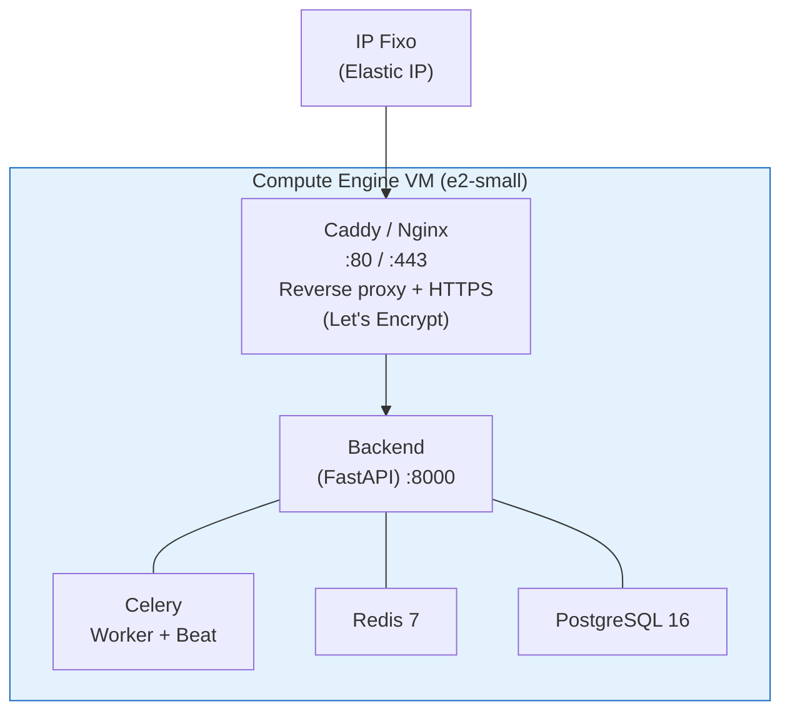
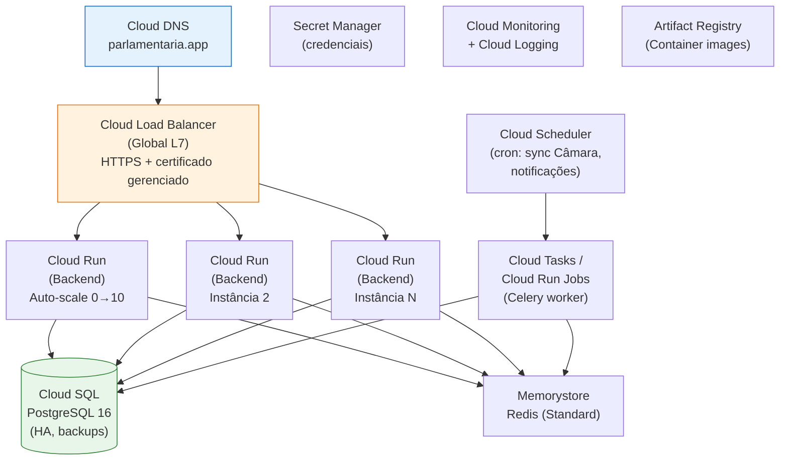

# Parlamentaria — Guia de Deploy

> Documentação completa para deploy da plataforma Parlamentaria em três cenários:
> desenvolvimento local, VM única no Google Cloud e produção escalável no GCP.

---

## Índice

1. [Deploy Local (Desenvolvimento)](#1-deploy-local-desenvolvimento)
2. [Deploy em VM Google Cloud (Staging / MVP)](#2-deploy-em-vm-google-cloud-staging--mvp)
3. [Deploy Produção Escalável (GCP)](#3-deploy-produção-escalável-gcp)
4. [Referência de Variáveis de Ambiente](#4-referência-de-variáveis-de-ambiente)
5. [Checklist Pré-Deploy](#5-checklist-pré-deploy)

---

## 1. Deploy Local (Desenvolvimento)

### 1.1 Pré-requisitos

| Software           | Versão Mínima | Instalação (macOS)                |
|--------------------|---------------|-----------------------------------|
| Docker Engine      | 24+           | `brew install --cask docker`      |
| Docker Compose     | 2.20+         | Incluído no Docker Desktop        |
| Python             | 3.12+         | `brew install python@3.12`        |
| Git                | 2.40+         | `brew install git`                |
| make (opcional)    | qualquer      | Xcode Command Line Tools          |

### 1.2 Setup Inicial

```bash
# 1. Clonar o repositório
git clone git@github.com:<org>/parlamentaria.git
cd parlamentaria

# 2. Copiar e configurar variáveis de ambiente
cp .env.example .env
# Edite .env com suas chaves (GOOGLE_API_KEY, TELEGRAM_BOT_TOKEN, etc.)

# 3. Criar virtualenv do backend (para IDE/linting/testes)
cd backend
python3.12 -m venv .venv
source .venv/bin/activate
pip install -e ".[dev]"
cd ..
```

### 1.3 Subir com Docker Compose

```bash
# Subir todos os serviços (backend, db, redis, celery-worker, celery-beat)
docker compose up --build

# Ou em background:
docker compose up --build -d

# Verificar logs:
docker compose logs -f backend
docker compose logs -f celery-worker
```

**Serviços disponíveis após startup:**

| Serviço        | URL / Porta                  | Descrição                          |
|----------------|------------------------------|------------------------------------|
| Backend API    | http://localhost:8000        | FastAPI + Swagger (`/docs`)        |
| Health Check   | http://localhost:8000/health | Status da aplicação                |
| PostgreSQL     | localhost:5432               | Banco de dados                     |
| Redis          | localhost:6379               | Cache + broker Celery              |

### 1.4 Migrations do Banco

```bash
# Executar dentro do container backend ou com virtualenv ativo:
cd backend
alembic upgrade head
```

Ou via Docker:

```bash
docker compose exec backend alembic upgrade head
```

### 1.5 Executar Testes

```bash
cd backend
source .venv/bin/activate

# Rodar todos os testes com cobertura
pytest --cov=app --cov-report=term-missing --cov-fail-under=75

# Apenas testes unitários
pytest -m unit

# Apenas testes de integração
pytest -m integration
```

### 1.6 Telegram Bot (Desenvolvimento)

Para testar o bot Telegram localmente, utilize um túnel HTTPS:

```bash
# Opção 1: ngrok
ngrok http 8000
# Copie a URL HTTPS gerada e configure no .env:
# TELEGRAM_WEBHOOK_URL=https://<id>.ngrok-free.app/webhook/telegram

# Opção 2: cloudflared (Cloudflare Tunnel)
cloudflared tunnel --url http://localhost:8000
```

Após configurar a URL, reinicie o backend para que o webhook seja registrado automaticamente no startup.

### 1.7 Comandos Úteis

```bash
# Parar tudo
docker compose down

# Parar e remover volumes (reset completo do banco)
docker compose down -v

# Rebuild de um serviço específico
docker compose up --build backend

# Shell interativo no container
docker compose exec backend bash

# Verificar logs do Celery
docker compose logs -f celery-worker celery-beat
```

---

## 2. Deploy em VM Google Cloud (Staging / MVP)

Cenário ideal para **validação inicial**, staging, ou rodar o MVP com custo mínimo. Tudo em uma única VM com Docker Compose.

### 2.1 Arquitetura



### 2.2 Especificação da VM Mínima

| Recurso        | Mínimo (MVP)           | Recomendado (Staging)   |
|----------------|------------------------|-------------------------|
| **Tipo**       | `e2-small`             | `e2-medium`             |
| **vCPUs**      | 2 (shared)             | 2 (shared)              |
| **RAM**        | 2 GB                   | 4 GB                    |
| **Disco**      | 20 GB SSD (pd-balanced)| 40 GB SSD (pd-balanced) |
| **SO**         | Ubuntu 24.04 LTS       | Ubuntu 24.04 LTS        |
| **Região**     | `southamerica-east1` (SP) | `southamerica-east1`  |

### 2.3 Estimativa de Custo Mensal (GCP — Março 2026)

> Preços estimados para a região `southamerica-east1` (São Paulo).
> Valores em USD, sujeitos a variações. Consulte a [calculadora GCP](https://cloud.google.com/products/calculator) para cotação atualizada.

#### Cenário MVP (Mínimo Absoluto)

| Recurso                        | Spec                  | Custo/mês (USD) |
|--------------------------------|-----------------------|------------------|
| Compute Engine `e2-small`      | 2 vCPU shared, 2 GB  | ~$15             |
| Disco pd-balanced 20 GB        | SSD                   | ~$2              |
| IP externo estático            | 1 IP                  | ~$3              |
| Tráfego de saída               | ~10 GB estimado       | ~$1              |
| **Total MVP**                  |                       | **~$21/mês**     |

#### Cenário Staging (Recomendado)

| Recurso                        | Spec                  | Custo/mês (USD) |
|--------------------------------|-----------------------|------------------|
| Compute Engine `e2-medium`     | 2 vCPU shared, 4 GB  | ~$27             |
| Disco pd-balanced 40 GB        | SSD                   | ~$4              |
| IP externo estático            | 1 IP                  | ~$3              |
| Tráfego de saída               | ~30 GB estimado       | ~$3              |
| Cloud SQL PostgreSQL (micro)   | db-f1-micro, 10 GB   | ~$10 (opcional)  |
| Memorystore Redis (basic, 1GB) | M1 basic              | ~$35 (opcional)  |
| **Total (tudo na VM)**         |                       | **~$37/mês**     |
| **Total (serviços gerenciados)**|                      | **~$82/mês**     |

> **Dica**: Para MVP, rode PostgreSQL e Redis dentro da mesma VM via Docker Compose. Migre para serviços gerenciados (Cloud SQL, Memorystore) quando precisar de backups automáticos e alta disponibilidade.

#### Créditos Gratuitos

- Google Cloud oferece **$300 em créditos** para novas contas (válido por 90 dias).
- O free tier inclui uma instância `e2-micro` (1 vCPU, 1 GB) gratuita em `us-*` — insuficiente para produção, mas útil para testes.

### 2.4 Passo a Passo — Provisionamento da VM

```bash
# 1. Instalar gcloud CLI (se necessário)
# https://cloud.google.com/sdk/docs/install

# 2. Autenticar e selecionar projeto
gcloud auth login
gcloud config set project SEU_PROJETO_ID

# 3. Criar IP estático
gcloud compute addresses create parlamentaria-ip \
  --region=southamerica-east1

# 4. Exibir o IP alocado
gcloud compute addresses describe parlamentaria-ip \
  --region=southamerica-east1 --format="get(address)"

# 5. Criar a VM
gcloud compute instances create parlamentaria-vm \
  --zone=southamerica-east1-a \
  --machine-type=e2-small \
  --image-family=ubuntu-2404-lts-amd64 \
  --image-project=ubuntu-os-cloud \
  --boot-disk-size=20GB \
  --boot-disk-type=pd-balanced \
  --address=parlamentaria-ip \
  --tags=http-server,https-server \
  --metadata=startup-script='#!/bin/bash
    apt-get update
    apt-get install -y docker.io docker-compose-v2
    systemctl enable docker
    usermod -aG docker $USER'

# 6. Criar regras de firewall (se não existirem)
gcloud compute firewall-rules create allow-http \
  --allow=tcp:80 --target-tags=http-server
gcloud compute firewall-rules create allow-https \
  --allow=tcp:443 --target-tags=https-server
```

### 2.5 Deploy na VM

```bash
# 1. Conectar via SSH
gcloud compute ssh parlamentaria-vm --zone=southamerica-east1-a

# 2. Clonar o repositório
git clone git@github.com:<org>/parlamentaria.git
cd parlamentaria

# 3. Configurar .env de produção
cp .env.example .env
nano .env
# Configure:
#   APP_ENV=staging
#   APP_DEBUG=false
#   DATABASE_URL=postgresql+asyncpg://parlamentaria:<SENHA_FORTE>@db:5432/parlamentaria
#   GOOGLE_API_KEY=<sua-api-key>
#   TELEGRAM_BOT_TOKEN=<seu-token>
#   TELEGRAM_WEBHOOK_URL=https://SEU_DOMINIO/webhook/telegram
#   TELEGRAM_WEBHOOK_SECRET=<random-32-chars>
#   ADMIN_API_KEY=<random-64-chars>
```

### 2.6 Arquivo docker-compose.prod.yml

Crie um override para produção na VM:

```yaml
# docker-compose.prod.yml
services:
  backend:
    command: >
      gunicorn app.main:app
      -w 2
      -k uvicorn.workers.UvicornWorker
      --bind 0.0.0.0:8000
      --access-logfile -
      --error-logfile -
    restart: always
    volumes: []  # Sem bind mounts em produção

  caddy:
    image: caddy:2-alpine
    restart: always
    ports:
      - "80:80"
      - "443:443"
    volumes:
      - ./Caddyfile:/etc/caddy/Caddyfile
      - caddy_data:/data
      - caddy_config:/config
    depends_on:
      - backend

  celery-worker:
    command: celery -A app.tasks worker -l warning --concurrency=2
    restart: always
    volumes: []

  celery-beat:
    command: celery -A app.tasks beat -l warning --schedule=/tmp/celerybeat-schedule
    restart: always
    volumes: []

  db:
    environment:
      POSTGRES_PASSWORD: "${POSTGRES_PASSWORD:-ALTERE_ESTA_SENHA}"
    volumes:
      - pgdata:/var/lib/postgresql/data
    restart: always

  redis:
    restart: always

volumes:
  caddy_data:
  caddy_config:
```

### 2.7 Caddyfile (HTTPS Automático)

```
# Caddyfile
SEU_DOMINIO.com {
    reverse_proxy backend:8000

    # Headers de segurança
    header {
        X-Content-Type-Options nosniff
        X-Frame-Options DENY
        Referrer-Policy strict-origin-when-cross-origin
    }

    # Logs
    log {
        output stdout
    }
}
```

> **Caddy** obtém e renova certificados HTTPS automaticamente via Let's Encrypt. Zero configuração de TLS manual.

### 2.8 Iniciar em Produção

```bash
# Build e start com o override de produção
docker compose -f docker-compose.yaml -f docker-compose.prod.yml up --build -d

# Executar migrations
docker compose exec backend alembic upgrade head

# Verificar health
curl https://SEU_DOMINIO.com/health

# Verificar logs
docker compose logs -f backend
docker compose logs -f celery-worker
```

### 2.9 Manutenção na VM

```bash
# Atualizar código
cd parlamentaria
git pull origin main

# Rebuild e restart (zero-downtime não garantido em VM única)
docker compose -f docker-compose.yaml -f docker-compose.prod.yml up --build -d

# Backup do PostgreSQL
docker compose exec db pg_dump -U parlamentaria parlamentaria > backup_$(date +%Y%m%d).sql

# Restaurar backup
cat backup_20260301.sql | docker compose exec -T db psql -U parlamentaria parlamentaria

# Monitorar recursos da VM
htop
docker stats
```

### 2.10 DNS e Domínio

1. Registre um domínio ou use um subdomínio existente.
2. Crie um registro **A** apontando para o IP estático da VM.
3. Aguarde propagação DNS (pode levar até 48h, geralmente minutos).
4. O Caddy detecta automaticamente e emite o certificado HTTPS.

---

## 3. Deploy Produção Escalável (GCP)

Arquitetura para produção com alta disponibilidade, auto-scaling e serviços gerenciados.

### 3.1 Visão Geral da Arquitetura



### 3.2 Componentes e Serviços GCP

| Componente              | Serviço GCP                 | Justificativa                                    |
|-------------------------|-----------------------------|--------------------------------------------------|
| **Backend API**         | Cloud Run                   | Serverless, auto-scale, billing por uso          |
| **Banco de Dados**      | Cloud SQL (PostgreSQL 16)   | HA, backups automáticos, réplicas de leitura     |
| **Cache/Broker**        | Memorystore (Redis)         | Gerenciado, alta performance, sem manutenção     |
| **Workers (Celery)**    | Cloud Run Jobs              | Execução sob demanda, sem custo ocioso           |
| **Scheduler (Beat)**    | Cloud Scheduler             | Cron gerenciado, dispara Cloud Run Jobs          |
| **Load Balancer**       | Cloud Load Balancing (L7)   | HTTPS, certificado gerenciado, CDN integrada     |
| **DNS**                 | Cloud DNS                   | Gerenciado, latência baixa, DNSSEC              |
| **Secrets**             | Secret Manager              | Rotação de chaves, sem .env em produção          |
| **Container Registry**  | Artifact Registry           | Imagens Docker privadas no GCP                   |
| **Monitoramento**       | Cloud Monitoring + Logging  | Alertas, dashboards, logs centralizados          |
| **CDN (opcional)**      | Cloud CDN                   | Cache de RSS Feed na edge                        |

### 3.3 Estimativa de Custo Mensal (Produção)

> Preços para `southamerica-east1` (São Paulo). Valores em USD.
> Estimativa baseada em **1.000 a 10.000 eleitores ativos** e **~500K requests/mês**.

#### Cenário Produção Base

| Recurso                           | Spec                              | Custo/mês (USD) |
|-----------------------------------|-----------------------------------|------------------|
| Cloud Run (Backend)               | 2 instâncias mín, 0.5 vCPU, 512MB| ~$30–50          |
| Cloud Run Jobs (Workers)          | ~2.000 execuções/mês              | ~$5–10           |
| Cloud SQL PostgreSQL              | db-custom-1-3840, 20GB SSD, HA   | ~$80–110         |
| Memorystore Redis                 | Basic 1GB (M1)                    | ~$35             |
| Cloud Load Balancer               | Global L7                         | ~$18 + $0.008/GB |
| Cloud DNS                         | 1 zona                            | ~$0.50           |
| Artifact Registry                 | ~5 GB armazenamento               | ~$1              |
| Secret Manager                    | ~20 secrets, ~10K acessos         | ~$1              |
| Cloud Scheduler                   | 3 jobs                            | Gratuito (< 3)   |
| Cloud Monitoring                  | Métricas + alertas básicos        | Gratuito*        |
| Cloud Logging                     | ~5 GB/mês                         | ~$2.50           |
| Tráfego de saída                  | ~50 GB                            | ~$6              |
| **Total Produção Base**           |                                   | **~$180–245/mês**|

#### Cenário Produção Escalada (50K+ eleitores)

| Recurso                           | Spec                              | Custo/mês (USD) |
|-----------------------------------|-----------------------------------|------------------|
| Cloud Run (Backend)               | 3–10 instâncias, 1 vCPU, 1GB     | ~$80–200         |
| Cloud Run Jobs (Workers)          | ~10.000 execuções/mês             | ~$20–40          |
| Cloud SQL PostgreSQL              | db-custom-2-7680, 100GB SSD, HA  | ~$200–300        |
| Memorystore Redis                 | Standard 2GB (HA)                 | ~$110            |
| Cloud Load Balancer               | Global L7 + Cloud CDN             | ~$25 + tráfego   |
| Cloud Logging                     | ~20 GB/mês                        | ~$10             |
| Tráfego de saída                  | ~200 GB                           | ~$24             |
| **Total Produção Escalada**       |                                   | **~$470–710/mês**|

> *Cloud Monitoring: primeiras 150MB de métricas e alertas são gratuitas.

### 3.4 Setup Inicial — Projeto GCP

```bash
# 1. Criar projeto
gcloud projects create parlamentaria-prod --name="Parlamentaria"
gcloud config set project parlamentaria-prod

# 2. Habilitar billing
gcloud billing accounts list
gcloud billing projects link parlamentaria-prod --billing-account=BILLING_ACCOUNT_ID

# 3. Habilitar APIs necessárias
gcloud services enable \
  run.googleapis.com \
  sql-component.googleapis.com \
  sqladmin.googleapis.com \
  redis.googleapis.com \
  secretmanager.googleapis.com \
  artifactregistry.googleapis.com \
  cloudscheduler.googleapis.com \
  compute.googleapis.com \
  dns.googleapis.com \
  monitoring.googleapis.com \
  logging.googleapis.com
```

### 3.5 Artifact Registry (Container Images)

```bash
# Criar repositório
gcloud artifacts repositories create parlamentaria \
  --repository-format=docker \
  --location=southamerica-east1 \
  --description="Imagens Docker da Parlamentaria"

# Configurar Docker auth
gcloud auth configure-docker southamerica-east1-docker.pkg.dev

# Build e push
docker build -t southamerica-east1-docker.pkg.dev/parlamentaria-prod/parlamentaria/backend:latest ./backend
docker push southamerica-east1-docker.pkg.dev/parlamentaria-prod/parlamentaria/backend:latest
```

### 3.6 Cloud SQL (PostgreSQL)

```bash
# Criar instância
gcloud sql instances create parlamentaria-db \
  --database-version=POSTGRES_16 \
  --tier=db-custom-1-3840 \
  --region=southamerica-east1 \
  --availability-type=REGIONAL \
  --storage-type=SSD \
  --storage-size=20GB \
  --storage-auto-increase \
  --backup-start-time=03:00 \
  --enable-bin-log \
  --maintenance-window-day=SUN \
  --maintenance-window-hour=04

# Criar banco e usuário
gcloud sql databases create parlamentaria --instance=parlamentaria-db
gcloud sql users create parlamentaria \
  --instance=parlamentaria-db \
  --password="GERE_SENHA_FORTE_AQUI"
```

### 3.7 Memorystore (Redis)

```bash
gcloud redis instances create parlamentaria-redis \
  --size=1 \
  --region=southamerica-east1 \
  --redis-version=redis_7_0 \
  --tier=BASIC
```

### 3.8 Secret Manager

```bash
# Criar secrets
echo -n "SUA_GOOGLE_API_KEY" | gcloud secrets create google-api-key --data-file=-
echo -n "SEU_TELEGRAM_BOT_TOKEN" | gcloud secrets create telegram-bot-token --data-file=-
echo -n "SENHA_DB_FORTE" | gcloud secrets create db-password --data-file=-
echo -n "$(openssl rand -hex 16)" | gcloud secrets create telegram-webhook-secret --data-file=-
echo -n "$(openssl rand -hex 32)" | gcloud secrets create admin-api-key --data-file=-

# Listar secrets
gcloud secrets list
```

### 3.9 Cloud Run (Backend)

```bash
# Deploy do backend
gcloud run deploy parlamentaria-backend \
  --image=southamerica-east1-docker.pkg.dev/parlamentaria-prod/parlamentaria/backend:latest \
  --region=southamerica-east1 \
  --platform=managed \
  --allow-unauthenticated \
  --port=8000 \
  --cpu=1 \
  --memory=512Mi \
  --min-instances=1 \
  --max-instances=10 \
  --concurrency=80 \
  --timeout=60 \
  --set-env-vars="APP_ENV=production,APP_DEBUG=false,LOG_LEVEL=WARNING" \
  --set-env-vars="CAMARA_API_BASE_URL=https://dadosabertos.camara.leg.br/api/v2" \
  --set-env-vars="AGENT_MODEL=gemini-2.0-flash" \
  --set-secrets="GOOGLE_API_KEY=google-api-key:latest" \
  --set-secrets="TELEGRAM_BOT_TOKEN=telegram-bot-token:latest" \
  --set-secrets="TELEGRAM_WEBHOOK_SECRET=telegram-webhook-secret:latest" \
  --set-secrets="ADMIN_API_KEY=admin-api-key:latest" \
  --add-cloudsql-instances=parlamentaria-prod:southamerica-east1:parlamentaria-db \
  --vpc-connector=parlamentaria-vpc-connector
```

> **Nota**: Para conectar ao Cloud SQL e Memorystore, é necessário configurar um **VPC Connector**:

```bash
# Criar VPC Connector (necessário para Cloud Run acessar Memorystore)
gcloud compute networks vpc-access connectors create parlamentaria-vpc-connector \
  --region=southamerica-east1 \
  --range=10.8.0.0/28
```

### 3.10 Cloud Run Jobs (Celery Workers)

Para substituir o Celery em Cloud Run, há duas abordagens:

#### Opção A: Cloud Run Jobs + Cloud Scheduler (recomendado)

```bash
# Job de sincronização com a Câmara (executa a cada 15 min)
gcloud run jobs create sync-camara \
  --image=southamerica-east1-docker.pkg.dev/parlamentaria-prod/parlamentaria/backend:latest \
  --region=southamerica-east1 \
  --cpu=1 \
  --memory=512Mi \
  --max-retries=2 \
  --task-timeout=300 \
  --set-env-vars="APP_ENV=production" \
  --set-secrets="GOOGLE_API_KEY=google-api-key:latest" \
  --command="python","-m","app.tasks.run_sync"

# Scheduler para disparar o job
gcloud scheduler jobs create http sync-camara-schedule \
  --location=southamerica-east1 \
  --schedule="*/15 * * * *" \
  --uri="https://southamerica-east1-run.googleapis.com/apis/run.googleapis.com/v1/namespaces/parlamentaria-prod/jobs/sync-camara:run" \
  --http-method=POST \
  --oauth-service-account-email=SA_EMAIL
```

#### Opção B: Cloud Run com Celery (mais simples migração)

Deploy do worker como um Cloud Run Service always-on:

```bash
gcloud run deploy parlamentaria-worker \
  --image=southamerica-east1-docker.pkg.dev/parlamentaria-prod/parlamentaria/backend:latest \
  --region=southamerica-east1 \
  --no-allow-unauthenticated \
  --cpu=1 \
  --memory=512Mi \
  --min-instances=1 \
  --max-instances=3 \
  --command="celery","-A","app.tasks","worker","-l","warning","--concurrency=2" \
  --set-env-vars="APP_ENV=production" \
  --vpc-connector=parlamentaria-vpc-connector
```

### 3.11 Cloud DNS

```bash
# Criar zona DNS
gcloud dns managed-zones create parlamentaria-zone \
  --dns-name="parlamentaria.app." \
  --description="Zona DNS da Parlamentaria"

# Adicionar registro A (após obter IP do Load Balancer)
gcloud dns record-sets create parlamentaria.app. \
  --zone=parlamentaria-zone \
  --type=A \
  --ttl=300 \
  --rrdatas=IP_DO_LOAD_BALANCER
```

### 3.12 CI/CD com GitHub Actions

Crie `.github/workflows/deploy.yml`:

```yaml
name: Deploy to GCP

on:
  push:
    branches: [main]

env:
  PROJECT_ID: parlamentaria-prod
  REGION: southamerica-east1
  REPO: parlamentaria
  IMAGE: backend

jobs:
  test:
    runs-on: ubuntu-latest
    steps:
      - uses: actions/checkout@v4
      - uses: actions/setup-python@v5
        with:
          python-version: "3.12"
      - name: Install dependencies
        run: |
          cd backend
          pip install -e ".[dev]"
      - name: Lint
        run: cd backend && ruff check .
      - name: Test
        run: |
          cd backend
          pytest --cov=app --cov-fail-under=75

  deploy:
    needs: test
    runs-on: ubuntu-latest
    permissions:
      contents: read
      id-token: write
    steps:
      - uses: actions/checkout@v4

      - id: auth
        uses: google-github-actions/auth@v2
        with:
          workload_identity_provider: ${{ secrets.WIF_PROVIDER }}
          service_account: ${{ secrets.WIF_SERVICE_ACCOUNT }}

      - uses: google-github-actions/setup-gcloud@v2

      - name: Configure Docker
        run: gcloud auth configure-docker ${{ env.REGION }}-docker.pkg.dev

      - name: Build & Push
        run: |
          IMAGE_TAG="${{ env.REGION }}-docker.pkg.dev/${{ env.PROJECT_ID }}/${{ env.REPO }}/${{ env.IMAGE }}"
          docker build -t ${IMAGE_TAG}:${{ github.sha }} -t ${IMAGE_TAG}:latest ./backend
          docker push ${IMAGE_TAG}:${{ github.sha }}
          docker push ${IMAGE_TAG}:latest

      - name: Deploy to Cloud Run
        run: |
          gcloud run deploy parlamentaria-backend \
            --image=${{ env.REGION }}-docker.pkg.dev/${{ env.PROJECT_ID }}/${{ env.REPO }}/${{ env.IMAGE }}:${{ github.sha }} \
            --region=${{ env.REGION }}

      - name: Run Migrations
        run: |
          gcloud run jobs execute run-migrations \
            --region=${{ env.REGION }} \
            --wait
```

### 3.13 Monitoramento e Alertas

```bash
# Criar política de alertas — latência alta do backend
gcloud alpha monitoring policies create \
  --display-name="Backend Latência P95 > 2s" \
  --condition-display-name="Cloud Run latência alta" \
  --condition-filter='resource.type="cloud_run_revision" AND metric.type="run.googleapis.com/request_latencies"' \
  --condition-threshold-value=2000 \
  --condition-threshold-duration=300s \
  --notification-channels=CHANNEL_ID

# Criar uptime check
gcloud monitoring uptime create parlamentaria-health \
  --display-name="Parlamentaria Health Check" \
  --resource-type=uptime-url \
  --hostname=parlamentaria.app \
  --path=/health \
  --check-interval=60s
```

### 3.14 Segurança em Produção

| Item                          | Implementação                                          |
|-------------------------------|--------------------------------------------------------|
| **Secrets**                   | Secret Manager — nunca `.env` em produção              |
| **HTTPS**                     | Certificado gerenciado via Load Balancer               |
| **IAM**                       | Principle of Least Privilege — SA dedicada por serviço |
| **VPC**                       | Cloud Run via VPC Connector, sem IPs públicos internos |
| **WAF (opcional)**            | Cloud Armor policies no Load Balancer                  |
| **Audit Logging**             | Cloud Audit Logs habilitado no projeto                 |
| **Vulnerability Scanning**    | Artifact Registry scan automático de containers        |
| **Backup do Banco**           | Cloud SQL automated backups + PITR                     |
| **Rate Limiting**             | slowapi no backend + Cloud Armor (L7)                  |

### 3.15 Scaling Automático

O Cloud Run escala automaticamente baseado em métricas de concorrência:

```
Configuração recomendada:
├── min-instances: 1          # Evita cold start
├── max-instances: 10         # Limite de custo
├── concurrency: 80           # Requests simultâneos por instância
├── cpu: 1                    # 1 vCPU por instância
├── memory: 512Mi             # 512 MB RAM
└── timeout: 60s              # Timeout máximo por request
```

**Quando escalar manualmente:**
- `max-instances`: aumente conforme crescer a base de eleitores.
- `min-instances`: aumente para 2+ se latência de cold start for problema.
- `memory`: aumente para 1Gi se análises IA consumirem mais memória.
- Cloud SQL: migre para `db-custom-2-7680` quando queries ficarem lentas.
- Memorystore: migre para Standard (HA) quando cache for crítico.

---

## 4. Referência de Variáveis de Ambiente

| Variável                             | Dev (local)           | VM (staging)                  | Produção (Cloud Run)          |
|--------------------------------------|-----------------------|-------------------------------|-------------------------------|
| `APP_ENV`                            | `development`         | `staging`                     | `production`                  |
| `APP_DEBUG`                          | `true`                | `false`                       | `false`                       |
| `LOG_LEVEL`                          | `DEBUG`               | `INFO`                        | `WARNING`                     |
| `DATABASE_URL`                       | `...@localhost:5432/` | `...@db:5432/`                | `...@/cloudsql/INSTANCE`      |
| `REDIS_URL`                          | `redis://localhost`   | `redis://redis:6379`          | `redis://MEMORYSTORE_IP`      |
| `GOOGLE_API_KEY`                     | `.env`                | `.env`                        | Secret Manager                |
| `TELEGRAM_BOT_TOKEN`                 | `.env`                | `.env`                        | Secret Manager                |
| `TELEGRAM_WEBHOOK_URL`               | ngrok URL             | `https://dominio.com/...`     | `https://parlamentaria.app/...`|
| `TELEGRAM_WEBHOOK_SECRET`            | `.env`                | `.env`                        | Secret Manager                |
| `ADMIN_API_KEY`                      | `.env`                | `.env`                        | Secret Manager                |

---

## 5. Checklist Pré-Deploy

### Desenvolvimento Local

- [ ] Docker e Docker Compose instalados
- [ ] `.env` configurado a partir de `.env.example`
- [ ] `docker compose up --build` sobe sem erros
- [ ] `curl localhost:8000/health` retorna `200`
- [ ] Migrations executadas (`alembic upgrade head`)
- [ ] Testes passando (`pytest --cov-fail-under=75`)

### Staging (VM)

- [ ] VM criada com IP estático
- [ ] Docker instalado na VM
- [ ] Código clonado e `.env` configurado
- [ ] Caddy/Nginx configurado com domínio
- [ ] HTTPS funcionando (certificado emitido)
- [ ] Telegram webhook registrado e respondendo
- [ ] Backup do PostgreSQL configurado (manual ou script cron)
- [ ] Monitoramento básico (`docker stats`, logs)

### Produção (GCP)

- [ ] Projeto GCP criado com billing ativo
- [ ] APIs necessárias habilitadas
- [ ] Artifact Registry com imagem latest
- [ ] Cloud SQL provisionado com backups automáticos
- [ ] Memorystore provisionado
- [ ] Secret Manager com todas as credenciais
- [ ] VPC Connector configurado
- [ ] Cloud Run deployado e respondendo
- [ ] Load Balancer com certificado HTTPS gerenciado
- [ ] DNS configurado e propagado
- [ ] CI/CD (GitHub Actions) funcionando
- [ ] Uptime check + alertas configurados
- [ ] Migrations executadas em produção
- [ ] Telegram webhook apontando para domínio de produção
- [ ] Teste end-to-end: enviar mensagem no Telegram → receber resposta

---

## Resumo Comparativo

| Aspecto               | Local (Dev)       | VM (Staging/MVP)    | Produção (GCP)        |
|-----------------------|-------------------|---------------------|-----------------------|
| **Custo**             | $0                | ~$21–37/mês         | ~$180–710/mês         |
| **Escalabilidade**    | N/A               | Vertical (resize VM)| Horizontal (auto)     |
| **Alta Disponibilidade** | N/A            | Não                 | Sim (HA, multi-zona)  |
| **HTTPS**             | ngrok/tunnel      | Caddy (auto)        | LB gerenciado         |
| **Backups**           | Manual            | Manual/cron         | Automático (Cloud SQL)|
| **Monitoramento**     | Logs locais       | docker stats/logs   | Cloud Monitoring      |
| **CI/CD**             | N/A               | Manual (git pull)   | GitHub Actions         |
| **Tempo de setup**    | ~15 min           | ~1 hora             | ~3–4 horas            |
| **Recomendado para**  | Desenvolvimento   | MVP / até ~500 eleitores | 500+ eleitores    |
