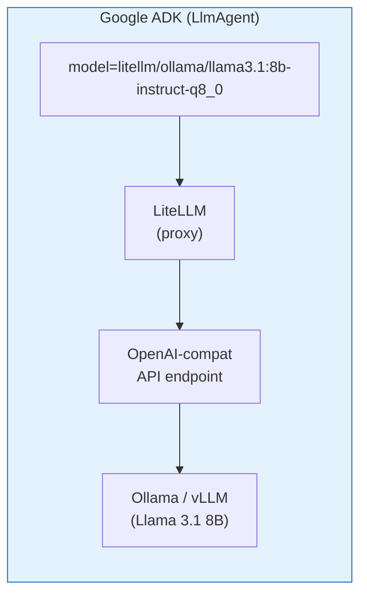
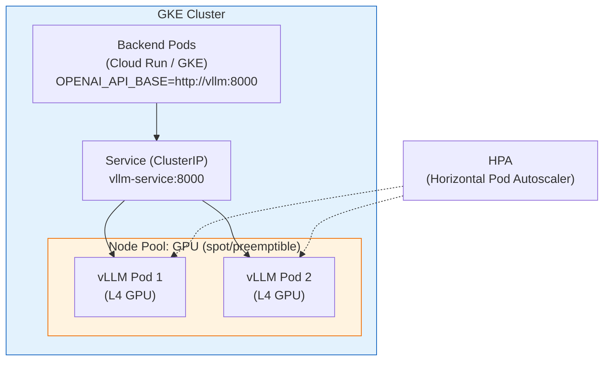

# Parlamentaria — Deploy de LLM (Llama 3.1 8B Instruct)

> Guia para deploy e integração do **Llama 3.1 8B Instruct** como LLM dos agentes
> Parlamentaria via Google ADK, cobrindo desenvolvimento local, VM no GCP e produção.

---

## Índice

1. [Por que Llama 3.1 8B Instruct?](#1-por-que-llama-31-8b-instruct)
2. [Integração com Google ADK](#2-integração-com-google-adk)
3. [Deploy Local (Ollama)](#3-deploy-local-ollama)
4. [Deploy em VM no GCP (Ollama ou vLLM)](#4-deploy-em-vm-no-gcp-ollama-ou-vllm)
5. [Deploy Produção Escalável (Vertex AI / GKE)](#5-deploy-produção-escalável-vertex-ai--gke)
6. [Benchmark e Sizing](#6-benchmark-e-sizing)
7. [Fallback e Estratégia Multi-Model](#7-fallback-e-estratégia-multi-model)
8. [Configuração do Projeto](#8-configuração-do-projeto)

---

## 1. Por que Llama 3.1 8B Instruct?

| Aspecto                  | Avaliação                                                     |
|--------------------------|---------------------------------------------------------------|
| **Capacidade**           | Suficiente para tool-calling, resumos e conversação em pt-BR  |
| **Custo**                | $0 de API — modelo open-weight rodando em infra própria       |
| **Latência**             | Menor que chamadas API remotas (quando self-hosted)           |
| **Privacidade**          | Nenhum dado do eleitor sai da sua infraestrutura              |
| **Tool Calling**         | Llama 3.1 Instruct tem suporte nativo a function calling      |
| **Tamanho**              | 8B parâmetros — roda em GPU consumer ou CPU (quantizado)      |
| **Português**            | Bom desempenho em pt-BR (treinado com dados multilíngues)     |

### Limitações a considerar

- **Reasoning complexo**: para análises legislativas profundas, um modelo 70B+ ou Gemini pode ser superior.
- **Contexto**: janela de 128K tokens, mas qualidade degrada após ~32K em modelos 8B.
- **Alucinações**: taxa um pouco maior que modelos maiores — mitigar com tools obrigatórias (o agente busca dados, não inventa).
- **Velocidade em CPU**: viável para dev, mas lento para produção (use GPU ou quantização agressiva).

---

## 2. Integração com Google ADK

O Google ADK é **model-agnostic**. Ele suporta qualquer LLM que exponha uma API compatível com OpenAI, via **LiteLLM** como wrapper. A integração com Llama funciona assim:



### 2.1 Como o ADK resolve o modelo

O `LlmAgent` do ADK aceita strings de modelo no formato:

| Formato                                      | Provider           | Exemplo                                      |
|----------------------------------------------|--------------------|----------------------------------------------|
| `gemini-2.0-flash`                           | Google Gemini      | API direta Google                            |
| `litellm/ollama/llama3.1:8b-instruct-q8_0`  | Ollama via LiteLLM | Llama rodando local via Ollama               |
| `litellm/ollama_chat/llama3.1:8b-instruct-q8_0` | Ollama via LiteLLM | Alternativa usando endpoint `/chat`      |
| `litellm/openai/llama3.1-8b`                | OpenAI-compat      | Qualquer servidor OpenAI-compatible (vLLM)   |

### 2.2 Dependência necessária

O `litellm` já é dependência transitiva do `google-adk`. Não precisa instalar separadamente. Basta que o ADK detecte o prefixo `litellm/` no `model` e roteia automaticamente.

### 2.3 Variável de ambiente

Basta alterar uma variável para trocar o modelo de **todos** os agentes:

```bash
# .env — trocar de Gemini para Llama local
AGENT_MODEL=litellm/ollama_chat/llama3.1:8b-instruct-q8_0
```

Isso funciona porque todos os agentes usam `model=settings.agent_model`:

```python
# agents/parlamentar/agent.py (já implementado assim)
root_agent = LlmAgent(
    name="ParlamentarAgent",
    model=settings.agent_model,  # ← lê de AGENT_MODEL
    ...
)
```

**Nenhuma alteração de código é necessária.** Apenas configuração de ambiente.

---

## 3. Deploy Local (Ollama)

A forma mais simples de rodar Llama 3.1 8B localmente para desenvolvimento.

### 3.1 Requisitos de Hardware

| Configuração         | RAM     | VRAM GPU  | Velocidade Esperada      |
|----------------------|---------|-----------|--------------------------|
| **CPU only (Q4_K_M)**| 8 GB+  | —         | ~5–10 tokens/s           |
| **CPU only (Q8_0)**  | 12 GB+ | —         | ~3–7 tokens/s            |
| **Apple Silicon (M1+)**| 16 GB | Unified  | ~20–40 tokens/s          |
| **NVIDIA GPU (8GB)** | 16 GB  | 8 GB      | ~40–80 tokens/s          |
| **NVIDIA GPU (16GB)**| 16 GB  | 16 GB     | ~60–100 tokens/s         |

> **Para Mac**: Apple Silicon (M1/M2/M3) com 16 GB de RAM unificada roda Llama 3.1 8B com excelente performance via Ollama nativo (Metal).

### 3.2 Instalar Ollama

```bash
# macOS
brew install ollama

# Linux
curl -fsSL https://ollama.com/install.sh | sh

# Verificar instalação
ollama --version
```

### 3.3 Baixar o modelo

```bash
# Quantização Q8_0 (~8.5 GB) — melhor qualidade
ollama pull llama3.1:8b-instruct-q8_0

# Quantização Q4_K_M (~4.9 GB) — mais leve, qualidade aceitável
ollama pull llama3.1:8b-instruct-q4_K_M

# Verificar modelos instalados
ollama list
```

### 3.4 Iniciar o servidor Ollama

```bash
# Ollama roda como servidor em background na porta 11434
ollama serve

# Testar se está funcionando
curl http://localhost:11434/api/tags
```

> **macOS**: se instalou via `brew`, o Ollama já inicia automaticamente como serviço.

### 3.5 Configuração para desenvolvimento

```bash
# .env (desenvolvimento com Llama local)
AGENT_MODEL=litellm/ollama_chat/llama3.1:8b-instruct-q8_0
OLLAMA_API_BASE=http://localhost:11434

# Se usar quantização menor:
# AGENT_MODEL=litellm/ollama_chat/llama3.1:8b-instruct-q4_K_M
```

### 3.6 Testar a integração

```bash
# 1. Verificar se Ollama está rodando
curl http://localhost:11434/api/tags | python -m json.tool

# 2. Testar inferência direto no Ollama
curl http://localhost:11434/api/chat -d '{
  "model": "llama3.1:8b-instruct-q8_0",
  "messages": [{"role": "user", "content": "O que é uma PEC?"}],
  "stream": false
}'

# 3. Subir o projeto e testar via chat
docker compose up --build
# Teste via /docs ou Telegram
```

### 3.7 Docker Compose com Ollama

Para rodar tudo containerizado (incluindo Ollama):

```yaml
# docker-compose.llama.yml — Override para Llama local
services:
  ollama:
    image: ollama/ollama:latest
    ports:
      - "11434:11434"
    volumes:
      - ollama_data:/root/.ollama
    # Para GPU NVIDIA, descomente:
    # deploy:
    #   resources:
    #     reservations:
    #       devices:
    #         - driver: nvidia
    #           count: 1
    #           capabilities: [gpu]
    healthcheck:
      test: ["CMD", "curl", "-f", "http://localhost:11434/api/tags"]
      interval: 10s
      timeout: 5s
      retries: 5

  # Serviço init para baixar o modelo automaticamente
  ollama-pull:
    image: ollama/ollama:latest
    depends_on:
      ollama:
        condition: service_healthy
    entrypoint: ["ollama", "pull", "llama3.1:8b-instruct-q8_0"]
    environment:
      - OLLAMA_HOST=http://ollama:11434
    restart: "no"

  backend:
    environment:
      - AGENT_MODEL=litellm/ollama_chat/llama3.1:8b-instruct-q8_0
      - OLLAMA_API_BASE=http://ollama:11434
    depends_on:
      ollama:
        condition: service_healthy

volumes:
  ollama_data:
```

**Uso:**

```bash
# Subir tudo com Llama
docker compose -f docker-compose.yml -f docker-compose.llama.yml up --build

# Primeira vez: aguarde o download do modelo (~8.5 GB)
docker compose -f docker-compose.yml -f docker-compose.llama.yml logs -f ollama-pull
```

---

## 4. Deploy em VM no GCP (Ollama ou vLLM)

Para staging ou MVP rodando Llama na própria VM.

### 4.1 Escolha: Ollama vs vLLM

| Critério              | Ollama                          | vLLM                             |
|-----------------------|---------------------------------|----------------------------------|
| **Facilidade**        | Muito fácil — binário único     | Moderada — requer setup Python   |
| **Performance**       | Boa — otimizado para inference  | Excelente — batching, PagedAttn  |
| **API**               | Proprietária + OpenAI-compat    | OpenAI-compatible nativa         |
| **Concorrência**      | Limitada — 1 request por vez*   | Alta — continuous batching       |
| **Recomendado**       | Dev, staging, poucos usuários   | Produção, muitos usuários        |

> *Ollama a partir da v0.4+ suporta paralelismo limitado via `OLLAMA_NUM_PARALLEL`.

**Recomendação**: Ollama para staging/MVP, vLLM para produção com 100+ usuários simultâneos.

### 4.2 Tipos de VM para Llama 3.1 8B

#### Opção A: Somente CPU (mínimo viável)

| Recurso        | Spec                              | Custo/mês (USD) |
|----------------|-----------------------------------|------------------|
| **Tipo VM**    | `e2-standard-4` (4 vCPU, 16 GB)  | ~$100            |
| **Disco**      | 50 GB pd-balanced                 | ~$5              |
| **Quantização**| Q4_K_M (~4.9 GB)                 | —                |
| **Performance**| ~5–10 tokens/s                    | —                |
| **Total**      |                                   | **~$105/mês**    |

> CPU-only é viável para MVP com poucos eleitores (<50 simultâneos), mas a latência será de 5–15 segundos por resposta.

#### Opção B: GPU NVIDIA T4 (recomendado para staging)

| Recurso        | Spec                              | Custo/mês (USD) |
|----------------|-----------------------------------|------------------|
| **Tipo VM**    | `n1-standard-4` + T4 GPU         | ~$230            |
| **GPU**        | NVIDIA T4 (16 GB VRAM)           | (incluso acima)  |
| **Disco**      | 50 GB pd-balanced                 | ~$5              |
| **Quantização**| Q8_0 (8.5 GB) ou FP16 (16 GB)   | —                |
| **Performance**| ~40-80 tokens/s (Q8_0)           | —                |
| **Total**      |                                   | **~$235/mês**    |

#### Opção C: GPU NVIDIA L4 (melhor custo-benefício)

| Recurso        | Spec                              | Custo/mês (USD) |
|----------------|-----------------------------------|------------------|
| **Tipo VM**    | `g2-standard-4` + L4 GPU         | ~$270            |
| **GPU**        | NVIDIA L4 (24 GB VRAM)           | (incluso acima)  |
| **Disco**      | 50 GB pd-balanced                 | ~$5              |
| **Quantização**| FP16 (16 GB) — sem perda         | —                |
| **Performance**| ~60-100 tokens/s                  | —                |
| **Total**      |                                   | **~$275/mês**    |

#### Resumo: VM + Backend juntos

Considerando que a VM roda Ollama/vLLM **e** o Docker Compose do Parlamentaria:

| Cenário              | VM                  | RAM Total | Custo/mês |
|----------------------|---------------------|-----------|-----------|
| **MVP CPU-only**     | `e2-standard-4`     | 16 GB     | ~$105     |
| **Staging GPU T4**   | `n1-standard-4`+T4  | 15 GB     | ~$235     |
| **Staging GPU L4**   | `g2-standard-4`+L4  | 16 GB     | ~$275     |

### 4.3 Provisionar VM com GPU

```bash
# VM com GPU T4 (mais barata com GPU)
gcloud compute instances create parlamentaria-llm \
  --zone=southamerica-east1-a \
  --machine-type=n1-standard-4 \
  --accelerator=type=nvidia-tesla-t4,count=1 \
  --image-family=ubuntu-2404-lts-amd64 \
  --image-project=ubuntu-os-cloud \
  --boot-disk-size=50GB \
  --boot-disk-type=pd-balanced \
  --maintenance-policy=TERMINATE \
  --tags=http-server,https-server \
  --metadata=startup-script='#!/bin/bash
    # Instalar drivers NVIDIA
    apt-get update
    apt-get install -y linux-headers-$(uname -r)
    curl -fsSL https://nvidia.github.io/libnvidia-container/gpgkey | gpg --dearmor -o /usr/share/keyrings/nvidia-container-toolkit-keyring.gpg
    curl -s -L https://nvidia.github.io/libnvidia-container/stable/deb/nvidia-container-toolkit.list | \
      sed "s#deb https://#deb [signed-by=/usr/share/keyrings/nvidia-container-toolkit-keyring.gpg] https://#g" | \
      tee /etc/apt/sources.list.d/nvidia-container-toolkit.list
    apt-get update
    apt-get install -y nvidia-driver-550 nvidia-container-toolkit
    # Instalar Docker
    apt-get install -y docker.io docker-compose-v2
    systemctl enable docker
    nvidia-ctk runtime configure --runtime=docker
    systemctl restart docker
    # Instalar Ollama
    curl -fsSL https://ollama.com/install.sh | sh'
```

Para **VM somente CPU** (mais barata):

```bash
gcloud compute instances create parlamentaria-llm \
  --zone=southamerica-east1-a \
  --machine-type=e2-standard-4 \
  --image-family=ubuntu-2404-lts-amd64 \
  --image-project=ubuntu-os-cloud \
  --boot-disk-size=50GB \
  --boot-disk-type=pd-balanced \
  --tags=http-server,https-server \
  --metadata=startup-script='#!/bin/bash
    apt-get update
    apt-get install -y docker.io docker-compose-v2
    systemctl enable docker
    curl -fsSL https://ollama.com/install.sh | sh'
```

### 4.4 Setup na VM

```bash
# SSH na VM
gcloud compute ssh parlamentaria-llm --zone=southamerica-east1-a

# Verificar GPU (se aplicável)
nvidia-smi

# Baixar modelo
ollama pull llama3.1:8b-instruct-q8_0

# Testar inferência
ollama run llama3.1:8b-instruct-q8_0 "O que é uma PL?"

# Clonar e configurar o projeto
git clone git@github.com:<org>/parlamentaria.git
cd parlamentaria
cp .env.example .env
nano .env  # Configurar AGENT_MODEL e demais variáveis

# Subir com Llama
docker compose -f docker-compose.yml -f docker-compose.llama.yml up --build -d
```

### 4.5 Systemd para Ollama (sem Docker)

Se preferir rodar Ollama nativo na VM ao invés de containerizado:

```bash
# Ollama já instala o systemd service automaticamente
sudo systemctl enable ollama
sudo systemctl start ollama
sudo systemctl status ollama

# Configurar variáveis do Ollama
sudo mkdir -p /etc/systemd/system/ollama.service.d
sudo tee /etc/systemd/system/ollama.service.d/override.conf << 'EOF'
[Service]
Environment="OLLAMA_HOST=0.0.0.0:11434"
Environment="OLLAMA_NUM_PARALLEL=4"
Environment="OLLAMA_MAX_LOADED_MODELS=1"
EOF

sudo systemctl daemon-reload
sudo systemctl restart ollama
```

Nesse caso, no `.env` use:

```bash
AGENT_MODEL=litellm/ollama_chat/llama3.1:8b-instruct-q8_0
OLLAMA_API_BASE=http://localhost:11434
```

### 4.6 Deploy com vLLM (alternativa de alta performance)

Para cenários que exigem maior throughput:

```bash
# Instalar vLLM na VM (requer GPU)
pip install vllm

# Iniciar servidor OpenAI-compatible
python -m vllm.entrypoints.openai.api_server \
  --model meta-llama/Llama-3.1-8B-Instruct \
  --host 0.0.0.0 \
  --port 8080 \
  --max-model-len 8192 \
  --gpu-memory-utilization 0.9 \
  --dtype auto
```

Ou via Docker:

```yaml
# docker-compose.vllm.yml
services:
  vllm:
    image: vllm/vllm-openai:latest
    ports:
      - "8080:8000"
    volumes:
      - hf_cache:/root/.cache/huggingface
    environment:
      - HUGGING_FACE_HUB_TOKEN=${HF_TOKEN}
    command: >
      --model meta-llama/Llama-3.1-8B-Instruct
      --max-model-len 8192
      --gpu-memory-utilization 0.9
    deploy:
      resources:
        reservations:
          devices:
            - driver: nvidia
              count: 1
              capabilities: [gpu]

  backend:
    environment:
      - AGENT_MODEL=litellm/openai/meta-llama/Llama-3.1-8B-Instruct
      - OPENAI_API_BASE=http://vllm:8000/v1
      - OPENAI_API_KEY=not-needed

volumes:
  hf_cache:
```

Configuração `.env` para vLLM:

```bash
AGENT_MODEL=litellm/openai/meta-llama/Llama-3.1-8B-Instruct
OPENAI_API_BASE=http://localhost:8080/v1
OPENAI_API_KEY=not-needed
```

---

## 5. Deploy Produção Escalável (Vertex AI / GKE)

Para produção com escala e alta disponibilidade no GCP.

### 5.1 Opção A: Vertex AI Model Garden (gerenciado)

O Google Cloud oferece Llama 3.1 no **Vertex AI Model Garden** como endpoint gerenciado:

```bash
# Implantar Llama 3.1 8B via Vertex AI Model Garden
gcloud ai endpoints create \
  --region=southamerica-east1 \
  --display-name=parlamentaria-llama

# Deploy do modelo (via Model Garden UI ou API)
# 1. Acesse: console.cloud.google.com > Vertex AI > Model Garden
# 2. Busque "Llama 3.1 8B Instruct"
# 3. Clique "Deploy" → selecione endpoint e máquina
# 4. Tipo recomendado: g2-standard-4 (GPU L4)
```

**Custo estimado Vertex AI:**

| Recurso             | Spec           | Custo/mês (USD) |
|---------------------|----------------|------------------|
| Endpoint com L4     | 1x L4, 4 vCPU | ~$300–400        |
| Prediction requests | Por 1K tokens  | ~$0.0002/1K      |

Configuração para ADK com Vertex AI:

```bash
AGENT_MODEL=litellm/vertex_ai/meta/llama-3.1-8b-instruct
GOOGLE_CLOUD_PROJECT=parlamentaria-prod
VERTEXAI_LOCATION=southamerica-east1
```

### 5.2 Opção B: GKE com vLLM (auto-managed)

Para controle total e melhor custo em escala:



**Kubernetes manifests:**

```yaml
# k8s/vllm-deployment.yaml
apiVersion: apps/v1
kind: Deployment
metadata:
  name: vllm-llama
spec:
  replicas: 1
  selector:
    matchLabels:
      app: vllm-llama
  template:
    metadata:
      labels:
        app: vllm-llama
    spec:
      containers:
        - name: vllm
          image: vllm/vllm-openai:latest
          args:
            - "--model"
            - "meta-llama/Llama-3.1-8B-Instruct"
            - "--max-model-len"
            - "8192"
            - "--gpu-memory-utilization"
            - "0.9"
          ports:
            - containerPort: 8000
          resources:
            limits:
              nvidia.com/gpu: 1
              memory: "16Gi"
            requests:
              nvidia.com/gpu: 1
              memory: "12Gi"
          readinessProbe:
            httpGet:
              path: /health
              port: 8000
            initialDelaySeconds: 120
            periodSeconds: 10
          volumeMounts:
            - name: model-cache
              mountPath: /root/.cache/huggingface
      volumes:
        - name: model-cache
          persistentVolumeClaim:
            claimName: model-cache-pvc
      nodeSelector:
        cloud.google.com/gke-accelerator: nvidia-l4
      tolerations:
        - key: nvidia.com/gpu
          operator: Exists
          effect: NoSchedule
---
apiVersion: v1
kind: Service
metadata:
  name: vllm-service
spec:
  selector:
    app: vllm-llama
  ports:
    - port: 8000
      targetPort: 8000
  type: ClusterIP
```

**Custo GKE com GPU spot:**

| Recurso                     | Spec                | Custo/mês (USD) |
|-----------------------------|---------------------|------------------|
| GKE node pool (GPU L4 spot) | g2-standard-4, spot| ~$80–120         |
| GKE cluster management      | Autopilot/Standard | ~$70             |
| PD para cache do modelo      | 50 GB              | ~$5              |
| **Total**                   |                     | **~$155–195/mês**|

> **Spot/Preemptible VMs**: até 60–70% de desconto. Adequado pois o modelo pode reiniciar sem perda de estado.

### 5.3 Opção C: Cloud Run + Ollama Sidecar

Para quem quer manter tudo serverless (experimental):

```bash
# Cloud Run com GPU (GA desde 2025)
gcloud run deploy parlamentaria-llm \
  --image=ollama/ollama:latest \
  --region=us-central1 \
  --gpu=1 \
  --gpu-type=nvidia-l4 \
  --cpu=4 \
  --memory=16Gi \
  --min-instances=1 \
  --max-instances=3 \
  --no-allow-unauthenticated \
  --port=11434
```

> **Nota**: Cloud Run com GPU ainda tem disponibilidade limitada por região. Verifique a disponibilidade em `southamerica-east1` antes de apostar nessa opção.

---

## 6. Benchmark e Sizing

### 6.1 Estimativa de tokens por interação

| Tipo de Interação          | Tokens Input | Tokens Output | Total  |
|----------------------------|-------------|---------------|--------|
| Pergunta simples           | ~200        | ~150          | ~350   |
| Buscar proposição + resumo | ~500        | ~400          | ~900   |
| Análise completa (IA)      | ~1.500      | ~800          | ~2.300 |
| Votação (tool calls)       | ~300        | ~200          | ~500   |
| **Média por interação**    | ~500        | ~350          | ~850   |

### 6.2 Capacidade por tipo de hardware

| Hardware            | Tokens/s | Interações/min | Eleitores simultâneos* |
|---------------------|----------|----------------|------------------------|
| CPU (Q4_K_M)        | ~8       | ~1             | 1–2                    |
| Apple M2 (16GB)     | ~30      | ~3             | 5–10                   |
| NVIDIA T4 (Q8_0)    | ~50      | ~5             | 10–20                  |
| NVIDIA L4 (FP16)    | ~80      | ~8             | 20–40                  |
| 2x NVIDIA L4 (vLLM) | ~150     | ~15            | 40–80                  |

> *Considerando resposta aceitável em <10 segundos.

### 6.3 Quando escalar verticalmente

| Indicador                          | Ação                                         |
|------------------------------------|-----------------------------------------------|
| Latência P95 > 10s                 | Migrar de CPU para GPU                        |
| Latência P95 > 5s com GPU          | Adicionar segunda GPU ou modelo maior         |
| Queue depth > 10 requests          | Adicionar réplica vLLM                        |
| Respostas com qualidade baixa      | Considerar modelo 70B ou Gemini para análises |

---

## 7. Fallback e Estratégia Multi-Model

O projeto já suporta troca de modelo via variável de ambiente. Estratégias recomendadas:

### 7.1 Configuração por ambiente

```bash
# Desenvolvimento (gratuito, offline)
AGENT_MODEL=litellm/ollama_chat/llama3.1:8b-instruct-q8_0

# Staging (Llama em GPU na VM)
AGENT_MODEL=litellm/ollama_chat/llama3.1:8b-instruct-q8_0

# Produção — opção econômica (Llama self-hosted)
AGENT_MODEL=litellm/openai/meta-llama/Llama-3.1-8B-Instruct

# Produção — opção premium (Gemini API)
AGENT_MODEL=gemini-2.0-flash
```

### 7.2 Fallback automático (futuro)

Uma evolução possível é implementar fallback no ADK — se Ollama estiver fora, usar Gemini:

```python
# Exemplo conceitual de fallback (implementação futura)
import os

def get_model_with_fallback() -> str:
    """Retorna modelo primário ou fallback se indisponível."""
    primary = os.getenv("AGENT_MODEL", "gemini-2.0-flash")
    fallback = os.getenv("AGENT_MODEL_FALLBACK", "gemini-2.0-flash")

    if primary.startswith("litellm/ollama"):
        try:
            import httpx
            resp = httpx.get(f"{os.getenv('OLLAMA_API_BASE', 'http://localhost:11434')}/api/tags", timeout=2)
            if resp.status_code == 200:
                return primary
        except Exception:
            pass
        return fallback
    return primary
```

### 7.3 Modelo diferente por agente (avançado)

Se precisar de mais capacidade para análises complexas, pode usar modelos diferentes por agente:

```python
# Exemplo: ProposicaoAgent com modelo maior para análises
proposicao_agent = LlmAgent(
    name="ProposicaoAgent",
    model=os.getenv("AGENT_MODEL_ANALISE", settings.agent_model),  # Gemini para análise
    ...
)

# Demais agentes com Llama (mais barato, suficiente para tool calling)
votacao_agent = LlmAgent(
    name="VotacaoAgent",
    model=settings.agent_model,  # Llama 8B para operações simples
    ...
)
```

Variáveis:

```bash
AGENT_MODEL=litellm/ollama_chat/llama3.1:8b-instruct-q8_0          # Padrão (Llama)
AGENT_MODEL_ANALISE=gemini-2.5-pro                                   # Análises complexas
```

---

## 8. Configuração do Projeto

### 8.1 Variáveis de ambiente específicas para Llama/Ollama

```bash
# === LLM — Llama via Ollama ===
AGENT_MODEL=litellm/ollama_chat/llama3.1:8b-instruct-q8_0

# URL do servidor Ollama (ajuste conforme o deploy)
OLLAMA_API_BASE=http://localhost:11434          # Local
# OLLAMA_API_BASE=http://ollama:11434           # Docker Compose
# OLLAMA_API_BASE=http://INTERNAL_IP:11434      # VM separada

# Paralelismo do Ollama (na VM, configure no systemd do Ollama)
# OLLAMA_NUM_PARALLEL=4

# === LLM — Llama via vLLM (alternativa) ===
# AGENT_MODEL=litellm/openai/meta-llama/Llama-3.1-8B-Instruct
# OPENAI_API_BASE=http://localhost:8080/v1
# OPENAI_API_KEY=not-needed

# === Fallback (opcional) ===
# AGENT_MODEL_FALLBACK=gemini-2.0-flash
# GOOGLE_API_KEY=<key-do-gemini>
```

### 8.2 Arquivo docker-compose.llama.yml completo

Referência completa para rodar Parlamentaria + Llama em qualquer ambiente:

```yaml
# docker-compose.llama.yml
# Uso: docker compose -f docker-compose.yml -f docker-compose.llama.yml up --build

services:
  ollama:
    image: ollama/ollama:latest
    ports:
      - "11434:11434"
    volumes:
      - ollama_data:/root/.ollama
    environment:
      - OLLAMA_HOST=0.0.0.0:11434
      - OLLAMA_NUM_PARALLEL=4
    # GPU NVIDIA (descomente se disponível):
    # deploy:
    #   resources:
    #     reservations:
    #       devices:
    #         - driver: nvidia
    #           count: 1
    #           capabilities: [gpu]
    healthcheck:
      test: ["CMD-SHELL", "curl -sf http://localhost:11434/api/tags || exit 1"]
      interval: 10s
      timeout: 5s
      retries: 10
      start_period: 30s
    restart: unless-stopped

  ollama-pull:
    image: ollama/ollama:latest
    depends_on:
      ollama:
        condition: service_healthy
    environment:
      - OLLAMA_HOST=http://ollama:11434
    entrypoint: >
      sh -c "ollama pull llama3.1:8b-instruct-q8_0 && echo 'Model ready!'"
    restart: "no"

  backend:
    environment:
      - AGENT_MODEL=litellm/ollama_chat/llama3.1:8b-instruct-q8_0
      - OLLAMA_API_BASE=http://ollama:11434
    depends_on:
      ollama:
        condition: service_healthy

  celery-worker:
    environment:
      - AGENT_MODEL=litellm/ollama_chat/llama3.1:8b-instruct-q8_0
      - OLLAMA_API_BASE=http://ollama:11434
    depends_on:
      ollama:
        condition: service_healthy

volumes:
  ollama_data:
```

### 8.3 Resumo: qual configuração escolher?

| Cenário                       | Modelo         | Infra LLM              | Custo LLM/mês | Custo Total* |
|-------------------------------|----------------|------------------------|----------------|--------------|
| **Dev local (Mac/Linux)**     | Llama 8B Q8    | Ollama nativo           | $0             | $0           |
| **MVP CPU-only (VM)**         | Llama 8B Q4    | Ollama na VM            | $0 (já na VM)  | ~$105        |
| **Staging GPU (VM T4)**       | Llama 8B Q8    | Ollama na VM + T4       | $0 (já na VM)  | ~$235        |
| **Produção (Gemini API)**     | Gemini Flash   | API Google              | ~$5–30†        | ~$185–275    |
| **Produção (Llama GKE)**      | Llama 8B FP16  | vLLM no GKE spot       | $0 (infra)     | ~$335–475    |
| **Produção (Vertex AI)**      | Llama 8B       | Vertex AI gerenciado    | ~$300–400      | ~$480–645    |

> *Custo total = LLM + Infra base (Cloud Run/VM + Cloud SQL + Redis) do DEPLOY.md.

> †Gemini Flash é cobrado por token: ~$0.075/1M input, ~$0.30/1M output. Para 500K interações/mês ≈ ~$5–30.

**Recomendação para iniciar:**
1. **Dev**: Ollama local no Mac → $0, setup em 5 minutos.
2. **MVP**: VM `e2-standard-4` CPU-only com Ollama → ~$105/mês, latência aceitável para poucos usuários.
3. **Escalar**: Migrar para VM com GPU T4 ou trocar `AGENT_MODEL` para `gemini-2.0-flash` (zero infra LLM, paga por uso).
