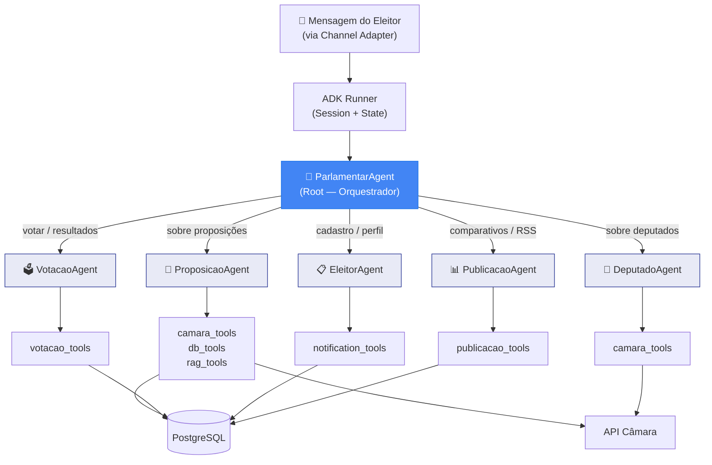
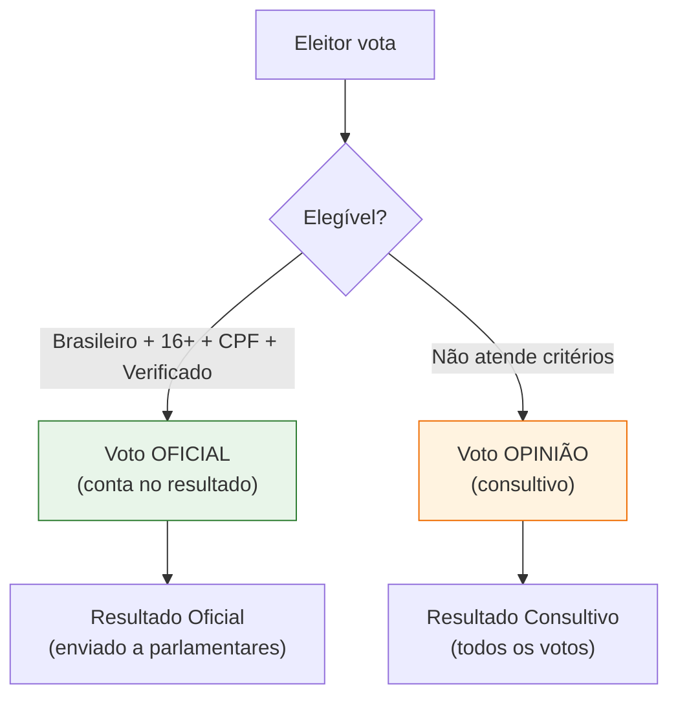
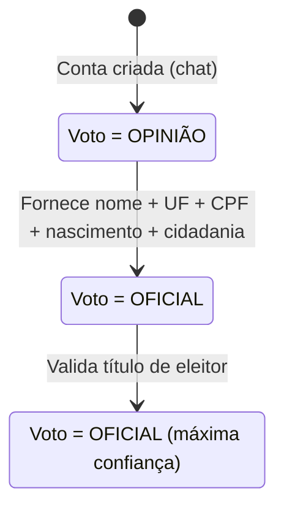
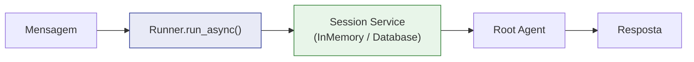
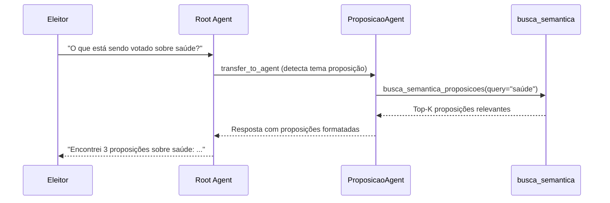
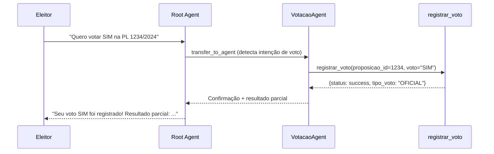
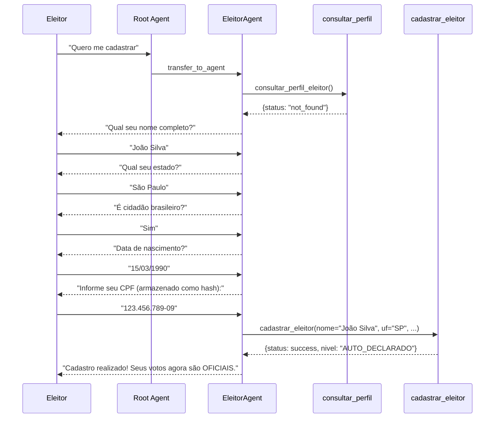

# Parlamentaria — Agentes de IA (Google ADK)

> Documentação dos agentes conversacionais que compõem o núcleo da plataforma.

---

## 1. Visão Geral

O coração da Parlamentaria é uma **arquitetura multi-agent** construída sobre o [Google ADK (Agent Development Kit)](https://google.github.io/adk-docs/). O eleitor conversa com agentes de IA que delegam entre si conforme o contexto.

Não existe frontend web para o eleitor — **toda interação ocorre via chat** (Telegram).

---

## 2. Arquitetura Multi-Agent



### Conceitos ADK Utilizados

| Conceito | Uso |
|----------|-----|
| **LlmAgent** | Todos os agentes (root + sub-agents) |
| **FunctionTool** | Funções Python como capacidades dos agentes |
| **Sub-Agents** | Delegação automática via `transfer_to_agent()` |
| **Session** | Contexto da conversa com cada eleitor |
| **State** | Dados temporários (eleitor logado, proposição ativa) |
| **Runner** | Orquestrador de execução do agente |

---

## 3. Root Agent — ParlamentarAgent

O agente principal que recebe **todas** as mensagens do eleitor e decide para qual sub-agente delegar.

**Arquivo:** `agents/parlamentar/agent.py`

```python
root_agent = LlmAgent(
    name="ParlamentarAgent",
    model=settings.agent_model,       # gemini-2.0-flash (configurável)
    instruction=ROOT_AGENT_INSTRUCTION,
    sub_agents=[
        proposicao_agent,
        votacao_agent,
        deputado_agent,
        eleitor_agent,
        publicacao_agent,
    ],
    tools=[buscar_eventos_pauta, consultar_agenda_votacoes],
)
```

### Persona e Regras

- **Acessível** — linguagem clara, sem juridiquês
- **Apartidário** — nunca emite opinião política
- **Informativo** — dados concretos com fontes
- **Respeitoso** — cordialidade e paciência
- **Proativo** — sugere ações (votar, conhecer deputados)

### Regras de Segurança

- Nunca inventa dados legislativos
- Nunca expõe detalhes técnicos (modelos, endpoints, tools)
- Nunca pede chat_id ou identificadores ao eleitor
- Responde sempre em português brasileiro

---

## 4. Sub-Agents

### 4.1 ProposicaoAgent — Proposições Legislativas

**Arquivo:** `agents/parlamentar/sub_agents/proposicao_agent.py`

| Responsabilidade | Descrição |
|------------------|-----------|
| Buscar proposições | Por tema, tipo (PL/PEC/MPV), ano |
| Explicar conteúdo | Linguagem acessível ao cidadão |
| Análise IA | Prós, contras, áreas afetadas |
| Tramitação | Situação atual e histórico |

**Tools disponíveis:**

| Tool | Descrição |
|------|-----------|
| `busca_semantica_proposicoes` | Busca por linguagem natural (RAG/pgvector) — **prioridade** |
| `buscar_proposicoes` | Busca na API Câmara com filtros exatos |
| `obter_detalhes_proposicao` | Detalhes completos de uma proposição |
| `consultar_proposicao_local` | Dados já sincronizados no banco |
| `obter_analise_ia` | Análise inteligente da proposição |
| `listar_tramitacoes_proposicao` | Histórico de tramitação |
| `listar_proposicoes_local` | Listagem do banco local |

### 4.2 VotacaoAgent — Votação Popular

**Arquivo:** `agents/parlamentar/sub_agents/votacao_agent.py`

| Responsabilidade | Descrição |
|------------------|-----------|
| Registrar voto | SIM / NÃO / ABSTENÇÃO |
| Resultados | Consolidação em tempo real |
| Histórico | Votos anteriores do eleitor |
| Votações Câmara | Resultados reais |

**Tools disponíveis:**

| Tool | Descrição |
|------|-----------|
| `registrar_voto` | Registra voto popular do eleitor |
| `obter_resultado_votacao` | Resultado consolidado |
| `consultar_meu_voto` | Se/como o eleitor votou |
| `historico_votos_eleitor` | Votos anteriores |
| `buscar_votacoes_recentes` | Votações recentes da Câmara |
| `obter_votos_parlamentares` | Como deputados votaram |

**Sistema de Elegibilidade:**



### 4.3 DeputadoAgent — Informações sobre Deputados

**Arquivo:** `agents/parlamentar/sub_agents/deputado_agent.py`

| Responsabilidade | Descrição |
|------------------|-----------|
| Perfil | Nome, partido, UF, foto |
| Despesas | Transparência da cota parlamentar |
| Votações | Como votou em proposições |

**Tools disponíveis:**

| Tool | Descrição |
|------|-----------|
| `buscar_deputado` | Pesquisa por nome, UF ou partido |
| `obter_perfil_deputado` | Detalhes do deputado |
| `obter_despesas_deputado` | Gastos da cota parlamentar |
| `obter_votos_parlamentares` | Votos em proposições |

### 4.4 EleitorAgent — Cadastro e Perfil

**Arquivo:** `agents/parlamentar/sub_agents/eleitor_agent.py`

| Responsabilidade | Descrição |
|------------------|-----------|
| Cadastro | Nome, UF, CPF, cidadania |
| Verificação | Progressiva (CPF → Título) |
| Preferências | Temas de interesse |
| Notificações | Frequência de digest |
| Recuperação | Vincular conta existente |

**Tools disponíveis:**

| Tool | Descrição |
|------|-----------|
| `consultar_perfil_eleitor` | Verifica se já está cadastrado |
| `cadastrar_eleitor` | Registra novo eleitor |
| `recuperar_conta` | Vincula conta existente via CPF |
| `verificar_titulo_eleitor` | Valida título de eleitor |
| `atualizar_temas_interesse` | Configura temas para notificações |
| `verificar_notificacoes` | Status de notificações |
| `configurar_frequencia_notificacao` | Ajusta frequência de digest |

**Fluxo de Verificação Progressiva:**



### 4.5 PublicacaoAgent — Comparativos e Publicação

**Arquivo:** `agents/parlamentar/sub_agents/publicacao_agent.py`

| Responsabilidade | Descrição |
|------------------|-----------|
| Comparativos | Voto popular vs resultado real |
| Status publicação | RSS Feed e Webhooks |
| Histórico | Votos com comparativos |
| Feedback | Resultado de proposições votadas |

**Tools disponíveis:**

| Tool | Descrição |
|------|-----------|
| `obter_comparativo` | Comparação pop vs real |
| `status_publicacao` | Info sobre RSS e Webhooks |
| `consultar_assinaturas_ativas` | Quantos parlamentares acompanham |
| `listar_comparativos_recentes` | Últimos comparativos |
| `consultar_historico_votos` | Histórico do eleitor com resultados |
| `disparar_evento_publicacao` | Notificar sistemas externos |

---

## 5. FunctionTools — Padrões

### 5.1 Convenções

Todas as FunctionTools seguem estes padrões:

```python
def nome_da_tool(
    param1: str,                    # Tipos simples: str, int, bool, float
    param2: int | None = None,      # Opcionais com None
    tool_context: ToolContext = None # Injetado pelo ADK (acesso ao state)
) -> dict:
    """Descrição clara do que a tool faz.

    O LLM usa o nome e docstring para decidir quando chamar.

    Args:
        param1: Descrição do parâmetro.
        param2: Descrição do parâmetro opcional.
        tool_context: Contexto do ADK (injetado automaticamente).

    Returns:
        Dict com chave "status" (success/error) e dados.
    """
    try:
        # Lógica...
        return {"status": "success", "dados": [...]}
    except Exception:
        return {
            "status": "error",
            "error": "Mensagem amigável para o eleitor."
        }
```

### 5.2 Regras

1. **Retornar `dict`** com chave `"status"` (`"success"` ou `"error"`)
2. **Parâmetros simples** — preferir `str`, `int`, `bool`
3. **Poucos parâmetros** — minimizar (o LLM decide os valores)
4. **Docstrings detalhadas** — Google style com Args e Returns
5. **Nunca retornar `str(e)`** — usar mensagens amigáveis e genéricas
6. **Nunca expor internos** — nomes de modelos, endpoints, stack traces
7. **Idempotentes** quando possível

### 5.3 Acesso ao State via ToolContext

O `ToolContext` fornece acesso ao state da sessão do eleitor:

```python
def minha_tool(tool_context: ToolContext = None) -> dict:
    # Obter chat_id do state (injetado automaticamente)
    chat_id = tool_context.state.get("user:chat_id") if tool_context else None
```

---

## 6. Runner e Sessões

### 6.1 ADK Runner

**Arquivo:** `agents/parlamentar/runner.py`

O Runner gerencia a execução do agente e as sessões:



| Ambiente | Session Service | Persistência |
|----------|----------------|--------------|
| Development | `InMemorySessionService` | Volátil (reinicia com o app) |
| Production | `DatabaseSessionService` | PostgreSQL (persistente) |

### 6.2 State Keys

Cada sessão mantém state com informações do eleitor:

| Key | Tipo | Descrição |
|-----|------|-----------|
| `user:chat_id` | `str` | ID do chat no mensageiro |
| `eleitor_id` | `str` | UUID do eleitor cadastrado |
| `eleitor_verificado` | `bool` | Se completou verificação |
| `eleitor_uf` | `str` | UF do eleitor |
| `proposicao_ativa` | `int` | ID da proposição sendo discutida |

### 6.3 Função Principal

```python
async def run_agent(user_id: str, session_id: str, message: str) -> str:
    """Entry point para channel adapters.
    
    1. Obtém ou cria sessão
    2. Constrói Content com a mensagem
    3. Executa runner.run_async()
    4. Extrai texto da resposta final
    5. Retorna string de resposta
    """
```

---

## 7. Modelo LLM

O sistema é **model-agnostic** via Google ADK:

| Modelo | Quando | Configuração |
|--------|--------|-------------|
| `gemini-2.0-flash` | Produção (padrão) | `AGENT_MODEL=gemini-2.0-flash` |
| `gemini-2.5-pro` | Análises complexas | `AGENT_MODEL=gemini-2.5-pro` |
| LiteLLM | Fallback/custom | `AGENT_MODEL=litellm/gpt-4o` |
| Ollama | Dev offline | `AGENT_MODEL=ollama/llama3` |

Configurável via variável de ambiente `AGENT_MODEL`.

---

## 8. Fluxo de Conversa — Exemplos

### 8.1 Eleitor pergunta sobre proposição



### 8.2 Eleitor vota em proposição



### 8.3 Eleitor se cadastra



---

## 9. Avaliação de Agentes

Datasets de avaliação em `agents/eval/`:

| Arquivo | Escopo |
|---------|--------|
| `proposicao_eval.json` | Busca e análise de proposições |
| `votacao_eval.json` | Registro de votos e resultados |
| `conversational_eval.json` | Fluxos conversacionais completos |

Executar avaliação:
```bash
python -m agents.eval.eval_runner
```

---

## 10. Referências

- [AGENTS.md](../AGENTS.md) — Guia completo para agentes IA
- [Google ADK Docs](https://google.github.io/adk-docs/)
- [Architecture](architecture.md) — Arquitetura geral do sistema
