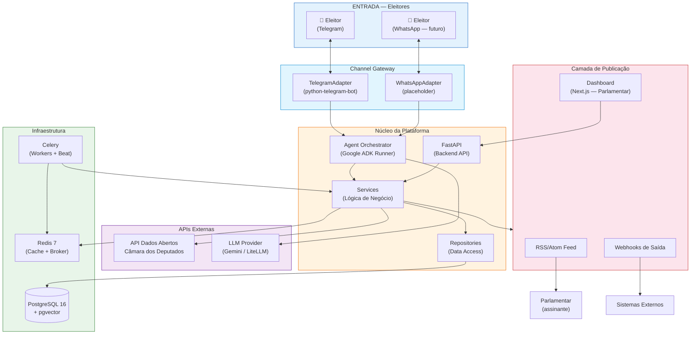
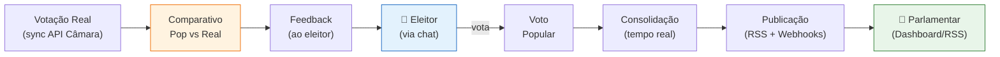
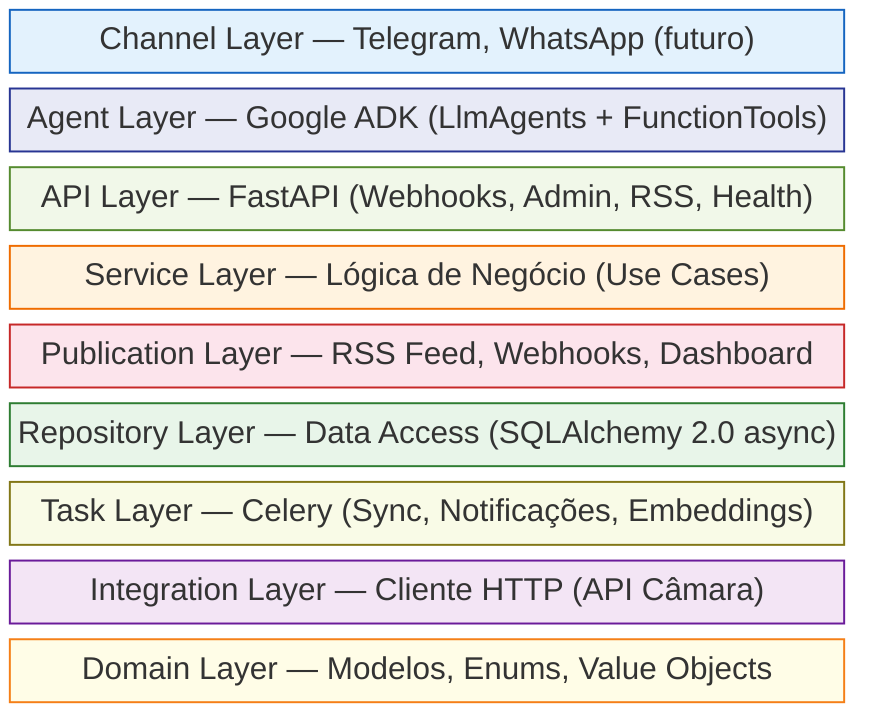
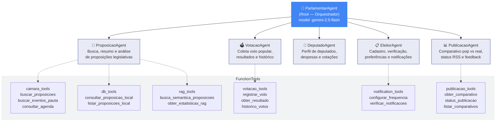
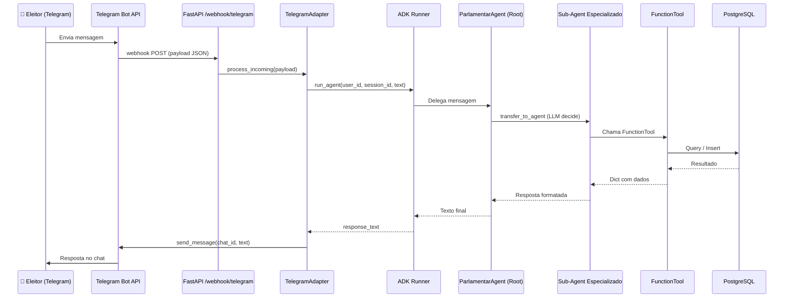
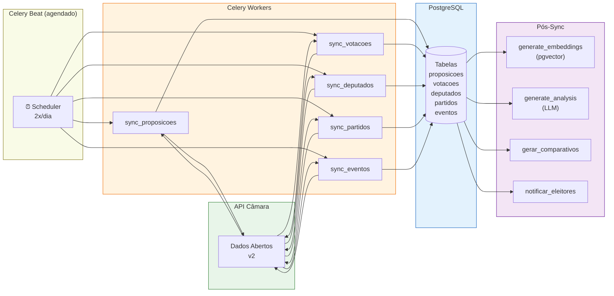
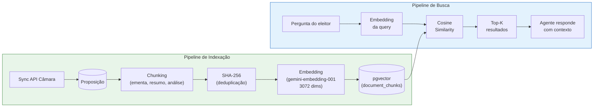
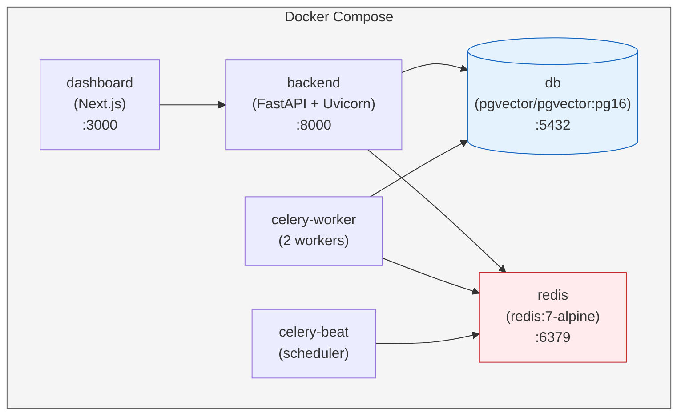

# Parlamentaria — Arquitetura do Software

> Plataforma agêntica que conecta eleitores às decisões legislativas da Câmara dos Deputados
> do Brasil através de agentes de IA conversacionais via Telegram.

---

## 1. Visão Geral

**Parlamentaria** é uma plataforma **agent-first** que democratiza o acesso à atividade legislativa brasileira. O eleitor interage com um agente de IA conversacional — o _Parlamentar de IA_ — diretamente via **Telegram** (canal primário), sem necessidade de frontend web.

O sistema monitora proposições legislativas, analisa textos com IA, coleta votação popular dos eleitores e compara com votações reais da Câmara, fechando o ciclo de democracia participativa.

---

## 2. Arquitetura Macro — Visão de Alto Nível



---

## 3. Ciclo Completo da Democracia Participativa

O sistema fecha um ciclo completo entre eleitor e parlamentar:



1. **Eleitor vota** via Telegram em proposições legislativas.
2. **Votos são consolidados** em tempo real (SIM/NÃO/ABSTENÇÃO).
3. **Resultado publicado** via RSS Feed e Webhooks para parlamentares.
4. **Votação real** é sincronizada da API da Câmara.
5. **Comparativo** é gerado automaticamente (alinhamento 0%–100%).
6. **Feedback** é entregue ao eleitor via chat.

---

## 4. Camadas Arquiteturais (Layered + Agent Architecture)



### 4.1 Descrição de Cada Camada

| Camada | Responsabilidade | Tecnologia |
|--------|------------------|------------|
| **Channel** | Adapters de mensageria (Telegram, WhatsApp) | python-telegram-bot |
| **Agent** | Agentes conversacionais multi-agent | Google ADK (LlmAgent) |
| **API** | Webhooks, endpoints admin, RSS, health | FastAPI |
| **Service** | Lógica de negócio, validações, orquestração | Python async |
| **Publication** | Saída para parlamentares (RSS, Webhooks, Dashboard) | feedgen, httpx |
| **Repository** | Abstração de acesso a dados | SQLAlchemy 2.0 async |
| **Task** | Jobs assíncronos e agendados | Celery + Redis |
| **Integration** | Clientes HTTP para APIs externas | httpx + tenacity |
| **Domain** | Entidades, enums, value objects | SQLAlchemy ORM |

---

## 5. Arquitetura Multi-Agent (Google ADK)

O sistema utiliza o padrão **Multi-Agent** do Google ADK, com um agente raiz orquestrando sub-agentes especializados:



### 5.1 Fluxo de Mensagem (End-to-End)



---

## 6. Fluxo de Dados — Sincronização com API Câmara



---

## 7. Pipeline RAG (Busca Semântica)

O sistema utiliza **RAG (Retrieval-Augmented Generation)** para busca semântica sobre proposições:



**Tipos de chunk indexados:**
- `ementa` — Texto da ementa da proposição
- `resumo_ia` — Resumo acessível gerado por IA
- `analise_resumo_leigo` — Análise simplificada
- `analise_impacto` — Análise de impacto esperado
- `analise_argumentos` — Argumentos a favor e contra
- `tramitacao` — Última tramitação

---

## 8. Infraestrutura e Deploy

### 8.1 Serviços Docker



| Serviço | Imagem/Build | Porta | Função |
|---------|-------------|-------|--------|
| **backend** | `./backend` (Dockerfile) | 8000 | API FastAPI, webhooks, ADK |
| **dashboard** | `./dashboard` (Next.js) | 3000 | Dashboard para parlamentares |
| **db** | `pgvector/pgvector:pg16` | 5432 | PostgreSQL + pgvector |
| **redis** | `redis:7-alpine` | 6379 | Cache, broker Celery, sessões |
| **celery-worker** | `./backend` | — | Processamento assíncrono |
| **celery-beat** | `./backend` | — | Agendamento de tasks |

### 8.2 Volumes Persistentes

- `pgdata` — Dados do PostgreSQL
- `redisdata` — Dados do Redis (AOF)

---

## 9. Tech Stack

| Camada | Tecnologia | Versão |
|--------|-----------|--------|
| **Agent Framework** | Google ADK | latest |
| **Backend API** | Python + FastAPI | 3.12+ |
| **Banco de Dados** | PostgreSQL + pgvector | 16+ |
| **ORM** | SQLAlchemy (async) | 2.0 |
| **Migrations** | Alembic | — |
| **Cache / Broker** | Redis | 7 |
| **Task Queue** | Celery | 5.x |
| **Canal Primário** | python-telegram-bot | — |
| **LLM** | Google Gemini (via ADK) | gemini-2.0-flash |
| **Embeddings** | gemini-embedding-001 | 3072 dims |
| **Dashboard** | Next.js | 15+ |
| **Container** | Docker + Docker Compose | — |
| **CI/CD** | GitHub Actions | — |
| **Linting** | Ruff | — |

---

## 10. Design Patterns

| Pattern | Onde | Justificativa |
|---------|------|---------------|
| **Multi-Agent** | Google ADK | Agentes especializados com delegação inteligente |
| **Channel Adapter** | `channels/` | Canal de mensageria desacoplado da lógica |
| **Repository** | `repositories/` | Abstração de persistência, testabilidade |
| **Service** | `services/` | Separação de regras de negócio |
| **FunctionTool** | `agents/tools/` | Funções Python como capacidades dos agentes |
| **Agent-as-a-Tool** | Sub-agents ADK | Delegação especializada por transferência |
| **Factory** | Channel adapters | Instanciação flexível por configuração |
| **DTO** | `schemas/` | Validação com Pydantic, transferência entre camadas |
| **Observer/Event** | Notificações | Desacoplamento entre sync e notificação |
| **Pub/Sub** | RSS + Webhooks | Parlamentares assinam resultados |
| **Comparator** | Comparativo service | Feedback transparente pop vs real |
| **Savepoint** | Sync batch | Isolamento de erros em operações em lote |

---

## 11. Estrutura de Diretórios

```
parlamentaria/
├── agents/                           # Google ADK — Agentes de IA
│   ├── parlamentar/
│   │   ├── agent.py                  # ParlamentarAgent (root)
│   │   ├── prompts.py                # System instructions
│   │   ├── runner.py                 # ADK Runner + session management
│   │   ├── sub_agents/               # Sub-agentes especializados
│   │   │   ├── proposicao_agent.py
│   │   │   ├── votacao_agent.py
│   │   │   ├── deputado_agent.py
│   │   │   ├── eleitor_agent.py
│   │   │   └── publicacao_agent.py
│   │   └── tools/                    # FunctionTools dos agentes
│   │       ├── camara_tools.py
│   │       ├── db_tools.py
│   │       ├── rag_tools.py
│   │       ├── votacao_tools.py
│   │       ├── notification_tools.py
│   │       └── publicacao_tools.py
│   └── eval/                         # Datasets de avaliação
│
├── channels/                         # Channel Adapters
│   ├── base.py                       # ChannelAdapter ABC
│   ├── telegram/                     # Telegram Bot
│   │   ├── bot.py                    # TelegramAdapter
│   │   ├── handlers.py               # Command handlers
│   │   ├── keyboards.py              # Inline keyboards
│   │   └── webhook.py                # FastAPI webhook
│   └── whatsapp/                     # Placeholder futuro
│
├── backend/
│   ├── app/
│   │   ├── main.py                   # Entrypoint FastAPI
│   │   ├── config.py                 # Settings (Pydantic)
│   │   ├── domain/                   # Modelos SQLAlchemy
│   │   ├── schemas/                  # DTOs Pydantic
│   │   ├── repositories/             # Data Access Layer
│   │   ├── services/                 # Business Logic
│   │   ├── integrations/             # Clients HTTP (API Câmara)
│   │   ├── routers/                  # API Endpoints
│   │   ├── tasks/                    # Celery Tasks
│   │   └── db/                       # Engine + Session factory
│   ├── alembic/                      # Database Migrations
│   └── tests/                        # Testes (pytest)
│
├── dashboard/                        # Next.js (Parlamentar Dashboard)
│
├── docs/                             # Documentação
│   ├── architecture.md               # Este documento
│   ├── database-schema.md            # Schema do banco de dados
│   ├── agents.md                     # Documentação dos agentes ADK
│   └── channels.md                   # Documentação dos canais
│
├── docker-compose.yaml                # Orquestração principal
└── AGENTS.md                         # Guia para agentes IA
```

---

## 12. Endpoints da API

### Webhooks (entrada de mensagens)
| Método | Endpoint | Descrição |
|--------|----------|-----------|
| POST | `/webhook/telegram` | Webhook Telegram Bot API |
| POST | `/webhook/whatsapp` | Webhook WhatsApp (futuro) |

### RSS Feed (saída para parlamentares)
| Método | Endpoint | Descrição |
|--------|----------|-----------|
| GET | `/rss/votos` | Feed RSS com resultados consolidados |
| GET | `/rss/comparativos` | Feed RSS com comparativos pop vs real |

### Assinaturas
| Método | Endpoint | Descrição |
|--------|----------|-----------|
| POST | `/assinaturas/rss` | Criar assinatura RSS |
| POST | `/assinaturas/webhooks` | Registrar webhook de saída |
| POST | `/assinaturas/webhooks/{id}/test` | Disparar payload de teste |

### Admin (protegido por API key)
| Método | Endpoint | Descrição |
|--------|----------|-----------|
| GET | `/admin/proposicoes` | Proposições sincronizadas |
| POST | `/admin/proposicoes/{id}/analisar` | Trigger análise IA |
| GET | `/admin/eleitores` | Eleitores cadastrados |
| GET | `/admin/rag/stats` | Estatísticas do índice vetorial |
| POST | `/admin/rag/reindex` | Re-indexar embeddings |

### Health
| Método | Endpoint | Descrição |
|--------|----------|-----------|
| GET | `/health` | Health check simples |
| GET | `/health/detailed` | Status DB, Redis, API Câmara |

---

## 13. Segurança

- **Autenticação de eleitores**: via `chat_id` do Telegram + verificação progressiva (CPF, título)
- **Dados sensíveis**: CPF e título de eleitor armazenados apenas como hash SHA-256
- **Admin API**: protegida por API key (`X-API-Key` header)
- **Webhooks de entrada**: validação de secret/assinatura do Telegram
- **Webhooks de saída**: payload assinado com HMAC-SHA256
- **Rate limiting**: `slowapi` por chat_id e por IP
- **Input validation**: Pydantic valida 100% dos inputs
- **SQL injection**: prevenido por SQLAlchemy ORM
- **HTTPS**: obrigatório em produção (webhooks exigem HTTPS)

---

## 14. Referências

- [AGENTS.md](../AGENTS.md) — Guia completo para agentes IA
- [Google ADK Documentation](https://google.github.io/adk-docs/)
- [API Dados Abertos da Câmara](https://dadosabertos.camara.leg.br/swagger/api.html)
- [python-telegram-bot](https://python-telegram-bot.readthedocs.io/)
