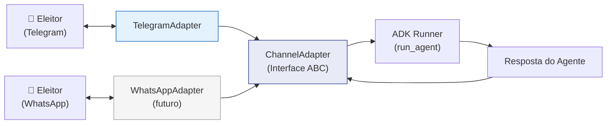
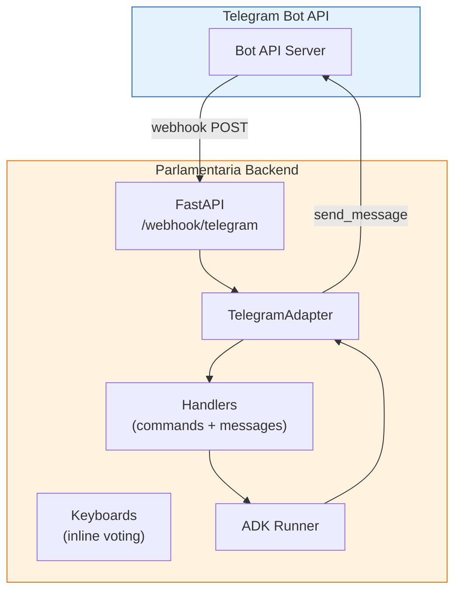
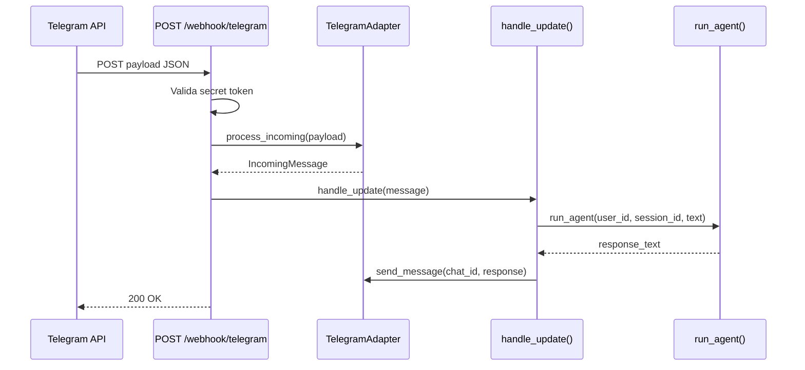
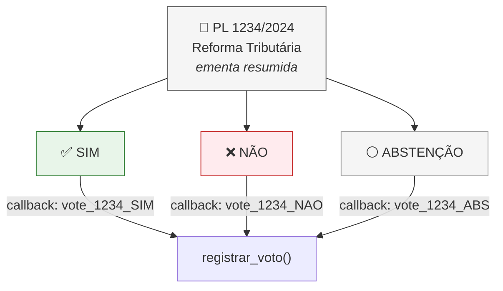
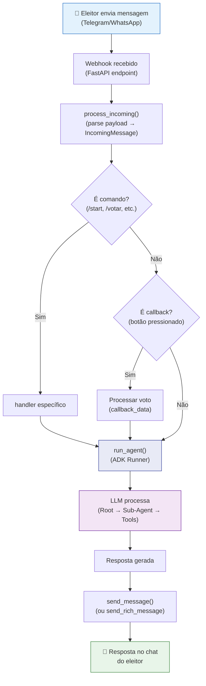

# Parlamentaria — Canais de Mensageria

> Documentação da camada de canais (Channel Adapters) que conecta eleitores ao sistema via Telegram e WhatsApp.

---

## 1. Visão Geral

A Parlamentaria é **100% conversacional** — não existe frontend web para o eleitor. Toda interação ocorre via mensageiros, usando o padrão **Channel Adapter** para desacoplar a lógica agêntica do canal de comunicação.



---

## 2. Interface Abstrata — ChannelAdapter

**Arquivo:** `channels/base.py`

Todos os adaptadores de canal implementam esta interface ABC:

```python
class ChannelAdapter(ABC):
    async def send_message(self, chat_id: str, text: str) -> None: ...
    async def send_rich_message(self, chat_id: str, text: str, buttons: list[list[Button]]) -> None: ...
    async def process_incoming(self, payload: dict) -> IncomingMessage | None: ...
    async def setup_webhook(self, url: str) -> bool: ...
    async def answer_callback(self, callback_id: str, text: str | None = None) -> None: ...
```

### Modelos de Dados

| Classe | Descrição |
|--------|-----------|
| **IncomingMessage** | Representação normalizada de mensagem recebida |
| **Button** | Botão para teclados inline (text + callback_data) |

**IncomingMessage:**

| Campo | Tipo | Descrição |
|-------|------|-----------|
| `chat_id` | `str` | ID do chat/conversa |
| `user_id` | `str` | ID do usuário/remetente |
| `text` | `str` | Texto da mensagem |
| `username` | `str \| None` | Username do remetente |
| `first_name` | `str \| None` | Primeiro nome |
| `callback_data` | `str \| None` | Dados de botão pressionado |
| `channel` | `str` | Identificador do canal |
| `raw_payload` | `dict \| None` | Payload original (debug) |

---

## 3. Telegram — Canal Primário

### 3.1 Arquitetura



### 3.2 Componentes

| Arquivo | Classe/Função | Responsabilidade |
|---------|---------------|------------------|
| `channels/telegram/bot.py` | `TelegramAdapter` | Implementa ChannelAdapter para Telegram |
| `channels/telegram/handlers.py` | `handle_update()` | Processa updates (mensagens + callbacks) |
| `channels/telegram/keyboards.py` | `criar_teclado_*()` | Gera inline keyboards |
| `channels/telegram/webhook.py` | Router FastAPI | Endpoint `/webhook/telegram` |

### 3.3 TelegramAdapter

**Arquivo:** `channels/telegram/bot.py`

Implementação principal usando `python-telegram-bot`:

```python
class TelegramAdapter(ChannelAdapter):
    def __init__(self, token: str | None = None):
        self._bot = Bot(token=token or settings.telegram_bot_token)

    async def send_message(self, chat_id, text): ...    # HTML + fallback plain text
    async def send_rich_message(self, chat_id, text, buttons): ...  # Inline keyboard
    async def process_incoming(self, payload): ...       # Parse webhook payload
    async def setup_webhook(self, url): ...              # Configurar webhook
    async def answer_callback(self, callback_id, text): ...  # Ack botão
```

**Features:**
- **HTML Parse Mode** com fallback para plain text (strip tags)
- **Message splitting** automático para mensagens > 4096 chars
- **Inline Keyboard** para votação (SIM/NÃO/ABSTENÇÃO)
- **Callback queries** para interações com botões

### 3.4 Webhook

**Arquivo:** `channels/telegram/webhook.py`



**Configuração:**
```bash
TELEGRAM_BOT_TOKEN=<token do @BotFather>
TELEGRAM_WEBHOOK_URL=https://seu-dominio.com/webhook/telegram
TELEGRAM_WEBHOOK_SECRET=<random-32-chars>
```

### 3.5 Comandos do Bot

| Comando | Descrição |
|---------|-----------|
| `/start` | Boas-vindas e introdução |
| `/proposicoes` | Buscar proposições em tramitação |
| `/votar` | Iniciar fluxo de votação |
| `/meuperfil` | Ver perfil e status |
| `/ajuda` | Menu de ajuda |

### 3.6 Teclados Inline (Votação)



---

## 4. WhatsApp — Canal Futuro

### 4.1 Status

**Em planejamento.** O diretório `channels/whatsapp/` contém apenas um placeholder.

### 4.2 Plano de Implementação

- **API:** WhatsApp Business API (Meta)
- **Webhook:** Mesmo padrão do Telegram — POST recebido pelo FastAPI
- **Adapter:** `WhatsAppAdapter` implementando `ChannelAdapter`
- **Rich Messages:** Template messages + reply buttons (limitação da API)

### 4.3 Vantagem da Arquitetura

Graças ao padrão **Channel Adapter**, adicionar WhatsApp requer:
1. Implementar `WhatsAppAdapter(ChannelAdapter)`
2. Criar endpoint `/webhook/whatsapp`
3. Configurar variáveis de ambiente

A lógica dos agentes, services e repositories **não muda** — funciona identicamente para qualquer canal.

---

## 5. Fluxo End-to-End Completo



---

## 6. Segurança do Canal

| Aspecto | Implementação |
|---------|---------------|
| **Webhook validation** | Secret token no header para validar origem |
| **Rate limiting** | `slowapi` por chat_id e IP |
| **Identificação** | `chat_id` do Telegram como identificador único |
| **HTTPS** | Obrigatório em produção (exigido pela Telegram API) |
| **Input sanitization** | Pydantic valida todos os payloads |

---

## 7. Configuração

### Variáveis de Ambiente

```bash
# Telegram
TELEGRAM_BOT_TOKEN=<token do @BotFather>
TELEGRAM_WEBHOOK_URL=https://seu-dominio.com/webhook/telegram
TELEGRAM_WEBHOOK_SECRET=<random-32-chars>

# WhatsApp (futuro)
WHATSAPP_API_TOKEN=
WHATSAPP_PHONE_NUMBER_ID=
WHATSAPP_WEBHOOK_VERIFY_TOKEN=
```

### Setup do Telegram Bot

1. Criar bot via [@BotFather](https://t.me/BotFather) no Telegram
2. Obter token e configurar em `TELEGRAM_BOT_TOKEN`
3. Configurar webhook: `TELEGRAM_WEBHOOK_URL` com HTTPS
4. O backend configura o webhook automaticamente no startup

---

## 8. Referências

- [Architecture](architecture.md) — Arquitetura geral
- [Agents](agents.md) — Documentação dos agentes ADK
- [python-telegram-bot docs](https://python-telegram-bot.readthedocs.io/)
- [WhatsApp Business API](https://developers.facebook.com/docs/whatsapp)
