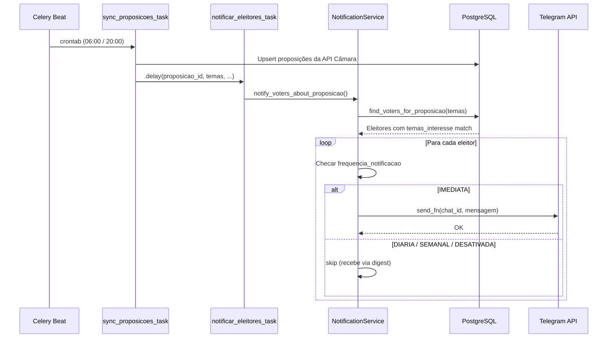
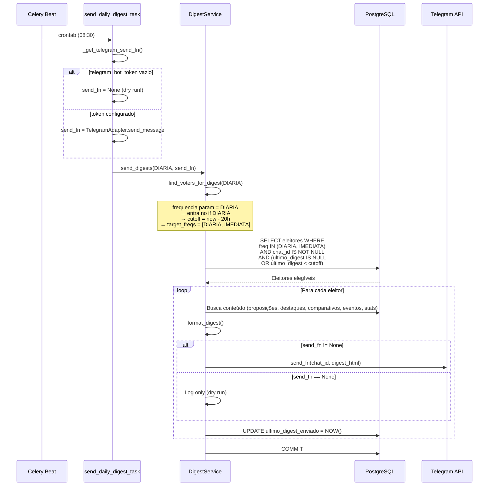
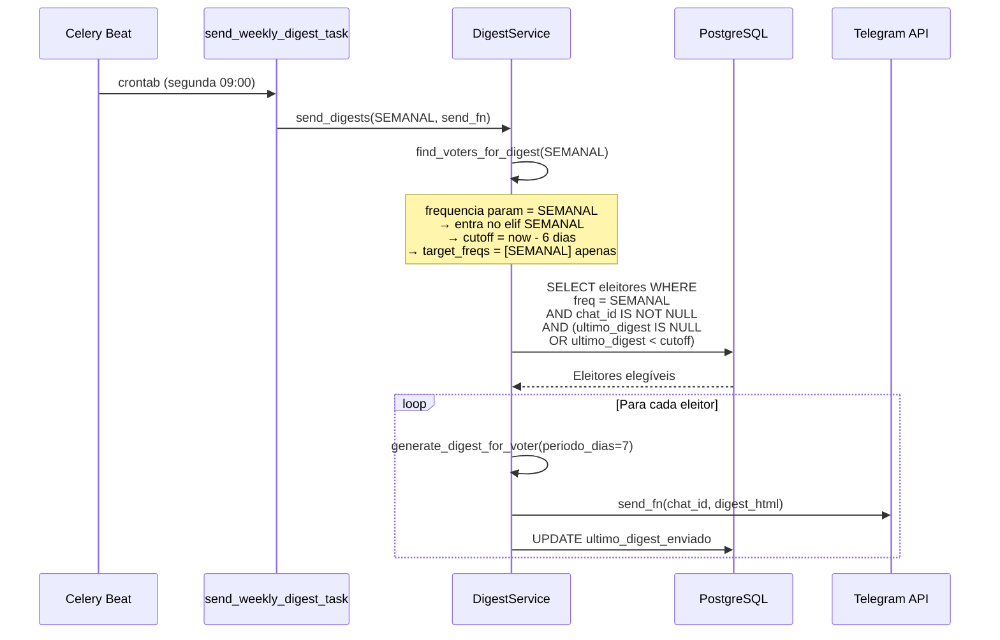

# Notificações & Digests — Guia de Debug

> Referência visual e checklist para diagnosticar problemas no pipeline de
> notificações proativas e digests periódicos.

---

## 1. Visão Geral — Dois Sistemas de Notificação

O Parlamentaria possui **dois caminhos independentes** de notificação ao eleitor:

| Sistema | Trigger | Quem recebe | Frequência |
|---------|---------|-------------|------------|
| **Alertas Imediatos** | Nova proposição sincronizada (temas match) | Apenas `IMEDIATA` | Tempo real (pós-sync) |
| **Digest Periódico** | Celery Beat (schedule fixo) | `DIARIA` + `IMEDIATA` (diário) / `SEMANAL` (semanal) | 1x/dia ou 1x/semana |

---

## 2. Fluxo Completo — Diagrama de Sequência

### 2.1 Alertas Imediatos (tempo real)



### 2.2 Digest Diário



### 2.3 Digest Semanal



---

## 3. Mapa de Decisões — Quem Recebe O Quê

```mermaid
flowchart TD
    START["Eleitor cadastrado"] --> FREQ{"frequencia_notificacao?"}

    FREQ -->|IMEDIATA| IM["✅ Alertas imediatos<br/>+ Digest diário (08:30)"]
    FREQ -->|DIARIA| DI["❌ Sem alertas imediatos<br/>✅ Digest diário (08:30)"]
    FREQ -->|SEMANAL| SE["❌ Sem alertas imediatos<br/>✅ Digest semanal (seg 09:00)"]
    FREQ -->|DESATIVADA| DE["❌ Nenhuma notificação<br/>(exceto comparativos de<br/>proposições em que votou)"]

    IM --> CHATID{"chat_id preenchido?"}
    DI --> CHATID
    SE --> CHATID

    CHATID -->|NULL| BLOCK["⛔ Não recebe nada<br/>(sem canal de entrega)"]
    CHATID -->|Preenchido| CUTOFF{"ultimo_digest_enviado<br/>antigo o suficiente?"}

    CUTOFF -->|Diário: > 20h atrás| SEND["📨 Recebe digest"]
    CUTOFF -->|Semanal: > 6 dias atrás| SEND
    CUTOFF -->|Muito recente| SKIP["⏭️ Pulado neste ciclo"]
    CUTOFF -->|NULL (nunca recebeu)| SEND

    style BLOCK fill:#ffcdd2,stroke:#c62828
    style SKIP fill:#fff9c4,stroke:#f57f17
    style SEND fill:#c8e6c9,stroke:#2e7d32
    style IM fill:#bbdefb,stroke:#1565c0
    style DI fill:#e3f2fd,stroke:#1565c0
    style SE fill:#e8f5e9,stroke:#2e7d32
    style DE fill:#f5f5f5,stroke:#9e9e9e
```

---

## 4. Timeline — Schedule do Celery Beat

```mermaid
gantt
    title Pipeline Diário (Celery Beat)
    dateFormat HH:mm
    axisFormat %H:%M

    section Sync Manhã
    sync_partidos        :05:30, 15m
    sync_deputados       :05:45, 15m
    sync_proposicoes     :06:00, 30m
    sync_votacoes        :06:30, 15m
    sync_eventos         :06:45, 15m
    gerar_comparativos   :07:00, 15m

    section Digests
    send_daily_digest    :crit, 08:30, 30m
    send_weekly_digest   :milestone, 09:00, 0m

    section Sync Noite
    sync_partidos        :19:30, 15m
    sync_deputados       :19:45, 15m
    sync_proposicoes     :20:00, 30m
    sync_votacoes        :20:30, 15m
    sync_eventos         :20:45, 15m
    gerar_comparativos   :21:00, 15m

    section Madrugada
    reindex_embeddings   :03:00, 60m
```



> **Nota:** `send_weekly_digest` só executa às segundas (`day_of_week=0`).

---

## 5. Checklist de Debug

### 5.1 "Não estou recebendo digest diário"

```
□ 1. CELERY BEAT RODANDO?
     docker compose ps | grep celery-beat
     → Se não está rodando, nenhuma task periódica executa.

□ 2. CELERY WORKER RODANDO?
     docker compose ps | grep celery-worker
     → Beat agenda, mas worker executa. Ambos precisam estar up.

□ 3. TASK FOI AGENDADA?
     Verificar logs do celery-beat:
     docker compose logs celery-beat | grep "send_daily_digest"
     → Deve aparecer "Scheduler: Sending due task send-daily-digest"

□ 4. TASK FOI EXECUTADA?
     docker compose logs celery-worker | grep "task.daily_digest"
     → Deve ter "task.daily_digest.start" e "task.daily_digest.complete"

□ 5. TELEGRAM TOKEN CONFIGURADO?
     .env → TELEGRAM_BOT_TOKEN não pode estar vazio
     → Se vazio: send_fn = None → dry run (só log, não envia)
     → Log: "digest.telegram_not_configured"

□ 6. ELEITOR TEM chat_id?
     SELECT chat_id, frequencia_notificacao, ultimo_digest_enviado
     FROM eleitores WHERE chat_id = '<seu_chat_id>';
     → chat_id NULL = não recebe nada

□ 7. FREQUÊNCIA CORRETA?
     SELECT frequencia_notificacao FROM eleitores WHERE ...
     → IMEDIATA ou DIARIA = elegível para digest diário
     → SEMANAL = só recebe segunda-feira
     → DESATIVADA = não recebe

□ 8. CUTOFF DE TEMPO?
     Diário: ultimo_digest_enviado deve ser > 20h atrás (ou NULL)
     → Se recebeu há menos de 20h, é pulado neste ciclo.
     SELECT ultimo_digest_enviado FROM eleitores WHERE ...

□ 9. STATS DA TASK?
     O retorno de send_digests() é logado:
     docker compose logs celery-worker | grep "digest.complete"
     → total_voters=0 → nenhum elegível encontrado
     → sent=0, errors=N → falhas no envio
     → sent=N → OK, enviou

□ 10. ERRO NO ENVIO TELEGRAM?
      docker compose logs celery-worker | grep "digest.send_error"
      → chat_id inválido, bot bloqueado, rate limit, etc.
```

### 5.2 "Não estou recebendo alertas imediatos"

```
□ 1. FREQUÊNCIA = IMEDIATA?
     → Apenas eleitores com IMEDIATA recebem alertas em tempo real.
     → DIARIA/SEMANAL recebem a mesma info no digest.

□ 2. TEMAS DE INTERESSE CONFIGURADOS?
     SELECT temas_interesse FROM eleitores WHERE ...
     → Se NULL ou [], não faz match com nenhuma proposição.

□ 3. PROPOSIÇÃO TEM TEMAS?
     → notify_voters_about_proposicao() retorna cedo se temas=[].

□ 4. TASK notificar_eleitores FOI DISPARADA?
     → É chamada por sync_proposicoes ao criar novas proposições.
     → Verificar se sync encontrou proposições novas.

□ 5. FILTRO DE FREQUÊNCIA NO NotificationService?
     → Linha ~230 de notification_service.py:
       if voter.frequencia_notificacao not in (IMEDIATA,):
           skip
```

### 5.3 "Não estou recebendo digest semanal"

```
□ 1. É SEGUNDA-FEIRA?
     → send_weekly_digest_task só roda day_of_week=0 (segunda).
     → Config: DIGEST_WEEKLY_DAY no .env

□ 2. FREQUÊNCIA = SEMANAL?
     → Apenas SEMANAL é incluído (IMEDIATA e DIARIA NÃO recebem semanal).

□ 3. CUTOFF DE 6 DIAS?
     → ultimo_digest_enviado deve ser > 6 dias atrás (ou NULL).
```

---

## 6. Componentes e Arquivos de Referência

| Componente | Arquivo | Responsabilidade |
|---|---|---|
| **Celery Beat Schedule** | `backend/app/tasks/celery_app.py` | Horários de todas as tasks periódicas |
| **Task Digest Diário** | `backend/app/tasks/send_digests.py` → `send_daily_digest_task` | Dispara digest para DIARIA + IMEDIATA |
| **Task Digest Semanal** | `backend/app/tasks/send_digests.py` → `send_weekly_digest_task` | Dispara digest para SEMANAL |
| **Task Alertas Imediatos** | `backend/app/tasks/notificar_eleitores.py` | Notifica sobre nova proposição |
| **DigestService** | `backend/app/services/digest_service.py` | Seleção de eleitores, geração e envio de digests |
| **NotificationService** | `backend/app/services/notification_service.py` | Alertas imediatos por tema |
| **TelegramAdapter** | `channels/telegram/bot.py` | Envio efetivo via Telegram Bot API |
| **Config** | `backend/app/config.py` | `digest_daily_hour/minute`, `digest_weekly_day/hour`, `telegram_bot_token` |
| **Modelo Eleitor** | `backend/app/domain/eleitor.py` | `frequencia_notificacao`, `chat_id`, `ultimo_digest_enviado`, `temas_interesse` |

---

## 7. Variáveis de Ambiente Relevantes

```bash
# Telegram (obrigatório para envio real)
TELEGRAM_BOT_TOKEN=...          # Se vazio → dry run (não envia)

# Horários dos digests
DIGEST_DAILY_HOUR=8             # Hora do digest diário (default: 8)
DIGEST_DAILY_MINUTE=30          # Minuto do digest diário (default: 30)
DIGEST_WEEKLY_DAY=0             # Dia do semanal: 0=seg, 6=dom (default: 0)
DIGEST_WEEKLY_HOUR=9            # Hora do digest semanal (default: 9)
DIGEST_BATCH_SIZE=50            # Eleitores por lote (default: 50)
DIGEST_MAX_DAILY_NOTIFICATIONS=3
```

---

## 8. Queries Úteis para Debug

```sql
-- Verificar configuração do seu eleitor
SELECT id, nome, chat_id, frequencia_notificacao,
       temas_interesse, ultimo_digest_enviado,
       horario_preferido_notificacao
FROM eleitores
WHERE chat_id = '<SEU_CHAT_ID>';

-- Eleitores elegíveis para digest diário AGORA
SELECT id, nome, chat_id, frequencia_notificacao, ultimo_digest_enviado
FROM eleitores
WHERE frequencia_notificacao IN ('IMEDIATA', 'DIARIA')
  AND chat_id IS NOT NULL
  AND (ultimo_digest_enviado IS NULL
       OR ultimo_digest_enviado < NOW() - INTERVAL '20 hours');

-- Eleitores elegíveis para digest semanal AGORA
SELECT id, nome, chat_id, frequencia_notificacao, ultimo_digest_enviado
FROM eleitores
WHERE frequencia_notificacao = 'SEMANAL'
  AND chat_id IS NOT NULL
  AND (ultimo_digest_enviado IS NULL
       OR ultimo_digest_enviado < NOW() - INTERVAL '6 days');

-- Últimos digests enviados (log via ultimo_digest_enviado)
SELECT nome, chat_id, frequencia_notificacao, ultimo_digest_enviado
FROM eleitores
WHERE ultimo_digest_enviado IS NOT NULL
ORDER BY ultimo_digest_enviado DESC
LIMIT 20;
```
